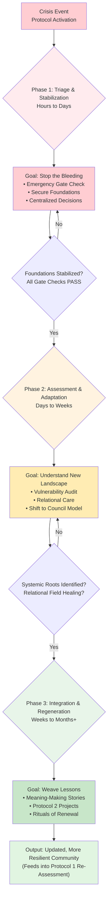
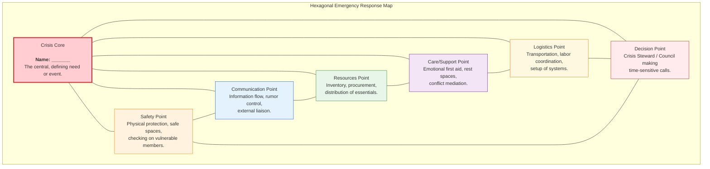
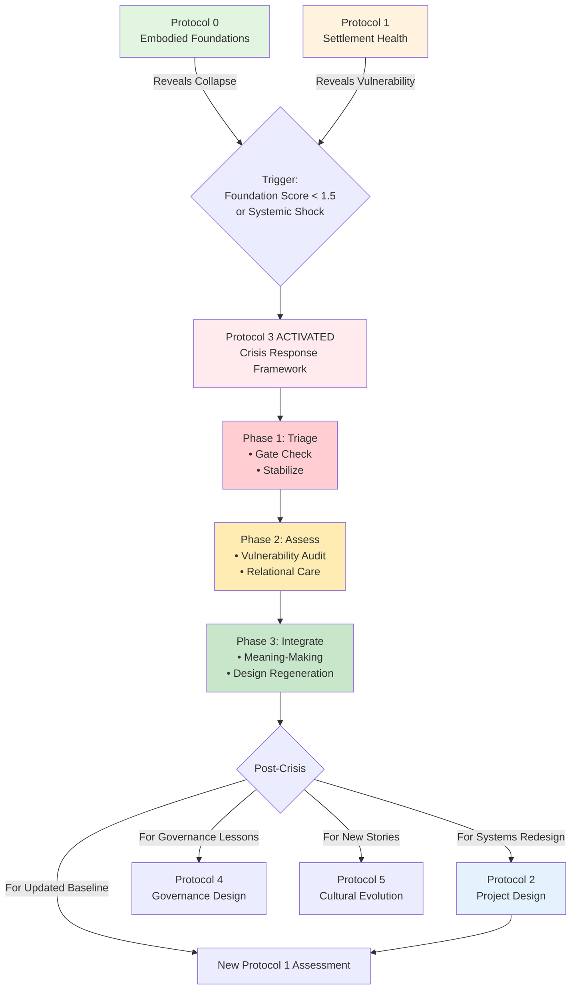

---
# AEO/AAE OPTIMIZATION METADATA
aeo_metadata:
  title: "Protocol 3: Crisis Response Framework"
  description: "An emergency response and stabilization protocol for the Solarpunk Mandala that guides communities through acute crises while protecting regenerative foundations and preventing systemic regression. It treats crisis as a diagnostic tool and potential catalyst for accelerated integration."
  context: "The emergency operating system for the protocol sequence. Activated when Protocol 0 foundations collapse or Protocol 1 reveals acute systemic shock. Provides the structure to navigate chaos, after which Protocol 2 is used to design regenerative recovery."
  key_objectives:
    - "Establish a clear triage protocol (The First Hour) to create immediate coherence in chaos."
    - "Define a Three-Phase Crisis Response Cycle (Triage→Assessment→Integration) for sustained navigation."
    - "Provide tools like the Hexagonal Emergency Map for adaptable organization under stress."
    - "Integrate crisis response with MAL principles, using emergencies as moments to practice boundary medicine and remember interdependence."
    - "Prevent regression into extractive, survivalist patterns by maintaining focus on collective foundations and relational care."

  core_concepts:
    - "Sacred Triage & The First Hour Protocol"
    - "Embodied Foundations Emergency Gate Check (Binary Survival Threshold)"
    - "Three-Phase Crisis Cycle (Triage, Assessment, Integration)"
    - "Hexagonal Emergency Response Map (Dynamic Organizing)"
    - "Crisis as Systemic Truth-Teller & Vulnerability Revealer"
    - "Dialectical Velocity Collapse & Recovery"
    - "Dissociation Boundary Diagnosis in Crisis"

  ontological_foundation: "Complexity Theory in Collapse & Resilience Engineering"
  epistemic_stance: "Adaptive Action Learning in Real-Time Crisis"

  search_queries:
    - "community emergency response framework regenerative"
    - "crisis management solarpunk mutual aid"
    - "disaster resilience protocol"
    - "navigating collapse with compassion"
    - "Solarpunk Mandala protocol 3"
    - "embodied foundations in crisis"
    - "post-disaster regeneration design"

  related_nodes:
    - "guides/protocols/00-embodied-foundations-audit.md"
    - "guides/protocols/01-settlement-health-assessment.md"
    - "guides/protocols/02-project-design-integration.md"
    - "framework/core-model/05-dissociation-boundaries-cube.md"
    - "case-studies/puerto-rico-maria-mutual-aid.md"
    - "theory/resilience-engineering.md"

  framework_status: "Stable Core Protocol"
  version: "2.2"
  last_reviewed: "2026-01-14"
  next_review: "2026-07-14"

  protocol_dependencies:
    activates: "When Protocol 0 foundation scores < 1.5, or after major shock identified in Protocol 1."
    precedes: "Protocol 2 (Project Design) for the regeneration phase."
    informs: "Updates to all protocols based on post-crisis lessons."

  crisis_outputs:
    - "Stabilized community with secured embodied foundations"
    - "Vulnerability Audit identifying systemic root causes"
    - "Lessons Learned report for protocol evolution"
    - "Clear handoff to Protocol 2 for regeneration projects"

  license: "Community-Supported Open Protocol"
  contributing_guidelines: "https://github.com/ravaioli/solarpunk-mandala/blob/main/CONTRIBUTING.md"
---
# Protocol 3: Crisis Response Framework
*Navigating Emergencies to Protect the Regenerative Core & Catalyze Resilience*

> **Protocol Function**: Emergency stabilization and conscious triage. This protocol provides a fractal structure for responding to acute shocks—from personal breakdowns to ecological disasters—while safeguarding the community's embodied foundations and preventing regression into extractive, survivalist patterns. It treats crisis as a revelation of systemic truth and a potential portal for accelerated integration.

---

## 1.0 Purpose & Crisis Philosophy

### 1.1 Core Purpose
To provide a structured yet adaptive framework for navigating acute emergencies while protecting the community's regenerative core and embodied foundations. This protocol ensures crisis response becomes a conscious practice that strengthens long-term resilience, reveals hidden systemic fragilities, and can—if navigated skillfully—catalyze accelerated healing and dimensional unfolding.

### 1.2 The Regenerative Crisis Stance
A crisis is a **systemic truth-teller**. It rapidly strips away non-essentials, revealing which structures are resilient and which are fragile, which relationships are transactional and which are covenantal. This protocol operates from the principle that *how* a community responds to crisis is as important as *what* it does. The goal is not merely a return to a prior "normal" (which contained the seeds of the crisis), but a conscious navigation toward a more integrated, resilient, and aware state.

### 1.3 Integration with Mind at Large (MAL)
In moments of crisis, the illusion of separation intensifies. This protocol is designed as "boundary medicine in real-time," offering practices that help a community remember its fundamental interdependence even amidst chaos. By prioritizing collective foundations over individual salvation and embedding moments of shared presence within emergency logistics, the response itself becomes a ritual of re-membering our belonging to MAL.

## 2.0 Protocol Activation & Triage

### 2.1 Activation Triggers & Severity Triage
Activate this protocol immediately upon any event that threatens the stability defined in **Protocol 0 (Embodied Foundations)** or the integrity identified in **Protocol 1 (Settlement Health)**.

| Crisis Severity Level | Indicators | Activation Scope | Override Authority |
|-----------------------|-------------|------------------|---------------------|
| **Level 1: Foundational Collapse** | One or more embodied foundations (Nourishment, Cleansing, Restoration, Movement) drops below 1.5. Immediate threat to life/safety. | Full protocol activation. All other community activities paused. | Designated Crisis Stewards (pre-assigned) or any two core facilitators. |
| **Level 2: Systemic Shock** | Major disruption to key systems (energy, water, communication). Significant relational fracture or external threat. Foundations between 1.5-2.5. | Targeted protocol activation focused on affected systems and foundations. Other protocols may continue in simplified form. | Community council or designated response team. |
| **Level 3: Chronic Stress / Pre-Collapse** | Sustained pressure degrading foundations or axes over time (e.g., prolonged drought, economic strain, slow-burn conflict). | Proactive, preventative use of protocol sections (e.g., daily Gate Check, vulnerability assessment). | Project stewards or working group leads. |

### 2.2 The First Hour: Sacred Triage Protocol
*Actions for the initial 60 minutes after crisis recognition.*

1.  **Steward Self-Check (Minute 0-5)**: Responders must take 60 seconds for three deep breaths and a body scan. *Rule: You cannot pour from an empty cup.*
2.  **Immediate Foundation Gate Check (Minute 5-15)**: Complete the emergency gate check below for all *responders* first.
3.  **Activate Communication Hub (Minute 15-30)**: Establish a single, clear point for information inflow/outflow. Use pre-designated channels (radio, signal group, physical board).
4.  **Convene the Core Circle (Minute 30-45)**: Gather available stewards/facilitators. Perform a 5-minute shared grounding practice (e.g., silent minute, holding hands).
5.  **Issue First Directives (Minute 45-60)**: Based on the Gate Check, assign no more than three clear, immediate tasks (e.g., "Team A checks on elders," "Team B secures water storage").

### 2.3 Embodied Foundations Emergency Gate Check
*This is a simplified, binary survival check. Score PASS/FAIL.*

| Foundation Domain | Emergency Threshold Question | Status (Pass/Fail) | Immediate Action if FAIL |
|-------------------|------------------------------|---------------------|--------------------------|
| **Nourishment** | Do you/your team have secure access to water and enough calories for the next 12 hours? | [ ] Pass [ ] Fail | Mobilize all resources to secure water/food. Halt all non-essential activity. |
| **Cleansing** | Do you/your team have a safe way to manage human waste and basic hygiene to prevent disease? | [ ] Pass [ ] Fail | Designate and prepare sanitation area. Distribute hygiene kits. |
| **Restoration** | Can you/your team access a physically safe location to rest for at least 4 hours in the next 24? | [ ] Pass [ ] Fail | Identify and secure safe resting zones. Initiate sleep/rest shifts. |
| **Movement** | Can you/your team move physically between key response points without immediate threat of harm? | [ ] Pass [ ] Fail | Assess and clear safe pathways. Establish buddy system for movement. |

**Golden Rule of Triage**: If any foundation scores **FAIL** for the response team, addressing it is the **sole community priority** until it is resolved. A collapsing system cannot save another.

## 3.0 The Three-Phase Crisis Response Cycle

### 3.1 Phase 1: Triage & Stabilization (Hours to Days)
*Goal: Stop the bleeding. Secure foundations. Create basic coherence.*

| Focus Area | Key Actions | Success Indicators |
|------------|-------------|---------------------|
| **Communication** | Establish "Hub & Spoke" model. Designate runners if tech fails. Use clear, simple codes (e.g., "Green/Yellow/Red" status). | Everyone knows where to get info and report needs. Rumors are minimized. |
| **Safety & Security** | Identify most vulnerable (elders, children, sick). Secure critical infrastructure (water, medicine, data). | No one is alone. Critical assets are protected. |
| **Resource Mobilization** | Take inventory of what exists *right now* (food, water, tools, skills). Implement rationing if needed, with transparency. | A shared, visible list of assets and needs is created. |
| **Decision-Making** | Shift to a clear, temporary "incident command" structure. Designate a Crisis Steward with final say for Phase 1. Decisions are logged. | Clear lines of authority prevent paralysis. Actions are documented. |

### 3.2 Phase 2: Assessment & Adaptation (Days to Weeks)
*Goal: Understand the new landscape. Shift from reaction to adaptation.*

| Focus Area | Key Actions | Success Indicators |
|------------|-------------|---------------------|
| **Systemic Vulnerability Audit** | Use an abbreviated **Protocol 1** lens: "Which pre-existing weaknesses did this crisis expose?" (e.g., fragile supply chains, unresolved conflicts). | A short list of root vulnerabilities is identified, not just symptoms. |
| **Relational Field Care** | Initiate daily "Circle Check-ins" (15 mins) for all working groups. Create space for grief, fear, frustration—without needing to "fix" it. | Emotional tension is acknowledged and held, reducing internal conflict. |
| **Resource & Role Fluidity** | Re-assess skills and needs. Allow roles to shift. Begin planning for medium-term needs (1-4 weeks out). | People are working in their zone of competence/growth, not just old roles. |
| **Decision-Making Transition** | Begin transitioning from centralized "command" to a council model with representatives from key areas (logistics, care, communication). | More people are brought into the decision-making loop as stability returns. |

### 3.3 Phase 3: Integration & Regeneration (Weeks to Months+)
*Goal: Weave lessons into the community's fabric. Design the "new normal."*

| Focus Area | Key Actions | Success Indicators |
|------------|-------------|---------------------|
| **Meaning-Making & Story** | Hold community "Story Circles" to share experiences. Ask: "What did we learn about ourselves? What strength did we not know we had?" | A coherent, shared narrative of the crisis emerges, integrating pain and insight. |
| **Protocol 2 Project Design** | Use the identified vulnerabilities and strengths to launch targeted **Protocol 2** projects aimed at *building back more resiliently*. | Crisis recovery transitions into conscious community development projects. |
| **Rituals of Closure & Renewal** | Design and hold a community ritual to formally mark the end of the crisis phase and honor losses, sacrifices, and lessons. | There is a collective psychological marker between "crisis time" and "recovery/rebuilding time." |
| **Systems Redesign** | Revisit governance, infrastructure, and relational agreements with the lessons of the crisis in mind. Update all relevant protocols. | Concrete policies or structures are changed to embody the resilience learned. |

## 4.0 The Hexagonal Emergency Response Map

## 5.0 Crisis-Specific Assessment & Adaptation

### 5.1 Dialectical Velocity in Crisis
Crisis typically collapses dialectical velocity toward **0.0-0.2 (Stagnant/Survival)**. This is natural and not a failure.

| Velocity Range | Realistic Goal | Leadership Style |
|----------------|----------------|------------------|
| **0.0 - 0.2** | Basic coherence. Clear commands. Meeting physiological needs. | Directive, compassionate authority. |
| **0.3 - 0.5** | Emerging patterns. Delegation becomes possible. | Facilitative, clarifying. |
| **0.6+** | Reflection and adaptation. Planning for the "next normal." | Collaborative, visionary. |

**Track velocity weekly**. A rise from 0.1 to 0.3 is a major success and indicates it may be time to transition from Phase 1 to Phase 2.

### 5.2 Dissociation Boundary Diagnosis
Crises violently activate specific dissociation boundaries. Diagnosing which one is key to a holistic response.

| Crisis Type | Likely Activated Boundary (Cube 5) | Symptom in Community | Boundary Medicine Practice |
|-------------|-----------------------------------|-----------------------|----------------------------|
| **Natural Disaster** | Human/Nature (Body-MAL) | Helplessness, terror of natural forces. | Rituals thanking the land, even in its fury. Work *with* natural forces in cleanup. |
| **Violence/Conflict** | Self/Other (LL Boundary) | Paranoia, us-vs-them thinking, scapegoating. | Structured dialogue circles emphasizing shared need. "How is this threat affecting all of us?" |
| **Economic Collapse** | Individual/Collective (UR/UL) | Hoarding, distrust, transactional relationships. | Visible acts of unconditional sharing. Transparent communal resource pools. |
| **Health Pandemic** | Body/Community (LR Boundary) | Fear of contamination, stigmatization of the sick. | Protocols that maximize safety *and* human connection (e.g., care teams, window visits). |

## 6.0 Case Study: Puerto Rico Mutual Aid Post-Hurricane Maria

**Context**: 2017, island-wide infrastructure collapse. Centralized government response was absent or ineffective. Foundations (Nourishment, Cleansing, etc.) for millions dropped below 1.0.

**Application of Protocol 3**:
- **Phase 1 (Weeks 1-2)**: Neighborhood groups formed and performed the **Emergency Gate Check**. The universal **FAIL** on Nourishment (no clean water) made it the sole focus. They ignored broken roofs to first set up rainwater catchment and purification.
- **Hexagonal Map in Action**: Each neighborhood "hub" had a hexagon structure. A "LOGISTICS" person with a truck connected to a central "RESOURCES" hub in San Juan, creating a resilient decentralized network.
- **Phase 2 (Weeks 3-8)**: As water stabilized (score to ~2.0), they conducted a **Systemic Vulnerability Audit**. The exposed fragility was **total dependency on a centralized, fossil-fuel grid**. Their emerging strength was **hyper-local social trust and cooperation**.
- **Phase 3 (Months 3-18)**: This diagnosis directly informed **Protocol 2 Project Design**. Instead of demanding the old grid back, they built solar-powered microgrids managed by neighborhood councils. The crisis-revealed strength (local cooperation) became the foundation for a more resilient system.

**Key Insight**: The protocol prevented a reactive return to a fragile past. By following the crisis assessment ("centralized systems failed, local trust worked"), they **regenerated toward a more resilient future**. The crisis became a mandatory upgrade, not just a disaster to recover from.

## 7.0 Dimensional Movement Through Crisis

Crisis can force a dimensional collapse, but conscious response can rebuild through the dimensions with greater integrity.

| Dimensional Shift | Crisis-Induced Collapse | Regenerative Response & Indicator of Movement |
|-------------------|-------------------------|-----------------------------------------------|
| **4D → 3D/2D** | Long-term vision evaporates. Panic focuses on immediate (0D) needs. | **Movement begins when** immediate needs are met reliably enough for people to think a week ahead. |
| **3D → 2D** | Complex systems fail. Community reverts to simpler, smaller group operations. | **Movement begins when** these small groups start coordinating and sharing resources (forming 2D networks). |
| **2D → 1D** | Networks break down. Individuals/families feel isolated and act alone. | **Movement begins when** a basic communication chain is re-established, creating a line (1D) of connection. |
| **1D → 0D** | Complete collapse into isolated points of survival. | **Response starts by** creating points of safety and resource distribution (0D nodes). |

**The Path Forward**: Track your community's position. Celebrate movement from 0D→1D as a monumental victory. The goal is not to snap back to a theoretical 4D, but to consciously re-build through each dimension, learning and integrating at each step.

## 8.0 Facilitator & Crisis Steward Guide

### 8.1 Role of the Crisis Steward
A temporary role for Phase 1, ideally rotating in Phase 2. The Steward is not a "boss" but a **holder of clarity and a model of grounded presence**. Primary duties:
1.  **Protect the Process**: Ensure the protocol is followed, especially the Gate Check.
2.  **Make the Call**: When consensus is impossible under time pressure, make a clear decision after seeking rapid input.
3.  **Model Self-Care**: Publicly take breaks, drink water, delegate. Your behavior sets the cultural norm.
4.  **Oversee Transition**: Proactively plan the shift from directive leadership (Phase 1) to collaborative leadership (Phase 2/3).

### 8.2 Essential Practices for Responders
- **The 3-Minute Reset**: Every 2-3 hours, stop all activity. Breathe deeply for 1 minute. Scan your body for tension for 1 minute. Set one simple intention for the next hour. Do this individually or as a team.
- **Check-In Rounds**: In any meeting, start with a one-word "weather report" of internal state (e.g., "stormy," "calm," "foggy"). No explanation needed. This builds empathy without taking time.
- **Blame → Inquiry**: When something goes wrong, immediately shift the question from "Whose fault is this?" to "What did this reveal about our system that we need to know?"

### 8.3 Post-Crisis Debrief Protocol (Within 1 Week of Stabilization)
A structured 90-minute session for all core responders:
1.  **Facts Timeline** (20 min): Co-create a neutral timeline of key events.
2.  **Rose, Thorn, Bud** (30 min):
    - *Rose*: What went well? Where did we see beauty/courage/connection?
    - *Thorn*: What was painful, difficult, or a clear mistake?
    - *Bud*: Based on this, what new possibility or insight is now emerging?
3.  **Systemic Lessons** (30 min): What does this tell us about our community's strengths and vulnerabilities? Update Protocol 1 assessment.
4.  **Appreciation & Release** (10 min): Each person acknowledges someone else's contribution. A shared breath to symbolically release the crisis intensity.

## 9.0 MAL Reflection in the Eye of the Storm

*Questions not for philosophical debate, but for grounding in the midst of action:*

1.  **Interbeing in Crisis**: As you distribute water or clear debris, can you feel—even for a moment—that you are not just helping an "other," but tending to a manifestation of the same conscious life that you are? Can you see the shared fear and hope in every face as a reflection of MAL's own vulnerability and creativity?
2.  **The Gift of Limitation**: This crisis has forced simplicity. It has stripped away the non-essential. Amidst the loss, can you identify one thing you are now free from? One complexity that was perhaps a distraction from a more authentic way of being together?
3.  **Crisis as Teacher**: If this entire event were a fierce, uncompromising message from Mind at Large to your community, what is the one-sentence message? Is it about interdependence? The fragility of ego? The strength of compassion?

## 10.0 Protocol Integration Matrix

| Protocol | Role During Crisis | Post-Crisis Integration |
|----------|-------------------|--------------------------|
| **Protocol 0** | **The Primary Metric**. The Emergency Gate Check dictates all priorities. | Re-assessment reveals which foundations need long-term repair. |
| **Protocol 1** | **Vulnerability Revealer**. An abbreviated audit identifies pre-existing weaknesses the crisis exploited. | Provides the baseline for post-crisis regeneration. The recovery goal is to improve these scores. |
| **Protocol 2** | **On Deck**. Not used during acute Phase 1. Planning begins in Phase 2. | **The Primary Tool** for Phase 3. Designs the projects that "build back better." |
| **Protocol 3** | **Active Framework**. This is the operating system for the crisis period. | Debriefs inform updates to this protocol itself. |
| **Protocol 4** | **Suspended**. Formal governance is simplified to crisis decision-making. | Re-evaluated and redesigned based on crisis lessons about decision efficacy. |
| **Protocol 5** | **Source of Symbol**. Existing rituals and stories provide comfort and cohesion. | New rituals and stories from the crisis experience are woven into the cultural fabric. |

---
