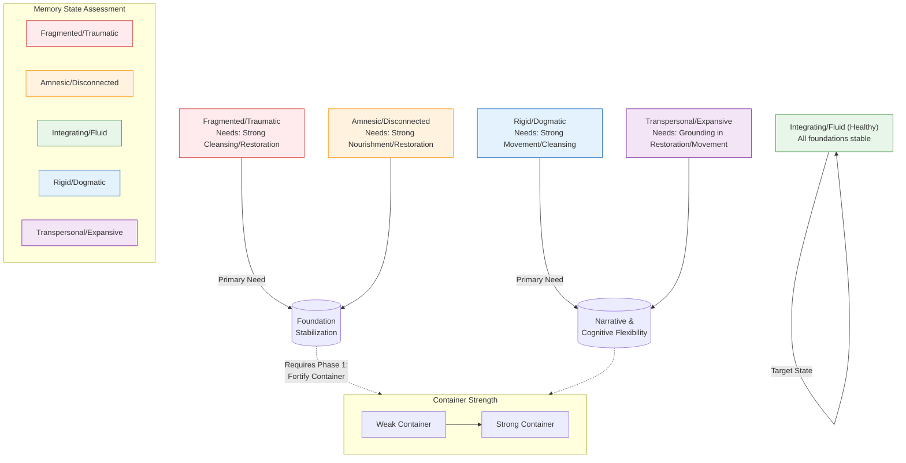
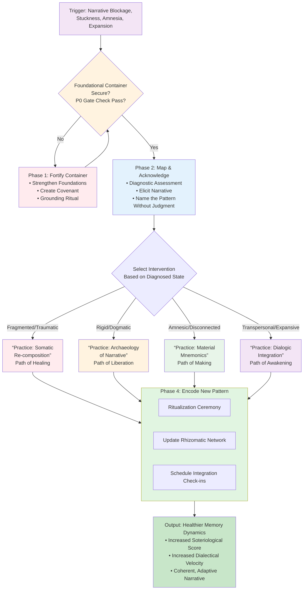
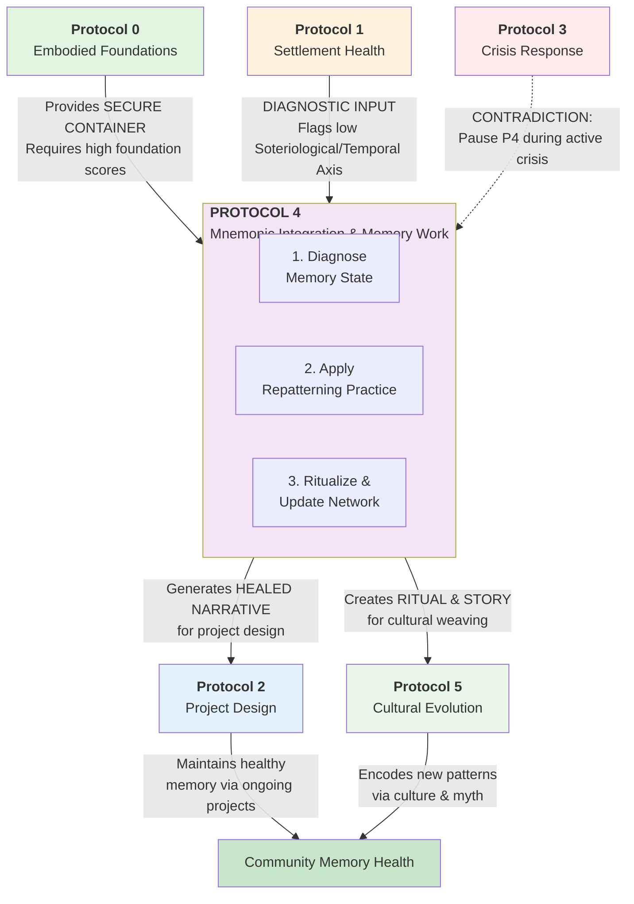

---
# AEO/AAE OPTIMIZATION METADATA
aeo_metadata:
  title: "Protocol 4: Mnemonic Integration & Memory Work"
  description: "A framework for diagnosing and transforming dysfunctional memory patterns within individuals and collectives, based on Analytic Idealist ontology. It treats memory as structural persistence in Mind at Large, offering pathways to heal fragmentation, rigidity, and amnesia to strengthen narrative identity and temporal wisdom."
  context: "A deep-structure protocol focusing on the Soteriological and Temporal axes. It is often activated after Protocol 1 identifies narrative or historical blockages, and requires the stable container provided by Protocol 0. Successful memory work provides material for Protocol 2 projects and Protocol 5 cultural evolution."
  key_objectives:
    - "Diagnose dysfunctional memory states (Fragmented, Rigid, Amnesic, Expansive) using embodied and narrative assessment tools."
    - "Provide a secure, foundationally-grounded container for potentially destabilizing memory work."
    - "Offer specific repatterning practices (e.g., Somatic Re-composition, Narrative Archaeology) tailored to each diagnosed state."
    - "Encode healed memory patterns into community culture through ritual and updates to the Rhizomatic Network."
    - "Integrate memory work within the Mandala framework, linking it to axis health and dialectical velocity."

  core_concepts:
    - "Memory as Structural Persistence in Mind at Large (MAL)"
    - "Memory State Diagnosis (Fragmented, Rigid, Amnesic, Integrating, Expansive)"
    - "The Foundational Container & Gate Check"
    - "Repatterning Practices (Somatic, Narrative, Material, Dialogic)"
    - "Ritualization & Rhizomatic Update"
    - "Memory work as Soteriological/Temporal Axis Healing"

  ontological_foundation: "Analytic Idealism & Process Philosophy"
  epistemic_stance: "Phenomenological Inquiry with Somatic Grounding"

  search_queries:
    - "memory work protocol analytic idealism"
    - "healing collective trauma community narrative"
    - "mnemonic integration solarpunk"
    - "Soteriological axis memory repair"
    - "Solarpunk Mandala protocol 4"
    - "ritual for historical healing"
    - "transpersonal memory integration"

  related_nodes:
    - "guides/protocols/00-embodied-foundations-audit.md"
    - "guides/protocols/01-settlement-health-assessment.md"
    - "framework/core-model/03-four-axes-of-transformation.md"
    - "framework/ontology/analytic-idealism-memory.md"
    - "practices/somatic-recomposition-guide.md"
    - "case-studies/river-of-stories-project.md"

  framework_status: "Stable Core Protocol"
  version: "2.1"
  last_reviewed: "2026-01-14"
  next_review: "2026-07-14"

  protocol_dependencies:
    prerequisite: "Protocol 0 (with high foundation scores, especially Cleansing/Restoration)"
    informs: "Protocol 2 (Project Design) and Protocol 5 (Cultural Evolution)"
    contraindicated: "During active Protocol 3 (Crisis)"

  therapeutic_note: "This is a community protocol, not a substitute for professional therapy. It operates at the intersection of personal healing and cultural repair."

  license: "Community-Supported Open Protocol"
  contributing_guidelines: "https://github.com/ravaioli/solarpunk-mandala/blob/main/CONTRIBUTING.md"
---
# Protocol 4: Mnemonic Integration & Memory Work
*Healing the Patterns of the Past to Weave the Fabric of Regenerative Futures*

> **Protocol Function**: Conscious Repatterning. This protocol provides a framework for diagnosing and transforming the persistent patterns of consciousness we call "memory"—within individuals and collectives. Moving beyond data storage, it treats memory as the living architecture of identity and culture, offering tools to heal fragmentation, soften rigidity, recover connection, and responsibly integrate transpersonal knowing.

---

## 1.0 Purpose & Ontological Grounding

### 1.1 Core Purpose
To provide a structured pathway for diagnosing and transforming dysfunctional memory dynamics (fragmentation, rigidity, amnesia) into sources of resilience, wisdom, and identity cohesion. This protocol enables individuals and communities to heal traumatic splits, liberate fossilized narratives, recover disconnected history, and integrate expansive recall—ultimately strengthening the Soteriological (self-meaning) and Temporal (time wisdom) axes of the Mandala.

### 1.2 Ontological Foundation: Memory in Analytic Idealism
Within the Solarpunk Mandala's Analytic Idealist framework, memory is **the structural persistence of mentation within Mind at Large (MAL)**. An individual's memory is not a passive recording but the ongoing, dynamic configuration of their dissociated segment of MAL. Collective and cultural memory is the shared patterning across a community of such segments. Therefore:
- **Memory work is conscious repatterning**, not data retrieval.
- **Trauma** is a deeply ingrained, maladaptive pattern that disrupts the healthy flow of consciousness.
- **Healing** involves gently introducing new information or context to allow the pattern to reconfigure into a more integrative, less painful form.
- The brain and cultural artifacts (books, rituals, landscapes) are the *extrinsic appearances* of these intrinsic mnemonic processes.

### 1.3 Protocol Position in the Mandala
This protocol operates at the intersection of the **Soteriological** (self-integration) and **Temporal** (deep time) axes. It is a deep-structure intervention that often follows foundational stability (**Protocol 0**), is informed by community health diagnostics (**Protocol 1**), and can be the focus of specific **Protocol 2** projects. It is **contraindicated during active crisis (Protocol 3)**.

## 2.0 Protocol Activation & Prerequisites

### 2.1 Activation Triggers
Initiate this protocol when memory-related patterns are identified as blockages to community or individual flourishing.

| Trigger | Indicators | Goal of Activation |
|---------|-------------|---------------------|
| **Narrative Blockage** | Community cannot agree on or articulate its origin story; personal biographies feel "stuck" or incoherent. | To create a coherent, unifying narrative that supports identity. |
| **Historical Stuckness** | Repetitive conflicts, inability to learn from past mistakes, or rigid adherence to "the way it's always been." | To liberate the present from maladaptive past patterns, increasing dialectical velocity. |
| **Cultural Amnesia** | Loss of traditional skills, ecological knowledge, or connection to place; feeling of being "untethered." | To actively recover and re-embed valuable knowledge and connection. |
| **Integration of Expansion** | Individuals or groups report dreams, visions, or intuitions that feel ancestral or transpersonal and seek grounding. | To integrate expansive experiences into a healthy, grounded sense of self/community. |

### 2.2 Foundational Container: The Essential Gate Check
Memory work can be destabilizing. A secure container is non-negotiable. **Do not proceed if thresholds are not met.**

| Foundation Domain | Personal Work Minimum | Collective Work Minimum | Rationale |
|-------------------|-----------------------|-------------------------|-----------|
| **Nourishment** | 2.5 | 3.0 | Provides the energetic stability to engage with difficult material. |
| **Cleansing** | 3.0 | 3.0 | Ensures reliable rituals for processing and releasing emotional charge. |
| **Restoration** | 3.0 | 3.5 | Critical for nervous system regulation before and after deep work. |
| **Movement** | 2.5 | 3.0 | Allows for the somatic expression and integration of memory. |

**Rule of Thumb**: For work on **Fragmented/Traumatic** memory, add +0.5 to all minimums. The container must be exceptionally strong.

### 2.3 Contraindications & Pauses
- **PAUSE** if the community is in **active Protocol 3 (Crisis Response)**.
- **PAUSE** if any participant's foundation scores drop below minimum during the process. Return to foundation support.
- **DO NOT INITIATE** to prove a historical "truth" or win a political argument. The goal is healing and integration, not debate.

## 3.0 Diagnostic Phase: Mapping the Memory Landscape

### 3.1 The Memory State Assessment
Use this table to diagnose the primary dysfunctional pattern. Most systems display a mix, but one is usually dominant.

| Memory State | Core Description | Manifestations in Community | Linked Mandala Contraction |
|--------------|------------------|-----------------------------|----------------------------|
| **Fragmented / Traumatic** | Memory is split, inaccessible, or intrudes violently. Coherent narrative is shattered. | Flashpoint conflicts over unhealed history; silences around certain topics; PTSD-like symptoms in group. | Soteriological Contraction (Fragmentation) |
| **Rigid / Dogmatic** | Memory is fossilized into a single, unquestioned story. Lacks adaptability and nuance. | "This is just how we do things"; rejection of new information; idealization of a founder or past era. | Epistemic Contraction (Dogmatic Fundamentalism) |
| **Amnesic / Disconnected** | Lack of connection to personal or cultural history. Feels untethered and rootless. | Loss of traditional skills; inability to answer "Who are we?"; constant reinvention without depth. | Ethical Contraction (context-less action) |
| **Integrating / Fluid (Healthy)** | Memory is accessible, can be reflected upon, and informs action without dictating it. | Ability to discuss past mistakes with nuance; rituals that adapt over time; intergenerational dialogue. | *Target State* |
| **Transpersonal / Expansive** | Access to memory-like content beyond personal biography (archetypal, ancestral, past-life). | Art and myth that taps deep wells; individuals reporting resonant "knowing"; synchronicities. | *Requires careful integration* |

### 3.2 Diagnostic Tools
**1. Narrative Elicitation Circle:**
- *Prompt:* "Tell the story of how we came to be here, as if to a curious child from the future."
- *Process:* Listen not just to the facts, but to the *emotions, pauses, and contradictions*. Map which parts are told with certainty, which with hesitation, which are omitted.

**2. Timeline Weaving Exercise:**
- Create a physical timeline (string on wall, large paper). Invite participants to place events (positive, traumatic, mundane).
- Observe: Are there large gaps (Amnesia)? Are events only from one perspective (Rigidity)? Is the timeline avoided or causes distress (Fragmentation)?

**3. Somatic Check-In:**
- When discussing the past, guide participants to notice body sensations. Tight chest? Numbness? Agitation? The body holds the pattern.

## 4.0 The Four-Phase Protocol Pathway

### 4.1 Phase 1: Fortify the Container (Boundary Medicine)
*If foundations are at minimum, start here. If they are strong, this is a brief dedicatory ritual.*

- **Action:** Conduct a dedicated **Protocol 0 Embodied Foundations Audit** for all participants. Create an explicit agreement (a "Container Covenant") covering confidentiality, the right to pause, and commitment to mutual care.
- **Ritual:** A simple grounding ritual to begin each session (e.g., shared breath, feeling feet on ground, naming one thing that feels safe).
- **Success:** All participants feel physically and psychologically safe enough to be vulnerable. Foundational scores are stable or improving.

### 4.2 Phase 2: Compassionate Mapping & Acknowledgement
*Goal: To see the pattern together without judgment, reducing shame and isolation.*

- **Practice: Reflective Listening Dyads.** One person shares a memory related to the diagnosed pattern. The listener's only role is to paraphrase back what they heard, ending with "Did I get it? Is there more?" No advice, no correction.
- **Facilitator Role:** To name the pattern from the Assessment Table. "What I'm hearing in our sharing sounds like the **Rigid/Dogmatic** pattern. The story feels very fixed. It's okay that it's here."
- **Output:** A shared, explicit understanding: "We have a fragmented memory around Event X." This shared acknowledgment is the first step of healing.

### 4.3 Phase 3: Selective Integration & Repatterning
*Targeted interventions based on the diagnosed Memory State.*

| Memory State | Primary Path | Core Practice | Guidance |
|--------------|--------------|---------------|----------|
| **Fragmented / Traumatic** | Path of Healing (*Cura*) | **Memory Re-composition (Somatic):** In a grounded state, gently approach the edge of a fragmented memory. Instead of reliving, invite the mind to introduce a resource (e.g., a present-day ally, a symbol of safety) *into the memory's felt sense*. Focus on shifting the **somatic pattern**, not the "facts." | Work slowly with a skilled facilitator. The goal is to reduce the autonomic charge, not create a "happy" memory. |
| **Rigid / Dogmatic** | Path of Liberation (*Liberação*) | **Archaeology of Narrative:** Deconstruct the dominant story. As a group, ask: 1) Who benefits from this single story? 2) What/who is excluded? 3) Can we find three pieces of evidence that contradict it? Document findings in the community's Rhizomatic Network. | The goal is to create cognitive flexibility and epistemic humility, not to replace one dogma with another. |
| **Amnesic / Disconnected** | Path of Making (*Capacitação*) | **Material Mnemonics:** Collaboratively build or restore a physical memory-holder. This could be: a community archive, a heritage garden with ancestral crops, a mural depicting lost history. The *process of making* is the vehicle for remembering. | The artifact is secondary to the relationships and recovered knowledge formed while creating it. |
| **Transpersonal / Expansive** | Path of Awakening (*Conscientização*) | **Dialogic Integration:** Record the expansive content (dream, vision, intuition). Then, engage it in a written dialogue. Ask it practical questions: "What are you here to teach me? How do you want to be expressed in my daily life?" Weave the insights into art or ritual. | Ground, ground, ground. The value is in its transformative effect on the present, not in claims of objective historical truth. Maintain epistemic humility. |

### 4.4 Phase 4: Ritualization & Rhizomatic Update
*To encode the new pattern into individual neurology and collective culture.*

1.  **Design a Closure Ritual:** Create a simple ceremony to mark the shift. Examples: Burying a written copy of the old story, planting a tree for the new narrative, a shared meal with storytelling.
2.  **Update the Rhizomatic Network:** Log the process in the community's knowledge system.
    - *Tag:* `CULTURE`, `MEMORY`, `[Diagnosed State e.g., FRAGMENTED]`
    - *Entry:* "We identified a fragmented pattern around [Event]. We used [Practice]. The new, more integrated narrative is: [Brief summary]. Key learnings: [Insights]."
3.  **Schedule Integration Check-Ins:** Plan to revisit the topic in one lunar cycle and again in one season. Has the new pattern held? Have foundations remained stable?

## 5.0 Case Study: The "River of Stories" Project

**Context:** A land-based community in the Pacific Northwest was stuck in conflict between founding families ("Old Guard") and newer members ("New Flow"). The **Rigid/Dogmatic** memory state dominated: a single, heroic story of the founders that excluded early struggles and marginalized contributors. Dialectical velocity was low.

**Application:**
- **Diagnosis:** Narrative Elicitation revealed the monolithic story. The Timeline Exercise showed no events from the first five years besides "community founded."
- **Phase 3 Intervention (Archaeology of Narrative):** A small group was tasked with "excavating" the hidden first five years. They interviewed shy early members, read old meeting notes, and discovered a period of near-collapse, mutual aid, and key contributions from people now sidelined.
- **Rhizomatic Update:** They created a new, multi-voiced "River of Stories" digital map in the network, with tributaries for different perspectives.
- **Ritualization:** At a solstice gathering, the "Old Guard" publicly shared the previously hidden struggles. The "New Flow" shared their hopes. Water from different members' cups was poured into a common river stone basin.

**Outcome:** The rigid narrative softened into a complex, truthful, and more resilient story of struggle and adaptation. The **Soteriological Axis** score (coherent narrative) rose significantly. The conflict transformed into a creative dialogue about how to honor the *full* history, not just a myth. The memory work became a **Protocol 2 Project** to maintain the living archive.

## 6.0 Facilitator Guidance & Ethical Considerations

### 6.1 The Facilitator as Container Gardener
Your primary role is not to "fix" memories but to **hold a safe, compassionate space** where repatterning can occur naturally. Your own foundation scores and nervous system regulation are your primary tools.

### 6.2 Key Skills & Stances
- **Non-Judgmental Presence:** Avoid labeling memories as "good" or "bad." Frame them as "patterns that were once adaptive and may now need updating."
- **Somatic Awareness:** Learn to read body language—when to gently encourage exploration and when to guide back to safety and the present moment.
- **Epistemic Humility:** Especially with transpersonal material, hold space for experience without validating unverifiable historical claims. Focus on meaning and integration.

### 6.3 Ethical Red Lines
1.  **No Coercion:** Participation must be fully voluntary. The right to pass on any exercise is absolute.
2.  **Not Therapy:** While therapeutic, this is a community protocol. For deep personal trauma, recommend working with a professional therapist *in parallel*, not as a substitute.
3.  **Consent for Collective Work:** Before updating a shared narrative in the Rhizomatic Network, gain explicit consent from those whose stories are involved.

## 7.0 MAL Reflection: Memory as a Portal

*Guiding questions for integration circles:*

1.  **Beyond the Personal:** If all memory is patterning within MAL, then when we heal a fragmented personal memory, are we also smoothing a ripple in a larger field of consciousness? What does it mean to do this work as a service to something greater than ourselves?
2.  **The Illusion of Separate Past:** In MAL, all time is present. When we work with "the past," are we actually working on a *present pattern of constriction*? How does this shift your relationship to "what happened"?
3.  **Memory as Love:** Can remembering—truly, fully, and compassionately—be an act of love towards the past iterations of MAL that experienced those events? How does bringing kindness to a painful memory change it?

## 8.0 Protocol Integration Matrix

| Protocol | Relationship to Protocol 4 | Integration Flow |
|----------|---------------------------|------------------|
| **Protocol 0** | **Absolute Prerequisite.** Provides the container stability. | Conduct P0 audit before initiating P4. Monitor foundations throughout. |
| **Protocol 1** | **Diagnostic Informant.** Low Soteriological/Temporal axis scores often point to memory work needs. | Use P1 to identify the need; use P4 to address it; then re-measure P1 axes. |
| **Protocol 2** | **Project Partner.** Memory work often becomes a formal project (e.g., archive building, oral history series). | P4 defines the "what" and "why"; P2 designs the "how" as a sustained project. |
| **Protocol 3** | **Contraindication.** Active crisis overwhelms the container needed for memory work. | Use P3 to stabilize crisis; later, use P4 to heal the memory patterns the crisis revealed or created. |
| **Protocol 4** | **Self (This Protocol).** | |
| **Protocol 5** | **Cultural Output.** Healed and integrated memories become the myths, art, and rituals of the community. | P4 generates the raw material of coherent story; P5 weaves it into the living culture. |

---
