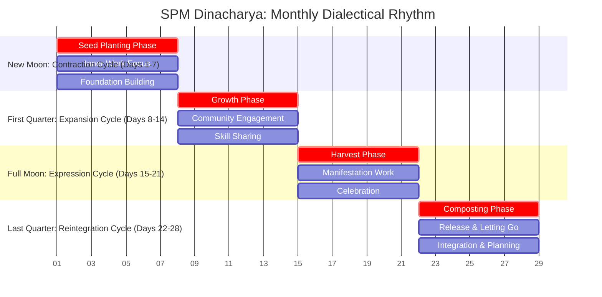

# Solarpunk Mandala Dinacharya Protocol
*A daily practice for cultivating symbiotic consciousness through Solarpunk Mandala principles*

**Protocol ID:** `SPM-PROTOCOL-05`  
**Type:** Personal/Community Integration Protocol  
**Location:** `guides/protocols/05-dinacharya-daily-rhythms.md`  
**Version:** 1.0  
**Last Updated:** 2025-12-29  

---

## 🎯 Protocol Intentions

### Primary Objectives:
1. **Consciousness Integration**: Bridge Analytic Idealism with daily experience
2. **Systems Awareness**: Cultivate nested systems perception
3. **Ethical Embodiment**: Live the Four Axes in real-time decisions
4. **Dialectical Flow**: Move gracefully through change phases
5. **Meta-Narrative Navigation**: Discern Necrocene vs Symbiotic patterns

### Expected Outcomes:
- Increased personal coherence and resilience
- Enhanced systems thinking capacity
- Natural alignment with symbiotic ethics
- Improved navigation of complexity
- Deeper community and bioregional connection

---

## 🔄 Protocol Structure: Four Dialectical Phases

### Phase 1: Crystallization (Morning: 4:00-9:00)
**Focus:** Intention setting, foundation building  
**Core Practice:** Consciousness-first awareness, Four Axes alignment

### Phase 2: Expression (Midday: 9:00-16:00)
**Focus:** Manifestation, community engagement  
**Core Practice:** Systems application, cybernetic feedback

### Phase 3: Liquefaction (Evening: 16:00-22:00)
**Focus:** Release, reflection, connection  
**Core Practice:** Pattern recognition, resource redistribution

### Phase 4: Reintegration (Night: 22:00-4:00)
**Focus:** Integration, dreaming, unconscious processing  
**Core Practice:** Mandala completion, dream incubation

---

## 📝 Detailed Protocol Steps

```mermaid
gantt
    title SPM Dinacharya: Daily Core Flow
    dateFormat HH:mm
    axisFormat %H:%M
    
    section Crystallization (4:00-9:00)
    Consciousness-First Meditation :04:00, 1h
    Four Axes Alignment :05:00, 1h
    Systems Connection :06:00, 1h
    Mandala Setup :07:00, 2h
    
    section Expression (9:00-16:00)
    Cybernetic Work Cycles :09:00, 6h
    Dialectical Check-ins :09:00, 7h
    
    section Liquefaction (16:00-22:00)
    Pattern Release :16:00, 1h
    Resource Assessment :17:00, 1h
    Symbiotic Connection :19:00, 2h
    
    section Reintegration (22:00-4:00)
    Day Integration :22:00, 1h
    Dream Incubation :23:00, 1h
    Sacred Sleep :00:00, 4h
```



### 🌅 Phase 1: Morning Crystallization (4:00-9:00)

#### Step 1: Pre-Dawn Awareness (4:00-5:00)
**Activity:** Analytic Idealism Meditation  
**Focus:** "I am not a body with consciousness, but consciousness experiencing a body"  
**Duration:** 20-30 minutes  
**SPM Integration:** Direct application of `01-ontology-analytic-idealism.md`

**Instructions:**
1. Sit in darkness/semi-darkness
2. Notice thoughts/sensations as objects within consciousness
3. Ask: "What remains when all sensations, thoughts, and emotions are observed as objects?"
4. Rest as the awareness that witnesses all phenomena

#### Step 2: Four Axes Alignment (5:00-6:00)
**Activity:** Ethical Axis Embodiment  
**Duration:** 20 minutes (5 minutes per axis)

1. **Contraction** (5 min): Feel inward pull, set intention for inner work
2. **Expansion** (5 min): Sense outward energy, set intention for contribution
3. **Coherence** (5 min): Notice alignment, set intention for integrity
4. **Radiance** (5 min): Feel generosity, set intention for sharing

**SPM Integration:** From `03-ethics-four-axes.md`

#### Step 3: Systems Connection (6:00-7:00)
**Activity:** Nested Systems Visualization  
**Duration:** 15 minutes

**Visualization Sequence:**
- Body → Home → Street → Bioregion → Continent → Planet → Solar System
- Notice feedback loops between levels
- Feel interconnectedness as lived experience

**SPM Integration:** GST application from `00-meta-framework-systems-cybernetics.md`

#### Step 4: Daily Mandala Setup (7:00-9:00)
**Activity:** Tesseract Day Mapping  
**Duration:** 5-10 minutes

**Instructions:**
1. Visualize the 4D tesseract unfolding
2. Place today's activities in different facets
3. Note: Which facets will be activated? Which need attention?
4. Set intention for geometric awareness throughout day

**SPM Integration:** From `02-epistemic-architecture-tesseract.md`

### ☀️ Phase 2: Midday Expression (9:00-16:00)

#### Step 1: Work Cycle Setup (Each 2-hour block)
**Activity:** Cybernetic Task Meditation  
**Duration:** 2 minutes before/after each task

**Before task:**
- Set intention and expected feedback indicators
- Note: What would success look/feel like?

**During task:**
- Notice micro-feedback (body sensations, emotional responses, emerging patterns)

**After task:**
- Compare expected vs actual feedback
- Adjust next iteration based on learning

**SPM Integration:** From `10-cybernetic-foundations.md`

#### Step 2: Dialectical Check-ins (Every 90 minutes)
**Activity:** Phase Recognition  
**Duration:** 1-2 minutes each check

**Check Schedule:**
1. **Crystallization Check** (9:00): "What's forming? What clarity emerges?"
2. **Expression Check** (10:30): "What's manifesting? How is energy flowing?"
3. **Liquefaction Check** (12:00): "What's dissolving? What needs releasing?"
4. **Reintegration Check** (13:30): "What's integrating? What's being synthesized?"

**SPM Integration:** From `04-temporal-unfolding-dialectical-phases.md`

#### Step 3: Meta-Narrative Filtering (Decision points)
**Activity:** Paradigm Awareness Practice  
**Duration:** 30 seconds per decision

**Before meetings/decisions:**
- Ask: "Is this action Necrocene or Symbiotic?"
- Notice extractive thoughts (ownership, separation) vs regenerative (connection, abundance)
- Practice "consciousness alchemy": Transform one Necrocene impulse into Symbiotic action daily

**SPM Integration:** Bridging both `meta-narratives/` directories

#### Step 4: Multiple Intelligences Engagement (13:00-13:15)
**Activity:** Whole-Being Mindfulness  
**Duration:** 15 minutes

**Weekly Rotation:**
- **Monday**: Somatic (body awareness scan)
- **Tuesday**: Emotional (heart-centered meditation)
- **Wednesday**: Cognitive (thought pattern observation)
- **Thursday**: Social (relationship dynamics awareness)
- **Friday**: Ecological (environmental connection)
- **Saturday**: Intuitive (gut feelings, synchronicities)
- **Sunday**: Spiritual (transpersonal awareness)

**SPM Integration:** From `08-multiple-intelligences-framework.md`

### 🌇 Phase 3: Evening Liquefaction (16:00-22:00)

#### Step 1: Pattern Recognition (16:00-17:00)
**Activity:** Daily Pattern Audit  
**Duration:** 10-15 minutes

**Journal Prompts:**
1. What Necrocene patterns emerged today?
2. What Symbiotic moments occurred?
3. How balanced were the Four Axes in my actions?
4. What feedback loops completed successfully?

**SPM Integration:** Using `tools/necrocene-decoupling-protocol.md`

#### Step 2: Resource Flow Assessment (17:00-18:00)
**Activity:** Consumption/Contribution Balance  
**Duration:** 5-10 minutes

**Questions to Ask:**
- What resources did I consume today? (Energy, time, materials, attention)
- What did I contribute? (Skills, support, resources, energy)
- What needs redistribution? (Excess to share, needs to acknowledge)
- How circular were my resource flows?

**SPM Integration:** From `framework/meta-narratives/symbiotic-commonwealth/commons-strategy.md`

#### Step 3: Symbiotic Connection (19:00-21:00)
**Activity:** Dialogic Engagement Practice  
**Duration:** Variable (one meaningful interaction)

**Practice Guidelines:**
- Listen without preparing response
- Notice when listening to respond vs understand
- Practice "listening for the system" — what wants to emerge through this conversation?
- Focus on connection quality over quantity

**SPM Integration:** From `framework/meta-narratives/symbiotic-commonwealth/dialogic.md`

#### Step 4: Material Intelligence Practice (21:00-21:30)
**Activity:** Matter-as-Participant Awareness  
**Duration:** 10-15 minutes

**Instructions:**
1. Hold an object (stone, plant, tool)
2. Sense its "knowing" through texture, temperature, weight
3. Contemplate: "This object is made of star-dust experiencing itself through form"
4. Feel how matter communicates through presence

**SPM Integration:** Directly from `07-material-intelligence-framework.md`

### 🌌 Phase 4: Night Reintegration (22:00-4:00)

#### Step 1: Day Integration (22:00-23:00)
**Activity:** Mandala Completion  
**Duration:** 10-15 minutes

**Visualization:**
1. Recall today's experiences as colors/patterns
2. Watch them arrange into a mandala of learning
3. Notice what's at center, what's at periphery
4. Offer gratitude for the completed cycle

**SPM Integration:** From `05-mandala-axis-four-pathways.md`

#### Step 2: Dream Incubation (23:00-pre-dawn)
**Activity:** Conscious Unconscious Dialogue  
**Duration:** 5 minutes before sleep

**Process:**
1. Review day's key themes through Four Axes lens
2. Formulate one question for unconscious processing
3. Visualize tesseract folding into dream space
4. Set intention: "May my dreams integrate today's learning"

**SPM Integration:** Dream as dialectical process from `04-temporal-unfolding-dialectical-phases.md`

#### Step 3: Lucid Awareness Practice (Sleep transitions)
**Activity:** Consciousness Continuity  
**Duration:** Moments upon waking

**Practice:**
- When waking between sleep cycles: "I am the dreamer"
- Notice shift from dream consciousness to waking consciousness
- Practice "conscious sleeping": Awareness resting in awareness
- Maintain thread of consciousness through sleep states

**SPM Integration:** Analytic Idealism applied to sleep states

---

## 🛠️ SPM Tools Integration

### Daily Assessment Tools:
| Time | Tool | Purpose | Integration Point |
|------|------|---------|------------------|
| Morning | Alpha Coefficient self-check | Foundation stability | `tools/assessments/alpha-coefficient-calculator/` |
| Midday | Dialectical Velocity metric | Transformation tracking | `tools/assessments/dialectical-velocity-metric/` |
| Evening | Embodied Foundations Audit | Somatic integration | `guides/protocols/00-embodied-foundations-audit.md` |
| Weekly | Settlement Health Assessment | Community vitality | `guides/protocols/01-settlement-health-assessment.md` |

### Weekly Specializations:
- **Monday**: Contraction Day - Deep inner awareness, use `tools/embodied-foundation-assessor.md`
- **Tuesday**: Expansion Day - Loving-kindness practice, apply `tools/ekistics-bioregional-supply-chain.md` mentally
- **Wednesday**: Coherence Day - Alignment meditation, use `tools/symmathesy-conflict-diagnostic.md` for internal conflicts
- **Thursday**: Radiance Day - Generosity practice, apply `tools/necrocene-decoupling-protocol.md` to selfish patterns
- **Friday**: Systems Day - Interconnection visualization, mentally map using `framework/arena/hexagonal-mapping.md`
- **Saturday**: Dialectical Day - Phase awareness, use `tools/assessments/dialectical-velocity-metric/`
- **Sunday**: Meta-Narrative Day - Paradigm witnessing, apply `appendices/F-meta-narrative-mapping.md`

```mermaid
gantt
    title SPM Dinacharya: Weekly Integration Cycle
    dateFormat HH:mm
    axisFormat %H:%M
    excludes weekends
    
    section Monday: Contraction Day
    Alpha Coefficient Check :crit, m1, 04:15, 15m
    Deep Inner Awareness :04:30, 1.5h
    Embodied Foundation Assessor :06:00, 30m
    Contraction Focus Tasks :09:00, 6h
    Evening Reflection (Inward) :19:00, 1h
    
    section Tuesday: Expansion Day
    Loving-Kindness Meditation :crit, t1, 04:30, 1h
    Bioregional Awareness :05:30, 30m
    Community Connection Planning :06:00, 1h
    Expansion Focus Tasks :09:00, 6h
    Evening Sharing Ritual :19:00, 1h
    
    section Wednesday: Coherence Day
    Alignment Meditation :crit, w1, 04:30, 1h
    Four Axes Balance Check :05:30, 30m
    Conflict Diagnostic Prep :06:00, 1h
    Coherence Focus Tasks :09:00, 6h
    Integration Review :19:00, 1h
    
    section Thursday: Radiance Day
    Generosity Practice :crit, th1, 04:30, 1h
    Resource Inventory :05:30, 30m
    Necrocene Decoupling Check :06:00, 1h
    Radiance Focus Tasks :09:00, 6h
    Contribution Celebration :19:00, 1h
    
    section Friday: Systems Day
    Systems Visualization :crit, f1, 04:30, 1h
    Hexagonal Mapping Practice :05:30, 30m
    Network Analysis :06:00, 1h
    Systems Focus Tasks :09:00, 6h
    Community Feedback Loop :19:00, 1h
    
    section Saturday: Dialectical Day
    Phase Transition Practice :crit, sa1, 04:30, 1h
    Velocity Metric Assessment :05:30, 30m
    Weekly Pattern Analysis :06:00, 1h
    Project Phase Work :09:00, 6h
    Weekend Integration :19:00, 1h
    
    section Sunday: Meta-Narrative Day
    Paradigm Witnessing :crit, su1, 04:30, 1h
    Narrative Mapping :05:30, 30m
    Weekly Synthesis :06:00, 1h
    Rest & Visioning :09:00, 6h
    Next Week Planning :19:00, 1h
```



### Monthly Deep Practices:
1. **First Weekend**: Complete full Mandala Project Generator session (`knowledge_base/templates/mandala-project-generator.md`)
2. **Third Weekend**: Apply Universal Case Study Template (`tools/universal-case-study-template.md`)
3. **Month End**: Use Compatible Frameworks Matrix (`framework/core-model/09-compatible-frameworks-matrix.md`)



### Seasonal Alignments:
- **Spring** (Mar-May): Crystallization focus - new beginnings, planting seeds
- **Summer** (Jun-Aug): Expression focus - growth, expansion, community engagement
- **Autumn** (Sep-Nov): Liquefaction focus - harvest, release, composting
- **Winter** (Dec-Feb): Reintegration focus - rest, dreaming, planning

---

## 📊 Adaptation Framework

### Personalization Guidelines:
**Week-by-Week Implementation:**
- **Week 1**: Focus only on morning crystallization practices (Phase 1)
- **Week 2**: Add evening reflection and integration practices (Phase 3)
- **Week 3**: Introduce midday systems check-ins (Phase 2)
- **Week 4**: Integrate all four phases, adjust timing based on personal feedback
- **Week 5+**: Refine practices based on what resonates, create personal variations

**Time Adaptation:**
- **Time-constrained version**: Focus on key practices:
  - Morning: 5-minute Four Axes alignment
  - Midday: One 90-second dialectical check-in
  - Evening: 3-minute pattern recognition
  - Night: 1-minute gratitude before sleep
- **Extended version**: Add supplementary practices:
  - Additional meditation sessions
  - Detailed systems mapping
  - Extended community engagement
  - Deep dream journaling

**Energy-Based Adaptation:**
- **High-energy days**: Lean into expansion and radiance practices
- **Low-energy days**: Focus on contraction and coherence practices
- **Balanced days**: Maintain equal attention to all four axes
### For Different Temperaments:
| Temperament | Primary Focus | Adaptation Suggestions | SPM Integration |
|-------------|---------------|------------------------|-----------------|
| **Introverts** | Contraction & Coherence | Extend morning quiet time, create solo integration spaces, focus on inner systems mapping | Emphasize `01-ontology-analytic-idealism.md` and `03-ethics-four-axes.md` (Contraction/Coherence) |
| **Extroverts** | Expansion & Radiance | Build community connection rituals, emphasize dialogue practices, create group accountability | Focus on `framework/meta-narratives/symbiotic-commonwealth/dialogic.md` and resource sharing practices |
| **Thinkers** | Systems & Cybernetics | Deepen midday applications, create detailed feedback loops, map system interactions | Use `tools/symmathesy-conflict-diagnostic.md` and `10-cybernetic-foundations.md` extensively |
| **Feelers** | Connection & Empathy | Emphasize evening connection practices, develop relational awareness, focus on heart-centered practices | Integrate `08-multiple-intelligences-framework.md` (emotional intelligence) and dialogic listening |

**Additional Temperament Considerations:**
- **Artists/Creatives**: Incorporate mandala drawing, creative visualization, symbolic dream work
- **Analysts/Planners**: Use tesseract mapping, dialectical phase charts, systematic tracking
- **Activists/Organizers**: Focus on meta-narrative filtering, community protocols, resource flow optimization
- **Healers/Caretakers**: Emphasize embodied foundations, multiple intelligences, compassionate awareness

### For Groups & Communities:
**Shared Practice Structures:**
- **Collective Morning Check-ins**: 15-minute shared intention setting (virtual or in-person)
- **Midday Pulse Checks**: Group messaging or brief check-ins at dialectical transition points
- **Evening Integration Circles**: Weekly sharing of insights and patterns
- **Community Resource Boards**: Physical or digital space for sharing skills, tools, and needs

**Community Protocol Adaptations:**
1. **Designate Roles**: 
   - Phase facilitators (morning, midday, evening coordinators)
   - Resource stewards (track and redistribute community assets)
   - Pattern observers (notice and share systemic insights)

2. **Create Shared Rituals**:
   - Weekly mandala creation (collective art project)
   - Monthly dialectical review (assess community phase transitions)
   - Seasonal celebrations aligned with SPM principles

3. **Develop Feedback Systems**:
   - Anonymous feedback channels for protocol adjustments
   - Regular community reflection sessions
   - Collective decision-making on practice adaptations

4. **Scale Considerations**:
   - **Small groups (2-10)**: Intimate sharing circles, personalized adaptations
   - **Medium communities (10-50)**: Structured check-ins, subgroup formations
   - **Large networks (50+)**: Distributed facilitation, digital coordination tools
---

## 📓 Journaling & Documentation

### Daily Journal Template:
```markdown
## [Date] | [Season: e.g., Late Winter] | [Moon Phase: e.g., Waxing Crescent]

### 🌅 Morning Crystallization (4:00-9:00)
**Four Axes Alignment:**
- Contraction Intention: [e.g., "Deepen inner awareness"]
- Expansion Intention: [e.g., "Contribute to community garden"]
- Coherence Intention: [e.g., "Align actions with values"]
- Radiance Intention: [e.g., "Share one insight openly"]

**Tesseract Facets to Activate:**
- [ ] Consciousness/Being
- [ ] Systems/Relations
- [ ] Ethics/Values  
- [ ] Time/Process
- [ ] Space/Place
- [ ] Matter/Form
- [ ] Energy/Flow
- [ ] Information/Pattern

### ☀️ Midday Expression (9:00-16:00)
**Dialectical Check-ins:**
- 9:00 (Crystallization): [Observation]
- 10:30 (Expression): [Observation]  
- 12:00 (Liquefaction): [Observation]
- 13:30 (Reintegration): [Observation]

**Meta-Narrative Filtering:**
- Necrocene patterns noticed: [e.g., "Urgency without purpose"]
- Symbiotic moments created: [e.g., "Shared tool with neighbor"]

**Cybernetics Feedback:**
- Expected outcomes: [List]
- Actual outcomes: [List]
- Adjustments for next cycle: [List]

### 🌇 Evening Liquefaction (16:00-22:00)
**Pattern Recognition:**
- Four Axes Balance Assessment:
  - Contraction: [1-10 rating]
  - Expansion: [1-10 rating]
  - Coherence: [1-10 rating]
  - Radiance: [1-10 rating]

**Resource Flow Audit:**
- Consumed: [Energy, time, materials, attention]
- Contributed: [Skills, support, resources, energy]
- Redistribution needed: [List]

**Dialogic Connections:**
- Quality conversations: [Number and themes]
- Listening vs responding ratio: [Estimate]
- System insights gained: [List]

### 🌌 Night Reintegration (22:00-4:00)
**Mandala Completion:**
- Central theme of day: [Word or phrase]
- Peripheral elements: [List]
- Gratitude offerings: [List]

**Dream Incubation:**
- Question for unconscious: [Write question]
- Intention set: [Yes/No]

**Sleep Quality:**
- Awakenings: [Number]
- Dream recall: [Brief description]
- Morning energy: [1-10 rating]

### 🔄 SPM Tools Used:
- [ ] Alpha Coefficient check
- [ ] Dialectical Velocity assessment  
- [ ] Embodied Foundations audit
- [ ] Other: [List]

### 🌱 One Regenerative Action Tomorrow:
[Specific, actionable commitment]
```

### Weekly Integration Template:
```markdown
# Weekly Integration: [Week of Date] to [Date]

## Consciousness Expansion
**Key Awareness Shifts:**
- Monday: [Insight]
- Tuesday: [Insight]
- Wednesday: [Insight]
- Thursday: [Insight]
- Friday: [Insight]
- Saturday: [Insight]
- Sunday: [Insight]

**Consciousness-First Moments:**
[Times when "awareness of awareness" was particularly clear]

## Systems Insights
**Patterns Noticed:**
- Personal systems: [e.g., "Energy peaks at 10am"]
- Relationship systems: [e.g., "Conflict follows communication gaps"]
- Community systems: [e.g., "Resource sharing increases on Fridays"]
- Ecological systems: [e.g., "Bird activity correlates with weather"]

**Feedback Loop Completions:**
1. [Description of loop and outcome]
2. [Description of loop and outcome]
3. [Description of loop and outcome]

## Ethical Development
**Four Axes Weekly Balance:**
- Contraction total: [Sum of daily ratings]
- Expansion total: [Sum of daily ratings]
- Coherence total: [Sum of daily ratings]
- Radiance total: [Sum of daily ratings]
- **Balance ratio:** [Calculate: (Lowest score/Highest score) × 100]%

**Meta-Narrative Progress:**
- Necrocene patterns reduced: [List]
- Symbiotic patterns increased: [List]
- Consciousness alchemy successes: [Describe transformations]

## Dialectical Movement
**Dominant Phase this Week:**
- Primary: [Crystallization/Expression/Liquefaction/Reintegration]
- Secondary: [Crystallization/Expression/Liquefaction/Reintegration]

**Phase Transition Moments:**
[Notable shifts between phases with dates/times]

**Stuck Points & Breakthroughs:**
- Where I got stuck: [Describe]
- How I moved through: [Describe]

## Resource Economy
**Consumption vs Contribution:**
- Total consumed: [Estimate in hours/units]
- Total contributed: [Estimate in hours/units]
- **Net balance:** [Contribution - Consumption]

**Circularity Assessment:**
- Linear flows identified: [List]
- Circular flows created: [List]
- Waste/leakage points: [List]

## Multiple Intelligences Engagement
**Most Activated This Week:**
1. [Intelligence type]
2. [Intelligence type]
3. [Intelligence type]

**Least Activated This Week:**
1. [Intelligence type]
2. [Intelligence type]
3. [Intelligence type]

## Next Week's Focus
**Primary Intention:** [One sentence]
**Specific Practice to Deepen:** [e.g., "Morning tesseract visualization"]
**Community Connection Goal:** [e.g., "Initiate one dialogic conversation"]
**Experiment to Try:** [e.g., "Adjust evening ritual timing"]

## Weekly Alpha Coefficient
**Foundation Stability Score:** [1-100]
**Factors affecting score:** [List]
**Action to improve:** [One specific action]
```

### Monthly Assessment Worksheet:
```markdown
# Monthly Assessment: [Month, Year]

## 1. Tesseract Geometry Mapping
**Place month's experiences on 4D facets:**

**Facet 1: Consciousness/Being**
- Key experiences: [List]
- Growth observed: [Describe]
- Integration needed: [List]

**Facet 2: Systems/Relations**
- Key experiences: [List]
- Patterns identified: [Describe]
- Optimization opportunities: [List]

**Facet 3: Ethics/Values**
- Key experiences: [List]
- Alignment assessment: [Describe]
- Adjustments needed: [List]

**Facet 4: Time/Process**
- Key experiences: [List]
- Phase rhythm: [Describe]
- Timing optimizations: [List]

**Facet 5: Space/Place**
- Key experiences: [List]
- Environmental impacts: [Describe]
- Place-based improvements: [List]

**Facet 6: Matter/Form**
- Key experiences: [List]
- Material intelligence: [Describe]
- Physical optimizations: [List]

**Facet 7: Energy/Flow**
- Key experiences: [List]
- Energy patterns: [Describe]
- Flow improvements: [List]

**Facet 8: Information/Pattern**
- Key experiences: [List]
- Learning integration: [Describe]
- Knowledge sharing: [List]

## 2. Four Axes Quarterly Assessment
**Contraction (Depth/Inner Work):**
- Monthly average: [1-10]
- Peak moments: [Describe]
- Growth areas: [List]
- Next month's focus: [Specific practice]

**Expansion (Reach/Contribution):**
- Monthly average: [1-10]
- Peak moments: [Describe]
- Growth areas: [List]
- Next month's focus: [Specific practice]

**Coherence (Alignment/Integrity):**
- Monthly average: [1-10]
- Peak moments: [Describe]
- Growth areas: [List]
- Next month's focus: [Specific practice]

**Radiance (Generosity/Sharing):**
- Monthly average: [1-10]
- Peak moments: [Describe]
- Growth areas: [List]
- Next month's focus: [Specific practice]

**Overall Balance Score:** [Calculate: (Sum of averages)/4]
**Axis Needing Most Attention:** [Identify based on lowest score]

## 3. Alpha Coefficient Calculation
**Personal Foundation Stability:**
- Physical foundation: [1-25]
- Emotional foundation: [1-25]
- Mental foundation: [1-25]
- Spiritual foundation: [1-25]
- **Total Alpha Coefficient:** [Sum of above, 4-100]

**Trend Analysis:**
- Previous month: [Score]
- Change: [+/- points]
- Primary factors in change: [List]

## 4. Community Contribution Metrics
**Hours/Energy Contributed:**
- Direct service: [Hours]
- Skill sharing: [Hours]
- Resource provision: [Estimated value]
- Emotional support: [Hours]
- **Total Contribution Score:** [Weighted sum]

**Impact Assessment:**
- Lives directly touched: [Number]
- Systems improved: [List]
- Ripple effects observed: [Describe]

## 5. Dialectical Phase Analysis
**Monthly Phase Distribution:**
- Crystallization days: [Number]
- Expression days: [Number]
- Liquefaction days: [Number]
- Reintegration days: [Number]

**Phase Transition Efficiency:**
- Smooth transitions: [Examples]
- Stuck points: [Examples]
- Average transition time: [Estimate]

## 6. Meta-Narrative Progress
**Necrocene Decoupling:**
- Patterns released: [List]
- Residual attachments: [List]
- Decoupling rate: [Estimate %]

**Symbiotic Embodiment:**
- New patterns adopted: [List]
- Integration level: [1-10]
- Embodiment rate: [Estimate %]

## 7. Experiment Results
**Previous Month's Experiment:**
- Hypothesis: [State]
- Method: [Describe]
- Results: [Data and observations]
- Conclusion: [Learnings]

## 8. Next Month's Design
**Primary Experiment:**
- Question: [Formulate]
- Method: [Design]
- Metrics: [What to measure]
- Duration: [Timeframe]

**Focus Areas:**
1. [Primary focus with why]
2. [Secondary focus with why]
3. [Tertiary focus with why]

**Resource Allocation:**
- Time commitment: [Hours/week]
- Energy investment: [High/Medium/Low]
- Support needed: [List from community]

## 9. Gratitude & Celebration
**Wins to Acknowledge:**
- Personal: [List]
- Relational: [List]
- Community: [List]
- Planetary: [List]

**Growth Milestones:**
- Consciousness: [Describe]
- Skill: [Describe]
- Connection: [Describe]
- Contribution: [Describe]

## 10. Integration Ritual
**Closing the Month:**
- Symbolic action: [Describe ritual]
- Release: [What to let go]
- Intention for next month: [One phrase]
- Offering to community: [Specific commitment]
```

---

## ⚠️ Common Challenges & Solutions

### Time Colonization:
**Symptom:** Feeling "productive" as primary metric, clock-watching anxiety  
**Solution:** Return to dialectical phases, not clock time  
**Practice:** Set intentions by phase, not hour; honor natural energy rhythms

### Extractive Energy Patterns:
**Symptom:** Pushing through fatigue, caffeine dependency, digital overload  
**Solution:** Listen to somatic intelligence, respect energy cycles  
**Practice:** Scheduled tech sabbaths, digital sunsets, conscious rest periods

### Separative Consciousness:
**Symptom:** Feeling isolated, competitive, disconnected from community  
**Solution:** Systems awareness practice, community connection rituals  
**Practice:** Daily check-in with at least one person, resource sharing

### Spiritual Bypassing:
**Symptom:** Using "it's all consciousness" to avoid real-world engagement  
**Solution:** Honor both absolute (consciousness) and relative (manifestation)  
**Practice:** Balance meditation with tangible action, track real-world impact

### Rigid Practice:
**Symptom:** Guilt when missing practices, dogmatic adherence  
**Solution:** Dialectical flexibility, self-compassion  
**Practice:** View protocol as living pattern, adjust based on feedback

---

## 🔍 Success Indicators

### Personal Markers:
- **Increased Coherence**: Thoughts, feelings, and actions align more consistently
- **Enhanced Resilience**: Stress triggers less reactive responses, challenges become learning opportunities
- **Expanded Radiance**: Natural generosity flows without depletion, creativity serves collective wellbeing
- **Systems Thinking**: Automatic perception of interconnections and feedback loops
- **Phase Navigation**: Graceful movement through crystallization, expression, liquefaction, reintegration

### Community Indicators:
- **Improved Communication**: More dialogic listening, less reactive speaking
- **Resource Circularity**: Increased sharing, reduced waste, conscious consumption
- **Collective Intelligence**: Emergence of group wisdom beyond individual contributions
- **Shared Vision**: Alignment around Symbiotic Commonwealth principles
- **Conflict Transformation**: Disagreements become opportunities for system learning

### Bioregional Impacts:
- **Deepened Connection**: Awareness of local ecosystems, seasons, and cycles
- **Regenerative Participation**: Actions that enhance rather than extract from place
- **Regional Resilience**: Contributions to local food, energy, and community systems
- **Ecological Literacy**: Understanding of local flora, fauna, water, and soil systems

---

## 🔗 Related Protocols & Resources

### Core SPM Protocols:
- `00-embodied-foundations-audit.md` - Assess somatic readiness and stability
- `01-settlement-health-assessment.md` - Evaluate community vitality and resilience
- `03-crisis-response-framework.md` - Navigate collapse and emergency scenarios
- `04-memory-protocol-integration.md` - Work with collective and ancestral memory

### Supporting Tools Directory:
- `tools/assessments/alpha-coefficient-calculator/` - Interactive foundation stability tool
- `tools/assessments/dialectical-velocity-metric/` - Change process tracking tool
- `tools/embodied-foundation-assessor.md` - Somatic assessment template
- `tools/symmathesy-conflict-diagnostic.md` - Systems conflict analysis
- `tools/necrocene-decoupling-protocol.md` - Pattern transformation guide

### Theory Foundations:
- `framework/core-model/01-ontology-analytic-idealism.md` - Consciousness-first reality
- `framework/core-model/03-ethics-four-axes.md` - Ethical development framework
- `framework/core-model/04-temporal-unfolding-dialectical-phases.md` - Rhythms of change
- `framework/core-model/10-cybernetic-foundations.md` - Feedback systems and governance

### Meta-Narrative Context:
- `framework/meta-narratives/necrocene/` - Patterns of extractive civilization
- `framework/meta-narratives/symbiotic-commonwealth/` - Patterns of regenerative civilization
- `appendices/F-meta-narrative-mapping.md` - Tools for narrative analysis

---

## 📈 Implementation Timeline

### Month 1: Foundation Building
**Week 1-2:** Establish morning crystallization practice only  
**Week 3-4:** Add evening reflection and integration  
**Focus:** Establishing basic rhythm, noticing personal patterns, developing consistency

### Month 2: Systems Integration
**Add:** Midday check-ins and cybernetic feedback loops  
**Practice:** Systems awareness in daily activities  
**Focus:** Seeing interconnections, practicing feedback-based adjustment

### Month 3: Ethical Embodiment
**Deepen:** Four Axes application in all decisions  
**Develop:** Meta-narrative filtering for choices  
**Focus:** Aligning actions with Symbiotic values, transforming extractive patterns

### Month 4: Community Application
**Expand:** Share practices with at least one other person  
**Develop:** Collective rituals or check-ins  
**Focus:** Scaling from personal to collective, contributing to community resilience

### Month 5+: Advanced Integration
**Master:** All four phases in fluid daily rhythm  
**Create:** Personal variations and innovations  
**Contribute:** Document insights, share adaptations, mentor others

---

## ❓ Frequently Asked Questions

### Q: What if I miss part of the practice?
**A:** The Dinacharya is a living pattern, not a rigid schedule. Notice what prevented your practice, learn from the feedback, and adjust. Each day is a new opportunity. Consistency over perfection.

### Q: Can I practice this with a busy schedule?
**A:** Absolutely. Start with one 5-minute practice (like Four Axes alignment). Even minimal consistent practice creates transformation. The protocol is modular—adapt it to your life.

### Q: How does this differ from other mindfulness practices?
**A:** This integrates specific SPM frameworks: Analytic Idealism (consciousness-first), GST (systems thinking), Cybernetics (feedback loops), and the Four Axes (ethical development). It's mindfulness specifically designed for navigating the Great Transition.

### Q: Do I need to understand all SPM theory first?
**A:** No. The practice itself teaches the theory through experience. Start with the practices, and the understanding will emerge organically. The protocol is designed to be experiential learning.

### Q: Can groups practice this together?
**A:** Yes! Collective practice deepens the experience. Consider weekly check-ins to share insights, adjust community rhythms, and support each other's practice.

### Q: What if I'm not a "morning person"?
**A:** Adjust the timing to match your natural rhythms. The phases are more important than the clock times. If you're more nocturnal, you might start your "morning" at noon—what matters is following the dialectical sequence.

### Q: How do I know if it's working?
**A:** Notice subtle shifts: increased awareness of systems, more ethical decision-making, greater resilience, deeper connections. Use the success indicators section as a guide, but trust your own experience.

### Q: Can I modify the practices?
**A:** Absolutely. This is a living protocol meant to evolve with you. Document your modifications and their effects—this contributes to the framework's evolution.

---

## 🌱 Living Protocol Notes

This protocol is designed to evolve with you and your community. As you practice:

1. **Notice what works**: Amplify effective elements, deepen successful practices
2. **Identify challenges**: Adjust or create new practices to address obstacles
3. **Share insights**: Contribute back to the community through documentation or discussion
4. **Iterate continuously**: Your personal Dinacharya will become unique to your path and context

**Remember:** You are not just following a routine, but participating in the conscious evolution of a living framework. Your experience matters and contributes to the collective wisdom.

---

## 📄 Protocol Metadata

**Protocol ID:** `SPM-PROTOCOL-05`  
**Protocol Name:** Dinacharya Daily Rhythms  
**Type:** Personal/Community Integration Practice  
**Category:** Daily Life Protocol  
**Complexity Level:** Intermediate (modular for all levels)  
**Time Commitment:** 20 minutes to full integration  
**Materials Needed:** None (optional: journal, meditation cushion, timer)  
**Created By:** Solarpunk Mandala Framework Community  
**Based On:** Analytic Idealism, General Systems Theory, Cybernetics, Process Philosophy  
**License:** Creative Commons Attribution-ShareAlike 4.0 International  
**Version History:** 1.0 (2024-12-27) - Initial protocol creation

**Related Files:**
- `guides/protocols/00-embodied-foundations-audit.md`
- `guides/protocols/01-settlement-health-assessment.md`
- `framework/core-model/03-ethics-four-axes.md`
- `framework/core-model/04-temporal-unfolding-dialectical-phases.md`

**Tags:** #daily-practice #mindfulness #systems-thinking #consciousness #ethics #dialectics #regenerative #solarpunk

---

**Start small. Be consistent. Notice patterns. Adjust. Share. This is how we practice the Great Transition, one day at a time.**

---
