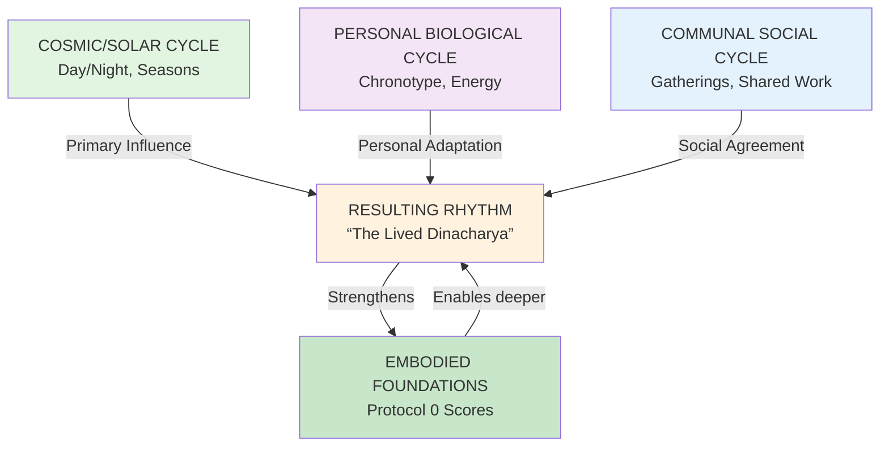
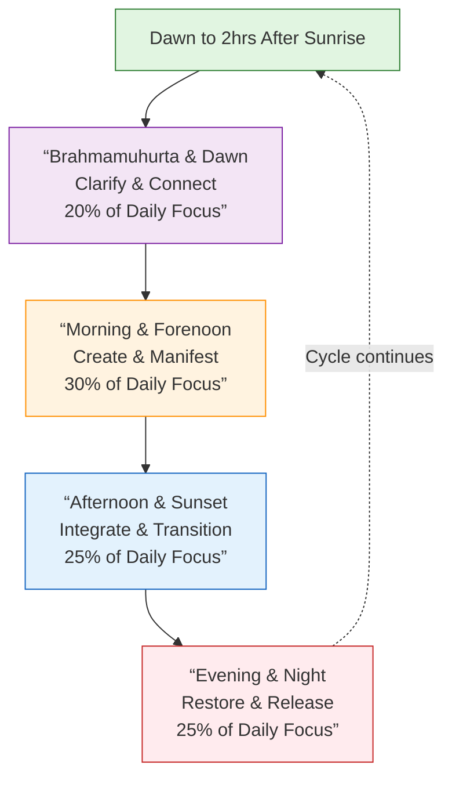
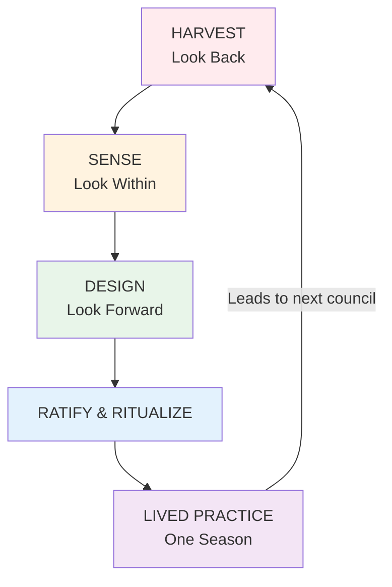

---
# AEO/AAE OPTIMIZATION METADATA
aeo_metadata:
  title: "Protocol 5: Dinacharya & Daily Rhythms"
  description: "A practical framework for designing and maintaining daily and seasonal rhythms that align individual and community life with natural cycles. This protocol translates Solarpunk Mandala principles into embodied practice, acting as foundational support and cultural integration for all other transformative work."
  context: "The daily-praxis protocol of the Mandala framework. It operationalizes the stability of Protocol 0 into conscious routine, supports the health measured in Protocol 1, and provides the rhythmic container for the deep work of Protocols 2-4. It is both preventative medicine and cultural glue."
  key_objectives:
    - "Provide a structured Solar Cycle framework for aligning daily activities with circadian and seasonal energies."
    - "Offer tools for co-creating communal rhythms that honor both collective needs and individual diversity (polyphony)."
    - "Integrate the Four Axes of Transformation (Soteriological, Axiological, Relational, Temporal) into the design of daily practice."
    - "Establish a seasonal adaptation process (Rhythm Council) to ensure rhythms remain responsive and resilient."
    - "Frame daily rhythm as 'boundary medicine' and conscious participation in the patterns of Mind at Large."

  core_concepts:
    - "Dinacharya (Conscious Daily Routine)"
    - "The Solar Cycle & Energetic Arc of the Day"
    - "Core Rhythmic Anchors (Sleep, First/Last Acts, Nourishment, Transitions)"
    - "Four-Axis Rhythm Integration Canvas"
    - "Seasonal Adaptation & The Rhythm of Rhythms"
    - "Communal Rhythm Council & Harmonious Polyphony"
    - "Rhythm as Boundary Medicine & MAL Alignment"

  ontological_foundation: "Cyclical Time (Sanātana Dharma, Process Philosophy) & Ecopsychology"
  epistemic_stance: "Embodied, Experiential Learning (Praxis-based)"

  search_queries:
    - "daily routine design solarpunk"
    - "Dinacharya modern practice community"
    - "seasonal living rhythms"
    - "circadian rhythm alignment wellness"
    - "Solarpunk Mandala protocol 5"
    - "communal daily schedule co-creation"
    - "ritual for daily life"

  related_nodes:
    - "guides/protocols/00-embodied-foundations-audit.md"
    - "guides/protocols/01-settlement-health-assessment.md"
    - "framework/core-model/03-four-axes-of-transformation.md"
    - "practices/seasonal-dinacharya-guide.md"
    - "theory/cycles-and-time.md"
    - "case-studies/forest-commons-winter-rhythm.md"

  framework_status: "Stable Core Protocol"
  version: "2.2"
  last_reviewed: "2026-01-14"
  next_review: "2026-07-14"

  protocol_dependencies:
    foundation: "Benefits from stable Protocol 0 scores, especially Restoration (≥3.5)."
    supports: "All other protocols by providing a stable, predictable daily container."
    informs: "Protocol 1 (Temporal Axis health) and Protocol 4 (container for memory work)."

  practice_outputs:
    - "Personal/Communal Four-Axis Rhythm Canvas"
    - "Seasonal Rhythm Charter or Agreement"
    - "Established Core Rhythmic Anchors"
    - "Regular Rhythm Council meetings"

  license: "Community-Supported Open Protocol"
  contributing_guidelines: "https://github.com/ravaioli/solarpunk-mandala/blob/main/CONTRIBUTING.md"
---
# Protocol 5: Dinacharya & Daily Rhythms
*Harmonizing Personal and Collective Cycles with Regenerative Intelligence*

> **Protocol Function**: Embodied Practice and Cultural Integration. This protocol translates the Solarpunk Mandala's principles into the rhythmic fabric of daily life. It provides a framework for designing, practicing, and refining daily routines (Dinacharya) that consciously align individual and community activities with natural cycles, strengthening the foundation for all other transformative work.

---

## 1.0 Purpose & Philosophical Foundation

### 1.1 Core Purpose
To provide a structured, adaptable framework for designing and maintaining daily rhythms (Dinacharya) that consciously harmonize individual and community life with natural, social, and cosmic cycles. This protocol aims to transform routine from a series of tasks into a living practice of alignment, resilience, and integration of the four Mandala axes into the fabric of everyday existence.

### 1.2 The Concept of Dinacharya
Dinacharya (Sanskrit: दिनचर्या, "daily routine") is an ancient concept that views the day as a microcosm of natural and cosmic order. In this protocol, Dinacharya is reimagined as **conscious participation in the fractal patterns of Mind at Large (MAL)**. It is the praxis of aligning personal and communal energy flows with the tides of the sun (circadian), moon (circalunar), seasons, and social cycles to create a stable, responsive foundation for regeneration.

### 1.3 Rhythms as Boundary Medicine
Chaotic, extractive, or dissociated daily rhythms reinforce the illusion of separation—from our bodies, each other, and the more-than-human world. A consciously designed Dinacharya acts as **applied boundary medicine**. It heals by creating regular, sacred touchpoints that dissolve these boundaries: waking with the sun (human-nature), sharing meals (self-other), and collective rest (individual-collective).

## 2.0 Protocol Activation & Foundational Requirements

### 2.1 Activation Triggers
This protocol can be activated at any time, but is most effectively initiated under these conditions:

| Trigger | Ideal Context | Starting Point |
|---------|---------------|----------------|
| **Personal/Community Foundation** | After achieving stable foundation scores (≥3.0 in Protocol 0) and seeking deeper integration. | Comprehensive Rhythm Design (Section 4). |
| **Recovery from Burnout/Chaos** | Following a period of crisis (Protocol 3) or chronic stress, to re-establish healthy patterns. | Focus on one or two Core Rhythmic Anchors (Section 3.3). |
| **Seasonal Transition** | At the solstice, equinox, or start of a new seasonal cycle. | Seasonal Rhythm Adaptation (Section 5.0). |
| **New Community Formation** | When a new group or household is establishing its shared culture. | Co-creating Communal Rhythm Agreements (Section 6.0). |

### 2.2 Prerequisites: The Rhythm Readiness Check
*Sustainable rhythms cannot be built on unstable ground.*

| Foundation Domain | Minimum for Personal Practice | Minimum for Communal Practice | Why It Matters for Rhythm |
|-------------------|-------------------------------|--------------------------------|---------------------------|
| **Nourishment** | 3.0 | 3.5 | Predictable access to food/water enables stable energy for practice. |
| **Cleansing** | 3.0 | 3.0 | Reliable hygiene and waste systems reduce background stress, freeing attention for ritual. |
| **Restoration** | 3.5 | 4.0 | **Critical.** Adequate, quality sleep is the bedrock of any sustainable daily rhythm. |
| **Movement** | 3.0 | 3.0 | The physical capacity to move through space and transition between activities. |

**Rule:** If Restoration is below 3.0, the *only* rhythm to design is a strict, protective sleep/wake schedule. All other complexity must wait.

## 3.0 The Core Rhythmic Framework: Three Interlocking Cycles

```mermaid
flowchart TD
    S[COSMIC/SOLAR CYCLE<br/>Day/Night, Seasons]
    P[PERSONAL BIOLOGICAL CYCLE<br/>Chronotype, Energy]
    C[COMMUNAL SOCIAL CYCLE<br/>Gatherings, Shared Work]
    
    S -->|Primary Influence| R[RESULTING RHYTHM<br/>“The Lived Dinacharya”]
    P -->|Personal Adaptation| R
    C -->|Social Agreement| R
    
    R -->|Strengthens| F[EMBODIED FOUNDATIONS<br/>Protocol 0 Scores]
    F -->|Enables deeper| R
    
    style S fill:#e1f5e1
    style P fill:#f3e5f5
    style C fill:#e3f2fd
    style R fill:#fff3e0
    style F fill:#c8e6c9
```

### 3.1 The Solar Cycle (Circadian): The Day's Arc
The primary container, aligning with the sun's energy.

| Phase (Approx. Time) | Solar Quality | Ideal Activities | MAL Integration Focus |
|----------------------|---------------|------------------|------------------------|
| **Brahmamuhurta & Dawn (Pre-dawn - 2hrs after sunrise)** | Pure, clear, sattvic. Time of greatest clarity and connection. | Meditation, intention-setting, gentle movement, planning. | Connecting individual consciousness to the unmanifest potential of MAL. |
| **Morning & Forenoon (Late morning - Noon)** | Rajas: active, projective, heating. Peak energy for external work. | Focused individual/collective work, learning, physical labor, communication. | Manifesting intention into form; conscious participation in MAL's creative expression. |
| **Afternoon & Sunset (Noon - Dusk)** | Transition from rajas to tamas. Energy begins to wane and turn inward. | Administrative tasks, review, gentle cleaning, preparation for evening, community sharing. | Integrating the day's experiences; gratitude for what was manifested. |
| **Evening & Night (Dusk - Bedtime)** | Tamas: calming, contracting, restorative. Time for release and repair. | Winding down, reflection, light reading, connection with loved ones, hygiene rituals. | Releasing the day's identifications; returning to the undifferentiated ground of MAL in sleep. |

```mermaid
flowchart TD
    Start[Dawn to 2hrs After Sunrise] --> A[“Brahmamuhurta & Dawn<br/>Clarify & Connect<br/>20% of Daily Focus”]
    A --> B[“Morning & Forenoon<br/>Create & Manifest<br/>30% of Daily Focus”]
    B --> C[“Afternoon & Sunset<br/>Integrate & Transition<br/>25% of Daily Focus”]
    C --> D[“Evening & Night<br/>Restore & Release<br/>25% of Daily Focus”]
    D -.->|Cycle continues| Start

    style Start fill:#e1f5e1,stroke:#2e7d32
    style A fill:#f3e5f5,stroke:#7b1fa2
    style B fill:#fff3e0,stroke:#ff8f00
    style C fill:#e3f2fd,stroke:#1565c0
    style D fill:#ffebee,stroke:#c62828
```

### 3.2 The Social & Communal Cycle: The Pulse of Belonging
Rhythms that weave the relational fabric.

| Rhythm Type | Frequency | Purpose | Example Practices |
|-------------|-----------|---------|-------------------|
| **Micro-Connections** | Daily | Maintain baseline relational warmth and awareness. | Shared meals, morning greeting circles, brief end-of-day check-ins. |
| **Weekly Pulses** | Weekly | Dedicated time for deeper connection, planning, and celebration. | Community council, skill-sharing workshops, shared meal with storytelling, day of rest (Sabbath). |
| **Lunar Gatherings** | Monthly (New/Full Moon) | Emotional and intuitive sync; release and intention. | Full moon gratitude/share circle; new moon intention-setting & letting-go ritual. |
| **Seasonal Councils** | Quarterly (Solstice/Equinox) | Strategic realignment; celebration of cyclical change. | Visioning retreats, major project reviews, seasonal festivals. |

### 3.3 Core Rhythmic Anchors
*Non-negotiable elements for a stable rhythm. Start here if overwhelmed.*

1.  **Sleep/Wake Anchor:** A consistent bedtime and wake-up time (within 1 hour), synchronized with the sun as much as possible.
2.  **First & Last Conscious Acts:** A simple 5-minute ritual upon waking (e.g., water, breath, gratitude) and before sleep (e.g., journal, gentle stretch, breath).
3.  **Nourishment Rhythm:** At least one shared, screen-free meal per day, or a consistent time for solitary mindful eating.
4.  **Transition Pause:** A conscious 60-second breath-and-body check at key transitions (e.g., finishing work, entering the home).

## 4.0 Designing Your Dinacharya: The Four-Axis Integration Canvas
*Use this canvas to design or audit your daily/weekly rhythm.*

### 4.1 Soteriological Axis (Meaning & Self-Integration)
*How does my daily rhythm cultivate inner clarity, awe, and connection to meaning?*

| Design Question | Current Practice (Y/N & Notes) | Aspirational Practice | Integration Strength (1-5) |
|-----------------|--------------------------------|------------------------|----------------------------|
| **4.1.1** Is there dedicated, protected time for silence, meditation, or solitary reflection? | | | _____ |
| **4.1.2** Do I encounter beauty, art, or nature in a mindful way each day? | | | _____ |
| **4.1.3** Does my rhythm include moments to consciously set/review intentions or express gratitude? | | | _____ |
| **SOTERIOLOGICAL RHYTHM SCORE** | | | **_____** |

### 4.2 Axiological Axis (Systems & Regeneration)
*How does my daily rhythm embody right relationship with resources and systems?*

| Design Question | Current Practice (Y/N & Notes) | Aspirational Practice | Integration Strength (1-5) |
|-----------------|--------------------------------|------------------------|----------------------------|
| **4.2.1** Do my consumption habits (food, energy, goods) align with regenerative principles? | | | _____ |
| **4.2.2** Does my routine include practices of care/maintenance for my tools, living space, and local ecology? | | | _____ |
| **4.2.3** Is there time for the mindful transformation of "waste" (composting, repair, creative reuse)? | | | _____ |
| **AXIOLOGICAL RHYTHM SCORE** | | | **_____** |

### 4.3 Relational Axis (Connection & Community)
*How does my daily rhythm nurture healthy, reciprocal relationships?*

| Design Question | Current Practice (Y/N & Notes) | Aspirational Practice | Integration Strength (1-5) |
|-----------------|--------------------------------|------------------------|----------------------------|
| **4.3.1** Is there meaningful, undistracted connection with at least one other being (human or animal)? | | | _____ |
| **4.3.2** Does my rhythm allow for both giving and receiving care/support? | | | _____ |
| **4.3.3** Are there clear boundaries between communal/relational time and solitary/recharge time? | | | _____ |
| **RELATIONAL RHYTHM SCORE** | | | **_____** |

### 4.4 Temporal Axis (Time Wisdom & Cycles)
*How does my daily rhythm honor deep time and natural cycles?*

| Design Question | Current Practice (Y/N & Notes) | Aspirational Practice | Integration Strength (1-5) |
|-----------------|--------------------------------|------------------------|----------------------------|
| **4.4.1** Is my sleep/wake cycle aligned with solar and seasonal light? | | | _____ |
| **4.4.2** Does my week include a true day of rest/different rhythm (Sabbath principle)? | | | _____ |
| **4.4.3** Are monthly or seasonal markers (moon phases, equinoxes) observed in any way? | | | _____ |
| **TEMPORAL RHYTHM SCORE** | | | **_____** |

### 4.5 Synthesis & Balance Check
**Overall Four-Axis Average**: _____
**Weakest Axis**: _________________ (Score: _____)
**Strongest Axis**: ________________ (Score: _____)

**Design Priority**: For the next cycle (e.g., two weeks), choose **one** practice from the "Aspirational" column of your weakest axis to integrate. Start small (5-10 minutes).

## 5.0 Seasonal Adaptation & The Rhythm of Rhythms
*No single rhythm is forever. The master practice is adapting your practice.*

### 5.1 The Seasonal Dinacharya
| Season | Solar Quality | Rhythmic Emphasis | Community Focus |
|--------|---------------|-------------------|-----------------|
| **Spring (Vasanta)** | Expanding, light, creative. | Earlier rising, vigorous cleansing, starting new projects, planting seeds (literal & metaphorical). | Collaborative launching of initiatives; spring cleaning of communal spaces. |
| **Summer (Grishma)** | Peak heat, expansion, outward expression. | Early morning activity, afternoon rest (siesta), hydration focus, celebration. | Festivals, communal meals outdoors, tending to collective projects. |
| **Autumn (Sharad)** | Contracting, harvesting, releasing. | Balancing activity with increasing introspection, harvesting & preserving, letting go of what no longer serves. | Harvest celebrations, gratitude rituals, preparing stores for winter. |
| **Winter (Hemanta/Shishira)** | Deep rest, inward focus, conservation. | Later rising, more sleep, indoor/reflective activities, dreaming and planning for spring. | Storytelling, crafting, strategic planning for the year ahead. |

### 5.2 Lifecycle & Community Phase Adaptation
- **Personal Life Stages:** Rhythms for parents of young children, elders, students, and those in intensive caregiving roles must honor their unique energy demands and social obligations.
- **Community Development:** A new community (high relational need) will have a different optimal rhythm than a stable one (may need more solitary/creative time).

**Assessment Question:** Does our current collective rhythm match our current community phase? (Refer to **Protocol 1** Dialectical Velocity).

## 6.0 Co-Creating Communal Rhythms

### 6.1 The Rhythm Council Process
A quarterly gathering (aligned with solstice/equinox) to review and adapt shared rhythms.

1.  **Harvest (Looking Back):** What worked well in our shared rhythm last season? What created friction or burnout?
2.  **Sense (Looking Within):** What is our current collective energy and focus (refer to Protocol 1 scores)? What are our upcoming seasonal commitments?
3.  **Design (Looking Forward):** Propose adjustments to:
    - Shared meal times
    - Quiet hours / noise expectations
    - Core communal gathering times (e.g., weekly meeting)
    - Celebration and holiday rhythms
4.  **Ratify & Ritualize:** Create a simple, visual "Rhythm Charter" for the season. Mark the transition with a shared activity (e.g., adjusting a communal clock, sharing a meal).

```mermaid
graph TD
    A[HARVEST<br/>Look Back]
    B[SENSE<br/>Look Within]
    C[DESIGN<br/>Look Forward]
    D[RATIFY & RITUALIZE]
    E[LIVED PRACTICE<br/>One Season]

    A --> B
    B --> C
    C --> D
    D --> E
    E -->|Leads to next council| A

    style A fill:#ffebee
    style B fill:#fff3e0
    style C fill:#e8f5e9
    style D fill:#e3f2fd
    style E fill:#f3e5f5
```

### 6.2 Navigating Rhythm Diversity
Not all community members will have identical rhythms. The goal is **harmonious polyphony, not unison**.

- **Create Clear Agreements:** About shared spaces during "quiet hours" and "social hours."
- **Design Overlap Zones:** Identify 1-2 key times daily or weekly when everyone is encouraged to synchronize (e.g., a shared dinner, a morning circle).
- **Honor Introvert/Extrovert Needs:** Ensure the rhythm provides for both communal recharge and solitary recharge.

## 7.0 Case Study: The "Forest Commons" Dinacharya

**Context:** A 20-person land-based community in the Scottish Highlands with long, dark winters and short, intense summers. Initial assessment showed high Restoration scores in summer (due to physical work) but critically low in winter (Seasonal Affective Disorder, social friction). The Relational axis also dropped in winter.

**Intervention:**
1.  **Winter Rhythm Redesign:** They used the Seasonal Dinacharya framework to consciously shift. Summer's 5:30 AM dawn circles were replaced with 8:00 AM shared breakfasts in winter. The emphasis moved from *external work* to *internal work*: craft circles, reading groups, and story-sharing by the fire.
2.  **Light Rituals:** To honor the Temporal axis, they created daily "Welcome the Light" rituals at sunrise (even if cloudy) and candle-lit dinners.
3.  **Communal Agreement:** They established "Quiet Hours" from 9 PM to 9 AM and a designated "Social Hearth" space for those who kept later hours.

**Outcome:** Winter Restoration scores stabilized and Relational scores improved. The community reported feeling more in harmony with the season rather than fighting it. The practice of consciously changing their rhythm twice a year became a beloved ritual in itself, strengthening their Temporal axis and community resilience.

## 8.0 MAL Reflection: Rhythm as Communion

*Guiding questions for personal or collective reflection:*

1.  **Ritual as Remembering:** When you perform your morning ritual with full attention, are you simply doing a task, or are you participating in a cosmic pattern of awakening? Can you feel the sun rising within billions of cells and creatures simultaneously?
2.  **The Gift of Constraint:** A rhythm creates limits. Within the "constraint" of a regular sleep time, what freedoms emerge (clarity, health, presence)? How can loving limits be a form of alignment with MAL's own structured unfolding?
3.  **Cycles Within Cycles:** Your breath is a cycle within your day, within your month, within your life, within the species, within the planet... Can you sense your small daily rhythm as an essential, conscious note in this vast, interpenetrating symphony of MAL?

## 9.0 Facilitator & Steward Notes

### 9.1 Role of the Rhythm Steward
A rotating role (weekly or monthly) responsible for gently holding the container of communal rhythm.

- **Responsibilities:** Gently remind of upcoming shared gatherings, monitor energy levels in the community, propose "rhythm check-ins" if friction arises.
- **Mindset:** A gardener, not a police officer. The role is to nurture the conditions for the rhythm to thrive, not to enforce compliance.

### 9.2 Introducing Rhythms to a Group
- **Start with Inquiry, Not Prescription:** Begin with a circle asking: "When do you feel most alive during the day? What part of our current daily flow feels jarring or draining?"
- **Prototype a Single Practice:** Introduce *one* new rhythmic element (e.g., a 10-minute morning silence together) for a week. Debrief.
- **Use the Four-Axis Canvas:** Frame the rhythm not as a productivity hack, but as an integration practice for meaning, ecology, relationship, and time.

### 9.3 Troubleshooting Common Challenges

| Challenge | Signs | Steward Response |
|-----------|-------|------------------|
| **Rhythm Rigidity** | Anxiety or judgment when the rhythm is disrupted; practice feels oppressive. | Organize a council to revisit intentions. Emphasize the rhythm as a *support*, not a master. Introduce "flex days." |
| **Rhythm Collapse** | The pattern falls apart completely; reversion to chaos. | Return to **Core Rhythmic Anchors** only. Strengthen the Restoration foundation. Investigate if foundational needs are unmet. |
| **Social Friction** | Conflict between early risers and night owls; different energy needs clash. | Facilitate a council to create clear spatial/temporal agreements (e.g., "quiet wing" vs. "common hall"). Validate different chronotypes. |
| **Lack of Buy-In** | Practice feels imposed; only a few participate. | Co-create from scratch using the Four-Axis Canvas. Ensure everyone's needs (e.g., caregivers, shift workers) are represented in the design. |

## 10.0 Protocol Integration Matrix

| Protocol | Relationship to Protocol 5 | Integration Flow |
|----------|---------------------------|------------------|
| **Protocol 0** | **Live Practice.** Dinacharya is the daily enactment and reinforcement of embodied foundations. | A healthy P5 rhythm directly boosts and maintains P0 foundation scores. |
| **Protocol 1** | **Diagnostic Feedback.** Low axis scores (esp. Temporal) indicate a need for rhythm work. Dysfunctional rhythms are both a cause and symptom of poor settlement health. | Use P1 to diagnose; use P5 to treat; improved P5 practice raises P1 scores. |
| **Protocol 2** | **Project Source.** A rhythm can become a formal project (e.g., "Design and implement a seasonal festival calendar"). | P5 identifies a need or opportunity; P2 provides the structured design process for complex implementations. |
| **Protocol 3** | **Preventative Medicine & Recovery Tool.** Strong rhythms prevent crises; simplified rhythms are key to recovery. | Post-crisis, use P5 to rebuild stabilizing daily anchors. |
| **Protocol 4** | **Supportive Container.** A stable daily rhythm provides the safety needed for deep memory work. | P5 creates the predictable, grounded container in which P4's potentially destabilizing work can safely occur. |
| **Protocol 5** | **Self (This Protocol).** The living practice that weaves all other protocols into daily life. | |

---
