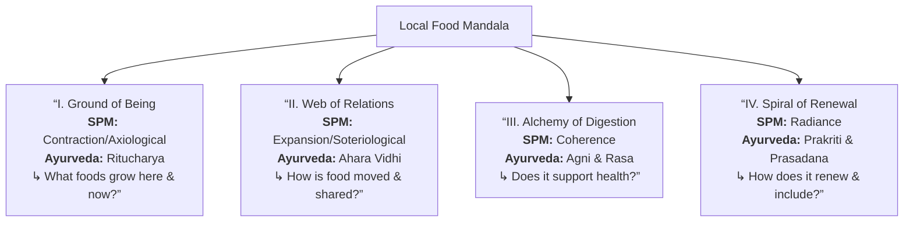
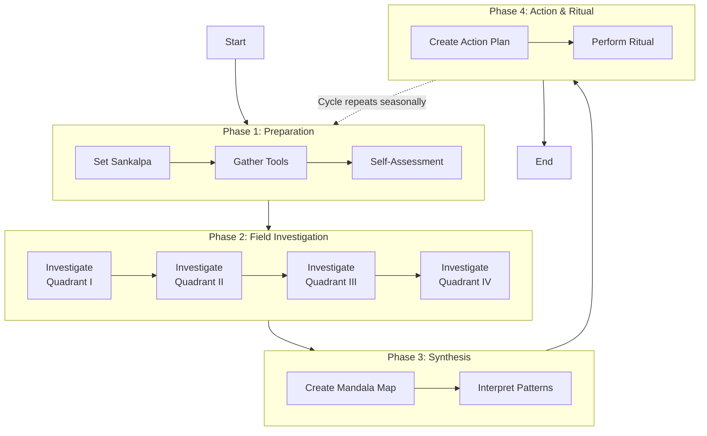

# Protocol: Mandala-Led Local Food Audit

## 1.0 Protocol Intentions & Scope

### 1.1 Purpose
This protocol provides a structured, place-based method to audit your local food system through the integrated lenses of Solarpunk Mandala (SPM) ethics and Ayurvedic wisdom. It moves from theoretical principles to actionable intelligence, transforming food consumption into an act of personal, community, and ecological regeneration.

### 1.2 Core Integration
The audit is founded on the synergy between two frameworks:
*   **Solarpunk Mandala (SPM)**: Provides the systemic and ethical architecture—the Four Axes and Embodied Foundations—for viewing the food system as a conscious, participatory mandala.
*   **Ayurveda**: Provides the physiological and qualitative lens—focusing on *agni* (digestion), *dosha* (constitution), *rasa* (taste), and *ritucharya* (seasonal rhythm)—for understanding food's impact on personal and environmental health.

### 1.3 Desired Outcome
Participants will generate a "Local Food Mandala Map" and a personal "Alignment Action Plan." This clarifies how one's diet currently interacts with the local food ecology and identifies precise steps for moving toward a more symbiotic, resilient, and nourishing practice.

## 2.0 Foundational Concepts

### 2.1 The Guiding Mandala: Four Quadrants of Inquiry
The audit is structured around a mandala with four interdependent quadrants, each corresponding to an SPM Ethical Axis and paired with an Ayurvedic principle.

| Mandala Quadrant | SPM Ethical Axis | Ayurvedic Principle | Core Inquiry |
| :--- | :--- | :--- | :--- |
| **I. The Ground of Being** | **Contraction/Axiological** (Regeneration) | **Ritucharya & Sattva Guna** (Seasonal Rhythm & Purity) | What foundational, regenerative foods are available from my immediate bioregion in this season? |
| **II. The Web of Relations** | **Expansion/Soteriological** (Integration) | **Ahara Vidhi & Virya** (Mindful Practice & Energy) | How is food moved and shared? What are the relationships and energy flows in my local food web? |
| **III. The Alchemy of Digestion** | **Coherence** (Integrity) | **Agni & Shad Rasa** (Metabolic Fire & Six Tastes) | Do the available foods and my eating patterns support strong, balanced digestion and nutritional completeness? |
| **IV. The Spiral of Renewal** | **Radiance** (Generosity) | **Prakriti & Prasadana** (Individual Constitution & Sacred Offering) | How do my personal needs align with local abundance? How is surplus preserved and generosity enacted? |

### 2.2 The Diagnostic Layers
Three cross-cutting layers deepen the audit, assessing the quality, ethics, and equity of the system.

1.  **Layer 1: Food Quality & Constitution** (*What is the nature of the food?*): Assesses the inherent qualities (*gunas*)—heavy/light, oily/dry, hot/cold—and vital essence (*prana*) of local offerings.
2.  **Layer 2: Production & Sourcing Ecology** (*How and where is it grown?*): Investigates the agricultural methods, land stewardship, and supply chain transparency.
3.  **Layer 3: Access & Economic Flow** (*Who can partake and under what terms?*): Maps economic accessibility, ownership models, and the circulation of value within the community.

## 3.0 Audit Procedure

### 3.1 Phase 1: Preparation & Inner Alignment (Week 1)
**Objective:** Set intention and prepare the observational toolkit.

1.  **Set Your Sankalpa (Intention)**: Formulate a clear purpose. (e.g., "To understand how my diet can better support my *vata* constitution and my city's food resilience.")
2.  **Gather Tools**: Create a dedicated notebook or digital document. Prepare a physical or digital map of your town/city/bioregion.
3.  **Self-Assessment Baseline**: Briefly journal on: What are your current primary food sources? What is one digestive (*agni*) or health pattern you notice? What is your guess at your dominant *dosha*?

### 3.2 Phase 2: Field Investigation & Mapping (Weeks 2-3)
**Objective:** Gather intelligence for each Mandala Quadrant and Diagnostic Layer.

**Method:** Engage in "Food System Satsang" (dialogue). Visit nodes of your food web (farms, markets, co-ops) not just as a consumer, but as a curious participant. Ask questions.

**Investigation Guide by Quadrant:**

*   **Quadrant I (Ground of Being):**
    *   **Actions:** Visit a farmers' market. Follow a local farm or forager on social media. Walk in a natural area to observe edible plants.
    *   **Questions to Ask/Answer:** "What is being harvested this month?" "What native or perennial staple crops are grown here?" "How is soil health discussed?"

*   **Quadrant II (Web of Relations):**
    *   **Actions:** Trace the journey of one local item (e.g., cheese) from producer to your table. Attend a community garden meeting.
    *   **Questions to Ask/Answer:** "Do you deliver or sell directly to consumers?" "Is there a food hub or cooperative distributor?" "Where do unused crops go?"

*   **Quadrant III (Alchemy of Digestion):**
    *   **Actions:** Analyze your market haul for the **Six Tastes**. Conduct a personal one-week *agni* log (energy after meals, digestion).
    *   **Questions to Ask/Answer:** "Can I find all six tastes locally?" (Bitter: dandelion, pungent: radish). "Do my meal times align with the sun's strength?"

*   **Quadrant IV (Spiral of Renewal):**
    *   **Actions:** Research local seed libraries, fermentation workshops, or "pay-what-you-can" CSA models.
    *   **Questions to Ask/Answer:** "Are there sliding-scale membership options?" "How is traditional food knowledge preserved here?" "What do I have to offer this system?"

### 3.3 Phase 3: Synthesis & Mandala Making (Week 4)
**Objective:** Synthesize data into your "Local Food Mandala Map."

1.  **Create Your Map:** In the center of a page, place "My Nourishment." Draw four quadrants around it, labeling them I through IV.
2.  **Populate the Quadrants:** Fill each with words, drawings, or symbols representing your findings (e.g., Quadrant I: "April - morels, ramps, spinach. Heavy, damp spring → need light, drying foods").
3.  **Layer the Diagnostics:** Using colored pencils or annotations, mark your map with insights from the three layers (e.g., mark producers using regenerative practices (Layer 2) or note areas with low access (Layer 3)).

## 4.0 Analysis & Alignment Planning

### 4.1 Interpreting Your Mandala
*   **Balance/Imbalance:** Is one quadrant overflowing with data while another is sparse? A sparse "Web of Relations" suggests a need to build more direct connections.
*   **Tensions & Synergies:** Note where findings conflict (e.g., local winter diet is mostly heavy *kapha* foods (I), but your personal need is light *vata*-pacifying foods (IV)). Note where they align beautifully.
*   **Leverage Points:** Identify one or two places where a small change could create positive ripple effects (e.g., shifting 10% of your grocery budget to a farmer practicing no-till agriculture).

### 4.2 Creating Your Alignment Action Plan
Based on your interpretation, formulate a **personal covenant** for the next season (3 months).

| SPM/Ayurvedic Goal | Specific Action | Resource/Support Needed | Success Metric |
| :--- | :--- | :--- | :--- |
| **Strengthen *Agni* (Coherence)** | Make lunch my largest, sit-down meal, focusing on local, cooked vegetables. | Meal prep time on Sundays. | Improved energy at 3 PM, less bloating. |
| **Deepen Web of Relations (Expansion)** | Join a CSA share from [Farm Name] and volunteer 4 hours per season. | CSA membership fee; scheduling. | Direct relationship with one grower; understanding of farm challenges. |
| **Eat Seasonally (Contraction)** | Preserve (ferment/freeze) one seasonal glut (e.g., summer berries) for winter. | Canning jars, recipe. | 3 jars of preserves in pantry by autumn. |

## 5.0 Protocol Integration & Ritual

*   **Cyclical Practice:** This audit is designed to be repeated seasonally (4x per year), creating a living dialogue with your place.
*   **Opening/Closing Ritual:** Begin Phase 1 and end Phase 4 with a simple ritual—lighting a candle, offering thanks to the land and laborers, and stating your intention/learnings aloud.
*   **Communal Dimension:** This protocol can be adapted for a "Sangha" (community group). Conduct the field investigation together and host a "Mapping Satsang" to share individual mandalas and identify collective action points.

---
*This protocol is a living document of the Solarpunk Mandala framework. It is offered for adaptation under the principles of the Symbiotic Commonwealth.*
