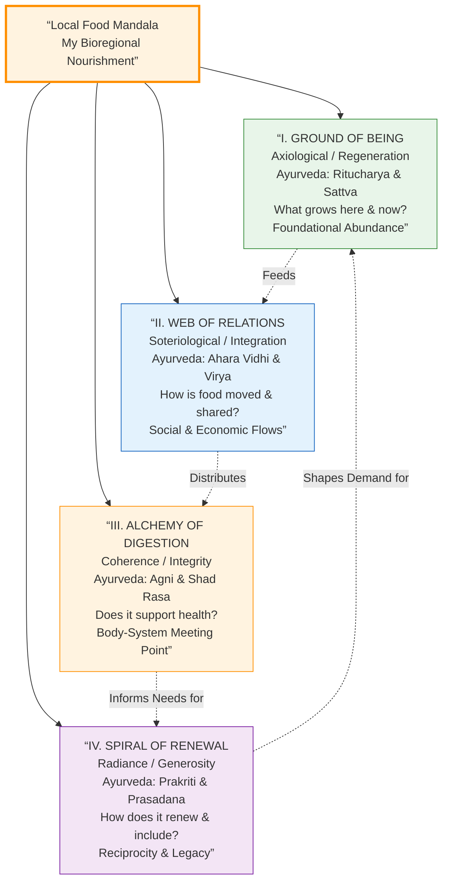
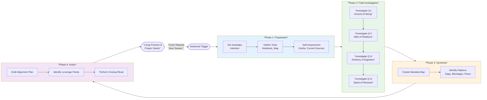
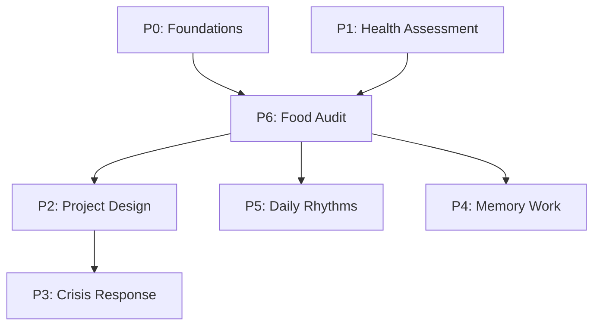

---
# AEO/AAE OPTIMIZATION METADATA
aeo_metadata:
  title: "Protocol 6: Local Food System Audit"
  description: "A bioregional diagnostic tool that audits local food ecologies through the integrated lenses of Solarpunk Mandala ethics and Ayurvedic principles. Generates a 'Food Mandala Map' to reveal leverage points for enhancing food sovereignty, personal health, and systemic resilience."
  context: "A specialized applied protocol within the Mandala framework. It operationalizes the Axiological (regenerative systems) and Soteriological (relational integration) axes through the tangible domain of food. Serves as a critical diagnostic preceding regenerative food projects (Protocol 2)."
  key_objectives:
    - "Provide a structured, four-quadrant framework (Ground, Web, Alchemy, Spiral) for holistically assessing a local food system."
    - "Integrate Solarpunk Mandala's systemic ethics with Ayurveda's physiological wisdom to create a unique diagnostic lens."
    - "Generate actionable outputs: a visual Food Mandala Map, a personal Seasonal Alignment Plan, and identified community leverage points."
    - "Establish food consumption as a conscious practice of bioregional participation and metabolic communion."
    - "Create a repeatable, seasonal practice that builds living intelligence about place-based nourishment."

  core_concepts:
    - "The Food Mandala Quadrants (Ground of Being, Web of Relations, Alchemy of Digestion, Spiral of Renewal)"
    - "SPM-Ayurveda Integration (Ritucharya/Seasonality, Agni/Digestion, Dosha/Constitution)"
    - "Diagnostic Layers (Food Quality, Production Ecology, Access & Economic Flow)"
    - "Food System Satsang (Dialogic Field Investigation)"
    - "Seasonal Alignment Plan & Leverage Point Analysis"

  ontological_foundation: "Bioregionalism & Metabolic Philosophy"
  epistemic_stance: "Embodied Systems Thinking via Direct Investigation"

  search_queries:
    - "local food system assessment tool"
    - "bioregional food audit solarpunk"
    - "Ayurveda and food sovereignty"
    - "community food mapping"
    - "Solarpunk Mandala protocol 6"
    - "seasonal eating plan diagnostic"
    - "regenerative agriculture assessment framework"

  related_nodes:
    - "guides/protocols/00-embodied-foundations-audit.md"
    - "guides/protocols/01-settlement-health-assessment.md"
    - "guides/protocols/02-project-design-integration.md"
    - "framework/core-model/03-four-axes-of-transformation.md"
    - "theory/ayurveda-spm-integration.md"
    - "case-studies/high-desert-foodshed-audit.md"

  framework_status: "Stable Applied Protocol"
  version: "2.1"
  last_reviewed: "2026-01-14"
  next_review: "2026-07-14"

  protocol_dependencies:
    prerequisite: "Stable Nourishment foundation (Protocol 0 score ≥3)"
    primary_output_for: "Protocol 2 (Project Design) - provides defined 'Project Seeds'"
    informs: "Protocol 5 (Daily Rhythms) with seasonal eating patterns"

  audit_outputs:
    - "Visual Local Food Mandala Map"
    - "Personal/Seasonal Alignment Action Plan"
    - "List of identified systemic Leverage Points"
    - "Documented field notes from Food System Satsang"

  license: "Community-Supported Open Protocol"
  contributing_guidelines: "https://github.com/ravaioli/solarpunk-mandala/blob/main/CONTRIBUTING.md"
---
# Protocol 6: Local Food System Audit
*Mapping Bioregional Nourishment Through the Lenses of Solarpunk Ethics & Ayurvedic Wisdom*

> **Protocol Function**: Systemic Diagnosis & Personal Alignment. This protocol provides a structured method to audit your local food ecology through the integrated frameworks of the Solarpunk Mandala and Ayurveda. It transforms food from a commodity into a map of relationships, resilience, and conscious participation in the metabolic cycles of your place.

---

## 1.0 Purpose & Integrative Framework

### 1.1 Core Purpose
To conduct a place-based, seasonal audit of the local food system that diagnoses its health, resilience, and alignment with regenerative principles. This protocol empowers individuals and communities to generate actionable intelligence—a "Local Food Mandala Map"—that reveals leverage points for strengthening food sovereignty, personal health, and ecological integration.

### 1.2 Integrative Philosophy: Two Frameworks, One Lens
This audit is founded on the synergy of two complementary systems:

*   **The Solarpunk Mandala (SPM)** provides the **systemic and ethical architecture**. It frames the food system as a conscious mandala, asking questions of regeneration (Axiological axis), connection (Soteriological axis), integrity (Coherence), and generosity (Radiance). It ensures the audit connects to embodied foundations and community-scale transformation.
*   **Ayurveda** provides the **physiological and qualitative lens**. Its principles of *agni* (digestive fire), *dosha* (constitution), *rasa* (taste), and *ritucharya* (seasonal rhythm) offer a timeless toolset to assess how food impacts personal and environmental health, grounding systemic analysis in bodily intelligence.

### 1.3 Desired Outcomes
1.  **A Diagnostic Map:** A visual "Local Food Mandala Map" detailing the assets, flows, blockages, and opportunities within your bioregion's food web.
2.  **A Personal Alignment Plan:** A specific, seasonal covenant aligning your dietary choices with local abundance and your constitutional needs.
3.  **A Community Action Seed:** Identification of 1-2 high-leverage interventions to strengthen local food resilience, suitable for a **Protocol 2 (Project Design)** initiative.

## 2.0 Protocol Activation & Prerequisites

### 2.1 Activation Triggers
| Trigger | Context | Audit Focus |
|---------|---------|-------------|
| **Seasonal Transition** | Solstice or equinox; shift in local harvest. | Update the Mandala Map; identify new seasonal foods and changing needs. |
| **Relocation or New Community** | Moving to a new bioregion or joining a land-based project. | Comprehensive baseline audit of all four quadrants. |
| **Health or Digestive Re-patterning** | Personal need to align diet with *dosha* or heal *agni*. | Deep focus on Quadrant III (Alchemy of Digestion) and IV (Spiral of Renewal). |
| **Food System Crisis/Opportunity** | Threat to supply chains or emergence of a new local initiative. | Focus on Quadrant II (Web of Relations) and systemic leverage points. |

### 2.2 Foundational Container Check
*An audit of external systems requires internal stability.*

| Foundation Domain (P0) | Recommended Minimum | Why It Matters |
|------------------------|----------------------|----------------|
| **Nourishment** | 3.0 | You must have basic food security to engage in reflective analysis without scarcity mindset. |
| **Cleansing** | 3.0 | Ability to process waste (physical and informational) gathered during the audit. |
| **Restoration** | 3.0 | Mental clarity and emotional resilience for observing system complexities. |
| **Movement** | 2.5 | Physical ability to visit farms, markets, and move through your bioregion. |

### 2.3 The Audit Cadence: A Cyclical Practice
- **Full Audit:** Conduct once per season (4x yearly) for a living, responsive understanding.
- **Mini-Audit:** A single-quadrant check-in monthly (e.g., focus on "Web of Relations" one month).
- **The Ritual of the Map:** The act of updating the Mandala Map itself becomes a seasonal ritual of reconnection.

## 3.0 The Food Mandala: Four Quadrants of Inquiry

The audit is structured around a mandala of four interdependent quadrants. Each blends an SPM ethical concern with an Ayurvedic principle.

```mermaid
flowchart TD
    A[“Local Food Mandala<br/>My Bioregional Nourishment”]

    A --> Q1[“I. GROUND OF BEING<br/>Axiological / Regeneration<br/>Ayurveda: Ritucharya & Sattva<br/>What grows here & now?<br/>Foundational Abundance”]

    A --> Q2[“II. WEB OF RELATIONS<br/>Soteriological / Integration<br/>Ayurveda: Ahara Vidhi & Virya<br/>How is food moved & shared?<br/>Social & Economic Flows”]

    A --> Q3[“III. ALCHEMY OF DIGESTION<br/>Coherence / Integrity<br/>Ayurveda: Agni & Shad Rasa<br/>Does it support health?<br/>Body-System Meeting Point”]

    A --> Q4[“IV. SPIRAL OF RENEWAL<br/>Radiance / Generosity<br/>Ayurveda: Prakriti & Prasadana<br/>How does it renew & include?<br/>Reciprocity & Legacy”]

    Q1 -.->|Feeds| Q2
    Q2 -.->|Distributes| Q3
    Q3 -.->|Informs Needs for| Q4
    Q4 -.->|Shapes Demand for| Q1

    style A fill:#fff3e0,stroke:#ff8f00,stroke-width:3px
    style Q1 fill:#e8f5e9,stroke:#388e3c
    style Q2 fill:#e3f2fd,stroke:#1565c0
    style Q3 fill:#fff3e0,stroke:#ff8f00
    style Q4 fill:#f3e5f5,stroke:#7b1fa2
```

### 3.1 Quadrant I: The Ground of Being
*The foundation of what the land provides.*

| Aspect | SPM Axis | Ayurvedic Principle | Guiding Questions |
|--------|----------|---------------------|-------------------|
| **Bioregional Abundance** | Axiological (Regeneration) | *Ritucharya* (Seasonal Rhythm) | What staple and seasonal foods are native or adapted to my bioregion? What is harvesting *now*? |
| **Agricultural Ecology** | Axiological (Regeneration) | *Sattva Guna* (Purity, Balance) | What farming methods dominate (regenerative, organic, conventional)? How is soil, water, and biodiversity stewarded? |
| **Primary Output** | *List of seasonal foods, primary crops, wild edibles. Notes on dominant agricultural practices.* |

### 3.2 Quadrant II: The Web of Relations
*The social and economic flows that move nourishment.*

| Aspect | SPM Axis | Ayurvedic Principle | Guiding Questions |
|--------|----------|---------------------|-------------------|
| **Supply Networks** | Soteriological (Integration) | *Ahara Vidhi* (Rules of Eating) | What pathways connect grower to eater? (CSA, farmers' markets, co-ops, intermediaries)? |
| **Knowledge & Culture** | Soteriological (Integration) | *Virya* (Potency, Energy) | Where is food knowledge held? (Seed libraries, cooking classes, elder knowledge)? What festivals or rituals involve food? |
| **Primary Output** | *Map of key nodes (farms, hubs, markets) and connectors. Notes on relational quality.* |

### 3.3 Quadrant III: The Alchemy of Digestion
*The meeting point of food and body—the transformation of matter into life.*

| Aspect | SPM Axis | Ayurvedic Principle | Guiding Questions |
|--------|----------|---------------------|-------------------|
| **Nutritional Completeness** | Coherence (Integrity) | *Shad Rasa* (Six Tastes) | Can I access all six tastes (sweet, sour, salty, pungent, bitter, astringent) from local sources? |
| **Metabolic Alignment** | Coherence (Integrity) | *Agni* (Digestive Fire) | Do local eating patterns (meal times, food combinations) support strong *agni*? |
| **Primary Output** | *Analysis of local diet against the six tastes. Personal *agni* assessment.* |

### 3.4 Quadrant IV: The Spiral of Renewal
*The cycles of reciprocity, inclusivity, and legacy.*

| Aspect | SPM Axis | Ayurvedic Principle | Guiding Questions |
|--------|----------|---------------------|-------------------|
| **Access & Equity** | Radiance (Generosity) | *Prasadana* (Sacred Offering) | Who is included/excluded from this food web? Are there sliding-scale, EBT, or mutual aid models? |
| **Preservation & Sovereignty** | Radiance (Generosity) | *Prakriti* (Individual Constitution) | How is surplus preserved (fermentation, seed saving)? How does the system honor diverse needs (allergies, *dosha*)? |
| **Primary Output** | *List of access points and barriers. Notes on preservation culture and personal alignment gaps.* |

## 4.0 The Audit Procedure: A Four-Phase Journey

```mermaid
flowchart LR
    subgraph P1[“Phase 1: Preparation”]
        direction LR
        1A[Set Sankalpa<br/>Intention] --> 1B[Gather Tools<br/>Notebook, Map] --> 1C[Self-Assessment<br/>Dosha, Current Sources]
    end

    subgraph P2[“Phase 2: Field Investigation”]
        direction TB
        2A[“Investigate Q.I<br/>Ground of Being”] --> 2B[“Investigate Q.II<br/>Web of Relations”] --> 2C[“Investigate Q.III<br/>Alchemy of Digestion”] --> 2D[“Investigate Q.IV<br/>Spiral of Renewal”]
    end

    subgraph P3[“Phase 3: Synthesis”]
        direction LR
        3A[Create Mandala Map] --> 3B[Identify Patterns<br/>Gaps, Blockages, Flows]
    end

    subgraph P4[“Phase 4: Action”]
        direction LR
        4A[Draft Alignment Plan] --> 4B[Identify Leverage Points] --> 4C[Perform Closing Ritual]
    end

    Start([Seasonal Trigger]) --> P1 --> P2 --> P3 --> P4 --> End([“Living Practice &<br/>Project Seeds”])

    End -.->|“Cycle Repeats<br/>Next Season”| Start

    style P1 fill:#e3f2fd
    style P2 fill:#e8f5e9
    style P3 fill:#fff3e0
    style P4 fill:#f3e5f5
```

### 4.1 Phase 1: Preparation & Sankalpa (Intention) - Week 1
*Setting the container and focus.*

1.  **Form a *Sankalpa*:** Write a clear intention. (e.g., "To map my city's summer food web and find three local sources that balance my *pitta* constitution.")
2.  **Gather Tools:** Dedicated notebook, regional map, camera, reusable bags for samples.
3.  **Self-Assessment:** Briefly journal on: Your dominant *dosha* (if known), your primary current food sources, one persistent digestive pattern.

### 4.2 Phase 2: Field Investigation - Weeks 2-3
*Gathering intelligence through "Food System Satsang" (respectful dialogue).*

| Quadrant | Field Actions | Key Questions for Producers |
|----------|---------------|----------------------------|
| **I. Ground** | Visit farmers' markets, follow local farms online, walk foraging trails. | "What are you most excited about growing this season?" "How do you build soil health?" |
| **II. Web** | Trace a local product's journey. Interview a market manager or food hub coordinator. | "What are the biggest challenges in getting food to people here?" "Where does unsold food go?" |
| **III. Alchemy** | Buy one of each taste locally. Keep a 3-day *agni* log (energy, digestion, mood post-meal). | "When was this harvested?" (vital for *prana*). "How do you recommend preparing this?" |
| **IV. Spiral** | Visit a community garden, find a seed library, research CSA subsidy models. | "How can someone with limited income participate?" "Do you offer work-trade?" |

<!-- Placeholder for Mermaid Diagram 2: The Field Investigation Flow -->

### 4.3 Phase 3: Synthesis & Mandala Mapping - Week 4
*Weaving data into a coherent picture.*

1.  **Create the Mandala Map:** On a large paper, draw a circle divided into four quadrants. Label them I-IV.
2.  **Populate Each Quadrant:** Use words, sketches, or glued-in images (package labels, photos) to represent your findings. Be specific: names, places, dates.
3.  **Apply the Diagnostic Layers:** Use colored dots or symbols to mark:
    - **Layer 1 (Quality):** High-*prana* (vibrant) vs. low-*prana* (processed) foods.
    - **Layer 2 (Sourcing):** Regenerative vs. extractive production methods.
    - **Layer 3 (Access):** Equitable vs. exclusionary economic models.
4.  **Identify Patterns:** Draw lines connecting related elements across quadrants (e.g., a farm in QI connects to a CSA in QII, which hosts cooking classes in QIV).

### 4.4 Phase 4: Action Planning & Ritual Closure - Week 4
*Moving from insight to integrated practice.*

1.  **Interpret the Map:** Where is it abundant? Where are gaps or blockages? Where is there tension (e.g., local winter diet is kapha-heavy, but your need is vata-pacifying)?
2.  **Draft a Seasonal Alignment Plan:** Create a personal covenant for the next 3 months using the table below.
3.  **Perform a Closing Ritual:** Share a meal from your audit findings. Offer thanks to the land and laborers. Speak your *sankalpa* and one key insight aloud.

## 5.0 Analysis & Alignment Planning

### 5.1 Creating Your Seasonal Alignment Plan

| SPM/Ayurvedic Goal | Specific Action (What will you do?) | Resource Needed | Success Metric (How will you know it worked?) |
|--------------------|--------------------------------------|-----------------|----------------------------------------------|
| **Strengthen Agni (Coherence)** | Make lunch my largest, sit-down meal, featuring at least two locally-grown, cooked vegetables. | Sunday meal prep time. | Consistent energy throughout afternoon; reduced bloating within 2 weeks. |
| **Deepen Web of Relations (Soteriological)** | Join the "River Farm" CSA and commit to 4 volunteer hours per season. | CSA membership fee; scheduling. | Knowing my farmers' names; understanding one seasonal challenge they face. |
| **Eat Seasonally (Axiological)** | Preserve (ferment or freeze) 20% of my seasonal fruit haul (e.g., summer berries). | Jars, starter culture, recipe. | 4 jars of preserves in pantry by autumn equinox. |
| **Improve Access (Radiance)** | Donate 5% of my food budget to the local "Food for All" fund, or volunteer at a community meal. | Budget adjustment or 2 hours/month. | Directly supporting one other household's access. |

### 5.2 Identifying Community Leverage Points
Review your Mandala Map for opportunities where a small, well-placed intervention could improve system resilience. These become seeds for **Protocol 2 (Project Design)**.
- **Example Leverage Point:** "The QII map shows a bottleneck: only one distributor connects small farms to downtown restaurants. **Project Idea:** Facilitate a direct farmer-restaurant matchmaking event."
- **Example Leverage Point:** "QIV reveals no local seed saving library. **Project Idea:** Start a community seed bank in the public library."

## 6.0 Case Study: The "High Desert Foodshed" Audit

**Context:** A community in the arid Southwest faced a dual challenge: a historical diet reliant on imported foods and worsening drought.

**Audit Application:**
- **Quadrant I (Ground):** Identified native, drought-resilient staples: tepary beans, mesquite flour, prickly pear. Found small farms experimenting with arid-adapted agroforestry.
- **Quadrant II (Web):** Mapped a fragile supply chain reliant on one major road. Discovered a nascent local food hub struggling with capacity.
- **Quadrant III (Alchemy):** The traditional native diet (light, hydrating) was coherent with the desert environment, unlike the heavy, imported diet.
- **Quadrant IV (Spiral):** Found knowledge holders among indigenous elders, but few avenues for knowledge transfer.

**Alignment Plan & Project Seed:**
1.  **Personal Plan:** Shift 30% of legume consumption to locally grown tepary beans; learn to prepare nopales (prickly pear pads).
2.  **Community Project Seed (Protocol 2):** A "Drylands Food Resilience" initiative with two arms: (a) A workshop series pairing elders with new farmers to teach dryland farming, and (b) a volunteer driver cooperative to bolster the food hub's distribution.

**Outcome:** The audit provided a shared, non-blaming map of the system. The personal plans built cultural buy-in, while the project seed addressed a critical systemic bottleneck (knowledge and distribution). The community moved from anxiety to agency.

## 7.0 Facilitator Notes & Adaptations

### 7.1 For Individual Practice
- **Start Small:** If overwhelmed, audit just **one quadrant** per season. Begin with Quadrant I (Ground of Being)—it's the most concrete.
- **Embrace Imperfection:** The first map will be messy and incomplete. Its value is in the process of looking, not in perfect data.
- **Use the Senses:** Let taste, smell, and touch guide you. A vibrant, fragrant tomato carries more *prana* than a bland one—this is valid data.

### 7.2 For Group or Community Audits
- **Divide the Quadrants:** Form four "Quadrant Teams" to investigate simultaneously, then reconvene for mapping.
- **Host a Mapping Satsang:** Make the Phase 3 synthesis a communal, potluck event. Lay out a giant map on the floor for collective plotting.
- **Focus on Leverage Points:** Guide the group to identify 1-2 collective Action Plan items from the analysis, moving from diagnosis to shared purpose.

### 7.3 For Educators & Organizers
- **Curriculum Integration:** This protocol serves as an excellent service-learning or civic ecology curriculum. Phase 2 is experiential education; Phase 3 is systems thinking in action.
- **Policy Advocacy Tool:** A well-documented Mandala Map, especially highlighting Layer 3 (Access & Equity) gaps, is powerful evidence for advocating municipal food policy changes.

## 8.0 MAL Reflection: The Communion of Consumption

*Questions to deepen the practice beyond the practical:*

1.  **Food as Information:** Every bite contains the history of its soil, water, sun, and the labor that nurtured it. When you eat, are you open to receiving this story? Can eating become a practice of listening to your place?
2.  **The Cycle of Offerings:** The sun offers energy to the plant, the plant offers its body, the farmer offers care, the cook offers transformation, you offer your digestive fire. In this chain, where are you merely a consumer, and where can you become a conscious, grateful participant in a sacred exchange?
3.  **Hunger as Guidance:** Personal cravings often point to systemic gaps. A craving for connection might manifest as a craving for sugary treats. What if your dietary "imbalances" were messages about your community's food system? What might your cravings be telling you about what your bioregion needs you to help build?

## 9.0 Protocol Integration Matrix

| Protocol | Relationship to Protocol 6 | Integration Flow |
|----------|---------------------------|------------------|
| **Protocol 0** | **Foundation & Metric.** A stable Nourishment foundation allows for reflective audit. The audit itself can reveal ways to improve the Nourishment score. | P0 enables P6; P6 insights can inform actions to improve P0 scores. |
| **Protocol 1** | **Systemic Context.** A low Axiological or Soteriological axis score in P1 may indicate a need for a food system audit. | P1 diagnoses community health; P6 provides a deep-dive tool for a critical subsystem (food). |
| **Protocol 2** | **Project Generator.** The leverage points and "Project Seeds" identified in P6 are perfect candidates for formal P2 Project Design. | P6 identifies *what* needs doing; P2 designs *how* to do it effectively. |
| **Protocol 3** | **Resilience Insight.** A pre-existing Food Mandala Map is an invaluable crisis asset, showing local food sources when supply chains fail. | P6 prepares the map; P3 uses it in emergency response. |
| **Protocol 4** | **Cultural Memory.** The audit recovers and documents local food knowledge and stories, contributing to cultural memory. | P6 fieldwork gathers memory; P4 provides frameworks for integrating it. |
| **Protocol 5** | **Rhythmic Synergy.** Eating seasonally (a core P6 output) is a direct application of P5's Dinacharya (honoring natural cycles). | P5 sets the daily/seasonal rhythm; P6 provides the specific, place-based content for that rhythm (what to eat and when). |

```mermaid
flowchart TD
    P0[P0: Foundations] --> P6
    P1[P1: Health Assessment] --> P6
    
    P6[P6: Food Audit] --> P2[P2: Project Design]
    P6 --> P5[P5: Daily Rhythms]
    P6 --> P4[P4: Memory Work]
    
    P2 --> P3[P3: Crisis Response]
```

---
