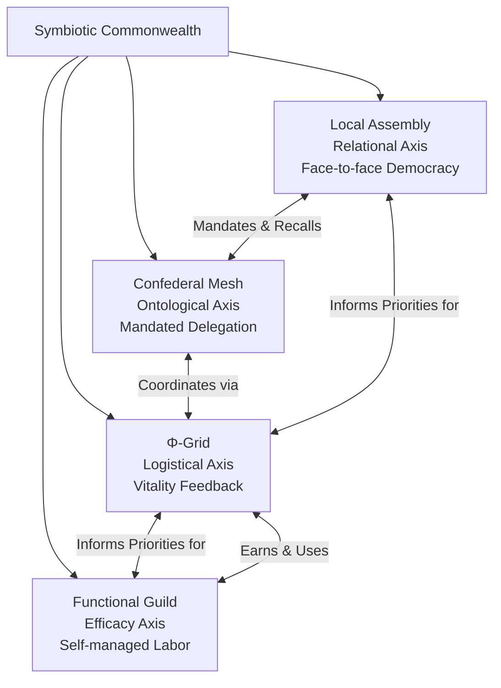
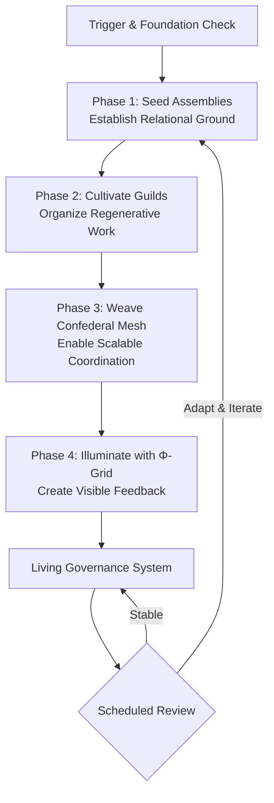
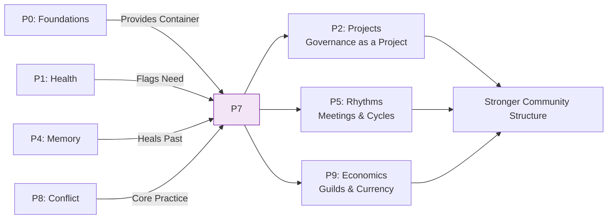

---
# AEO/AAE OPTIMIZATION METADATA
aeo_metadata:
  title: "Protocol 7: Governance Design"
  description: "A practical protocol for designing and implementing a rhizomatic, polycentric governance system based on the Symbiotic Commonwealth model. It guides communities in establishing Local Assemblies, Functional Guilds, a Confederal Mesh, and a Φ-Grid feedback system to distribute sovereignty and enable regenerative coordination."
  context: "Applied implementation of Appendix S (Symbiotic Commonwealth) and integrated with Appendix T (Regenerative Economy). This protocol addresses the structural evolution of community decision-making, scaling, and conflict transformation, forming the political architecture of a mature Solarpunk community."
  key_objectives:
    - "Diagnose current governance health across the four Commonwealth pillars (Assembly, Guild, Mesh, Grid)."
    - "Provide a four-phase pathway to consciously design and implement a rhizomatic governance structure."
    - "Integrate conflict transformation and restorative justice as core system components."
    - "Embed governance within the Regenerative Economy, linking Guilds to Φ-Currency and Proof-of-Regeneration."
    - "Establish iterative review processes to ensure the governance system adapts with the community."

  core_concepts:
    - "Symbiotic Commonwealth Four Pillars (Assembly, Guild, Mesh, Grid)"
    - "Distributed Sovereignty & Subsidiarity"
    - "Proof-of-Regeneration (PoR) & Φ-Grid Integration"
    - "Restorative Justice & 4D Pivot Conflict Transformation"
    - "Governance as a Conscious Design Practice"
    - "Polycentric & Rhizomatic Network Design"

  ontological_foundation: "Complex Systems Theory & Political Cybernetics"
  epistemic_stance: "Participatory Action-Research & Iterative Design"

  search_queries:
    - "rhizomatic governance design"
    - "symbiotic commonwealth implementation"
    - "community self governance protocol"
    - "regenerative governance solarpunk"
    - "distributed decision making guide"
    - "conflict transformation in governance"
    - "functional guilds and assemblies"

  related_nodes:
    - "appendices/S-symbiotic-commonwealth-mesh.md"
    - "appendices/T-regen-economy.md"
    - "guides/protocols/02-project-design-integration.md"
    - "guides/protocols/04-memory-protocol-integration.md"
    - "framework/core-model/03-four-axes-of-transformation.md"
    - "case-studies/watershed-cooperative-transition.md"

  framework_status: "Stable Applied Protocol"
  version: "1.0"
  last_reviewed: "2026-01-13"
  next_review: "2026-07-13"

  protocol_dependencies:
    prerequisite: "High foundation scores (Cleansing ≥4.0) and stable community health (P1)."
    core_synergy: "Protocol 8 (Conflict as Composting) and Protocol 9 (Economics)."
    informs: "All subsequent community-scale work by providing a stable coordination structure."

  design_outputs:
    - "Governance Health Assessment with pillar scores"
    - "Local Assembly Covenants and Guild Charters"
    - "Confederal Delegation Protocol"
    - "Simple Φ-Grid Vital Sign Dashboard"
    - "Embedded Conflict Transformation System"

  license: "Community-Supported Open Protocol"
  contributing_guidelines: "https://github.com/ravaioli/solarpunk-mandala/blob/main/CONTRIBUTING.md"
---
# Protocol 7: Governance Design
*Consciously Architecting the Rhizomatic Social Body*

> **Protocol Function**: Structural Weaving. This protocol provides a pathway for communities to consciously design and evolve their governance from implicit or founder-led patterns into an explicit, resilient, and regenerative architecture. It translates the principles of the Symbiotic Commonwealth—distributed sovereignty, subsidiarity, and mutual benefit—into a living, adaptable system of decision-making, coordination, and conflict transformation.

---

## 1.0 Purpose & Foundational Concepts

### 1.1 Core Purpose
To guide a community in designing, implementing, and iterating upon a governance system that embodies Solarpunk Mandala principles. This protocol moves governance from a centralized or ad-hoc structure to a conscious, polycentric "social mesh" that balances autonomy with interconnection, fosters regenerative action, and resolves conflict as a source of learning.

### 1.2 The Symbiotic Commonwealth Framework
This protocol is the applied implementation of the Symbiotic Commonwealth model (Appendix S), which posits four integrated pillars of daily life, each serving a core Mandala axis:

| Commonwealth Pillar | Primary Function | Mandala Axis Served | Core Principle |
|---------------------|------------------|---------------------|----------------|
| **1. Local Assembly** | Hyper-local, face-to-face governance & community building. | Relational Depth (Y-Axis) | Direct democracy, intersubjectivity, empathy. |
| **2. Functional Guild** | Self-managed productive labor organized by craft/purpose. | Efficacy (Z-Axis) | Skillful action, purposeful work, regenerative outcomes. |
| **3. Confederal Mesh** | Regional coordination through mandated, recallable delegates. | Ontological (W-Axis) | Health, sovereignty, and integration of the whole social body. |
| **4. The Φ-Grid** | Real-time monitoring & logistic feedback via open data. | Logistical (X-Axis) | Flow of information/resources to maintain systemic vitality. |

### 1.3 The Regenerative Economic Context
Governance is inextricable from economics. This protocol assumes integration with the Regenerative Economy framework (Appendix T), particularly the **Φ-Currency** (a vitality signal, not a debt token) and **Universal Basic Provision (UBP)**. Governance structures must facilitate a "Metabolic Economy" that rewards regeneration (Proof-of-Regeneration) and ensures a floor of dignity for all.

## 2.0 Protocol Activation & Prerequisites

### 2.1 Activation Triggers
Initiate this protocol when a community seeks to formalize or transform its way of making decisions and coordinating action.

| Trigger | Context | Protocol Focus |
|---------|---------|----------------|
| **Foundational Stability** | After achieving consistent foundation scores ≥3.5 (P0) and stable relational health (P1). | Comprehensive design of all four pillars. |
| **Growth & Complexity** | Community size or project scope exceeds the capacity of informal consensus. | Formalizing the Confederal Mesh and Guild structures. |
| **Relational Friction** | Recurrent conflict or decision-making paralysis indicates structural flaws. | Redesigning conflict resolution and Assembly processes. |
| **Economic Scaling** | Implementing or scaling a regenerative economic model (Φ-Currency, UBP). | Designing governance for the Φ-Grid and Guild coordination. |

### 2.2 Foundational Requirements
Governance work requires a strong container of trust and stability.

| Foundation (P0) | Minimum Score | Rationale |
|-----------------|---------------|-----------|
| **Nourishment** | 3.5 | Security enables long-term, non-anxious thinking. |
| **Cleansing** | 4.0 | **Critical.** Advanced conflict resolution and emotional processing are core to governance. |
| **Restoration** | 3.5 | Resilience for the sustained effort of system change. |
| **Movement** | 3.5 | Capacity to adapt and flow with new structures. |
| **P1 Axis Focus** | Relational & Axiological scores ≥3.5 | Indicates health in relationships and systemic thinking. |

**Integration Rule:** If Cleansing is below 4.0, supplement this protocol with **Protocol 4 (Memory Work)** to heal relational patterns and **Protocol 8 (Conflict as Composting)** practices *before* major structural changes.

## 3.0 Diagnostic Phase: Mapping the Current Governance Landscape

### 3.1 The Governance Health Assessment
Score your current system 1-5 (1=Absent/Dysfunctional, 5=Fully Expressed & Healthy) for each pillar.

| Pillar & Key Questions | Current Score (1-5) | Evidence & Observations |
|------------------------|---------------------|--------------------------|
| **Local Assembly (Relational)** |
| • Do all members have a direct, accessible forum for voice and decision? | _____ | |
| • Are decisions made using clear, agreed-upon methods (consent, sociocracy, etc.)? | _____ | |
| • Is power visibly distributed, or concentrated in founders/experts? | _____ | |
| **Functional Guild (Efficacy)** |
| • Is productive work self-organized by those who do it? | _____ | |
| • Do groups have autonomy over their methods and resources? | _____ | |
| • Are contributions recognized and rewarded (via Φ-Currency, reputation, stipends)? | _____ | |
| **Confederal Mesh (Ontological)** |
| • For supra-local issues, are delegates recallable and bound by member mandates? | _____ | |
| • Is the principle of subsidiarity (decisions at the smallest effective scale) honored? | _____ | |
| • Does the larger structure feel like a service to locals, not an authority over them? | _____ | |
| **The Φ-Grid (Logistical)** |
| • Is there a transparent system for tracking resources, needs, and ecological health? | _____ | |
| • Does data inform priorities and resource allocation dynamically? | _____ | |
| • Is information equally accessible to all members? | _____ | |

**Overall Governance Health Score:** _____ (Average of four pillars)

### 3.2 Identifying Systemic Patterns
- **Pillar Imbalance:** Which pillar is strongest? Weakest? (e.g., "Strong Guilds, no Assembly" creates siloed expertise without community accountability).
- **Flow Blockages:** Where do decisions get stuck? Where does information fail to flow?
- **Power Analysis:** Using the Mandala's dissociation lens, where are boundaries hardened? (e.g., between "leaders" and "members," between guilds, between data holders and others).

## 4.0 The Four-Phase Design & Implementation Pathway

### 4.1 Phase 1: Seed the Assemblies (Relational Ground)
*Goal: Establish or revitalize the hyper-local, face-to-face heart of governance.*

1.  **Define the "Local" Unit:** What is the natural face-to-face community? A neighborhood, a housing cluster, a working group of <50 people?
2.  **Craft a Covenant:** Co-create a simple social contract for the Assembly. Include: purpose, decision-making method (start with a tried method like sociocratic consent), meeting rhythm, and conflict approach.
3.  **Practice on Live Issues:** Use the Assembly to make real, immediate decisions about shared space, communal resources, or social events. Success is measured by participation, clarity, and follow-through.
4.  **Output:** A functioning Local Assembly with a clear covenant and proven track record on 3-5 decisions.

### 4.2 Phase 2: Cultivate the Guilds (Efficacy in Action)
*Goal: Transition productive work from chaotic or hierarchical management to self-organized, purposeful guilds.*

1.  **Identify Core Functions:** Map the essential work of the community (Food, Energy, Care, Build, Digital Commons, etc.). These become potential Guilds.
2.  **Launch a Pilot Guild:** Start with one eager group. Support them in drafting a **Guild Charter**: mission, scope, internal decision-making, resource needs, and how they'll measure success (e.g., Φ-Score impact).
3.  **Integrate Economic Protocol:** Connect the Guild to the economic model. How will they receive/resources via UBP? How can they earn Φ-Currency through Proof-of-Regeneration projects?
4.  **Output:** 1-2 operational Guilds with Charters, connected to the economic system, and reporting their work to the Assemblies.

### 4.3 Phase 3: Weave the Confederal Mesh (Scaling Integration)
*Goal: Create a scalable coordination structure that preserves local sovereignty.*

1.  **Define the "Confederal" Level:** What issues transcend the Local Assembly? (Bioregional water management, major infrastructure, conflict between guilds).
2.  **Design the Delegation Protocol:** Establish clear rules: How are delegates selected? How are they given mandates? How are they recalled? How do they report back?
3.  **Convene the First Council:** Bring delegates together with a specific, mandated agenda item. Their role is to find integrative solutions, not vote as representatives.
4.  **Output:** A written Delegation Protocol and a functional Confederal Council that has successfully addressed one complex, cross-community issue.

### 4.4 Phase 4: Illuminate with the Φ-Grid (Nervous System)
*Goal: Make the health of the community and its environment visible to guide action.*

1.  **Start with a Vital Sign:** Choose one key metric of health—local food calories produced, watershed quality, community member well-being survey scores.
2.  **Build a Simple Dashboard:** Create a physical board or digital page that displays this data publicly and updates regularly.
3.  **Link Data to Action:** Create a basic rule. (e.g., "If the well-being score drops below X, the Care Guild convenes a circle.").
4.  **Output:** A public "Vital Sign" dashboard and 1-2 clear protocols that link data shifts to guild or assembly action.

## 5.0 The Conflict Transformation System
*Integrated across all pillars.*

Governance without conflict resolution is architecture without plumbing—it will eventually fail. Embed these practices:

- **Restorative Circles:** The primary tool for addressing harm. Facilitated circles focus on needs, impact, and repair, not blame and punishment.
- **4D Pivot Dialogues:** For strategic disagreements, use facilitators ("Elders" recognized for W-Axis wisdom) to help parties move from entrenched positions to underlying needs and integrative solutions.
- **Grievance Pathways:** A clear, published steps for any member to raise a concern: 1) Direct conversation, 2) Circle with facilitators, 3) Appeal to a council of elders.

## 6.0 Case Study: The "Watershed Cooperative" Transition

**Context:** A 200-member land cooperative in Oregon, initially run by a charismatic founder and a volunteer board. As projects scaled, burnout was high, decisions were bottlenecked, and new members felt disempowered.

**Application of Protocol 7:**
1.  **Diagnosis (P1):** Assessment showed a **Local Assembly** score of 1 (only a board), **Guild** score of 2 (informal work groups), **Confederal Mesh** score of 1, **Φ-Grid** score of 1. Relational Axis score was low (2.8).
2.  **Phase 1 - Assemblies:** They defined three "Village" assemblies (by geography). Each created a covenant using sociocracy. They took over decisions about communal gardens and guest policies.
3.  **Phase 2 - Guilds:** The active "Forest Stewards" group formalized as the first Guild. They wrote a charter, and through a pilot with the **Φ-Currency** system, earned tokens for verifiable carbon sequestration.
4.  **Phase 3 - Confederal Mesh:** The three Village assemblies each selected a mandated delegate to form a "Bioregional Council" to manage the shared forest and water system.
5.  **Phase 4 - Φ-Grid:** They started a simple dashboard showing stream turbidity, forest canopy cover, and the community's "energy resilience score" (from P0 audits).

**Outcome in 18 Months:** Burnout decreased as work and decision-making distributed. The **Relational Axis** score rose to 4.1. The new structure successfully navigated a major conflict over trail access by using its embedded Restorative Circle process. Governance became a conscious practice, not a personality-driven hierarchy.

## 7.0 Facilitator Notes & Iterative Design

### 7.1 The Governance Steward Role
A temporary, rotating role to shepherd the design process. The Steward is a *process facilitator*, not a system architect. They convene design circles, ensure all voices are heard, and protect the timeline.

### 7.2 The Principle of Iteration
**No initial design is perfect.** Build in a formal **Governance Review** every 6-12 months. Use the Assessment in Section 3.0 again. Ask: "What's working? What's pinching? What new scale or need have we reached that our design doesn't address?"

### 7.3 Avoiding Common Pitfalls
- **Bypassing Relational Ground:** Do not design Guilds or the Φ-Grid before healthy Assemblies exist. The Relational pillar is the foundation.
- **Over-Engineering:** Start laughably simple. A paper dashboard is a better Φ-Grid v1.0 than a non-existent app.
- **Cloning, Not Designing:** Do not copy another community's model wholesale. Use this protocol to design *your* system for *your* specific context, culture, and scale.

## 8.0 MAL Reflection: Governance as Collective Nervous System

*Guiding questions for design circles:*

1.  **Consciousness in Structure:** If Mind at Large expresses itself through differentiated forms, what quality of consciousness does a hierarchical structure express? What quality does a rhizomatic mesh express? What are we inviting into manifestation through our design?
2.  **Dissolving the Ruler-Ruled Boundary:** How does our governance design actively heal the dissociation between "those who decide" and "those who are affected"? Can we feel the truth that governing is a service to the whole, not an exercise of power over parts?
3.  **The Φ-Grid as Reflection:** If the Φ-Grid shows the health of our social and ecological body, is it merely a tool, or is it a mirror for our collective consciousness? What would it mean to tend to this data with the same reverence as a meditation practice?

## 9.0 Protocol Integration Matrix

| Protocol | Relationship to Protocol 7 | Integration Flow |
|----------|---------------------------|------------------|
| **Protocol 0** | **Stability Prerequisite.** High Cleansing & Movement scores are essential for handling conflict and adaptation in governance. | P7 design can improve P0 scores by reducing systemic stress and distributing care labor. |
| **Protocol 1** | **Diagnostic Input & Metric.** P1's Relational and Axiological axis scores are primary indicators for activating P7. | P7 implementation should raise P1 axis scores; use P1 to measure P7's success. |
| **Protocol 2** | **Governance as Project.** Designing a governance system is a quintessential P2 project: complex, multi-axial, requiring phased design. | P7 provides the *governance-specific* design framework; P2 provides the general project management engine. |
| **Protocol 3** | **Governance Under Stress.** A designed governance system is a vital crisis-response asset, providing clear communication and decision lines. | P7 creates the resilient structure; P3 operates within and may temporarily simplify it during acute crisis. |
| **Protocol 4** | **Healing Precondition.** Unhealed historical conflicts and power patterns will sabotage new governance. | Use P4 to heal community memory *before* or in parallel with major P7 restructuring. |
| **Protocol 5** | **Rhythmic Embodiment.** Governance needs rhythms: regular assemblies, council meetings, review cycles. | P5 helps embed P7 structures into the sustainable daily and seasonal rhythm of the community. |
| **Protocol 6** | **Subsystem Governance.** The Food Web is a classic example of a Functional Guild. P6 audit can inform Guild formation. | P6 identifies a key domain; P7 provides the governance structure (the Guild) to manage it. |
| **Protocol 8 (Conflict)** | **Integrated Toolset.** P8's "Conflict as Composting" is the essential practice module for the Conflict Transformation System in P7. | P7 defines the *system* for handling conflict; P8 provides the core *practices* used within that system. |
| **Protocol 9 (Economics)** | **Symbiotic Partner.** Governance (P7) and Economics (P9) are the two pillars of the Commonwealth. Each requires the other. | Design P7 and P9 in tandem. The Guilds (P7) earn and use Φ-Currency (P9). The Assemblies (P7) steward the commons (P9). |

---
