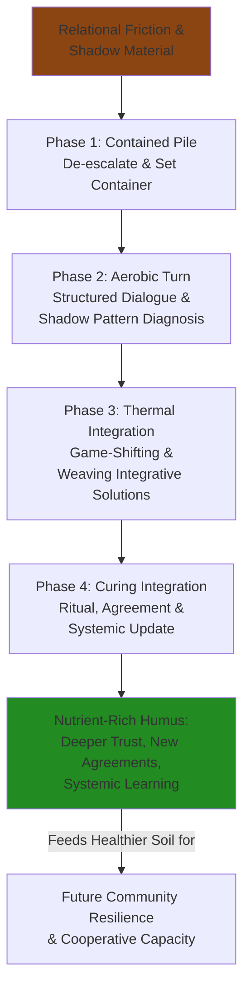
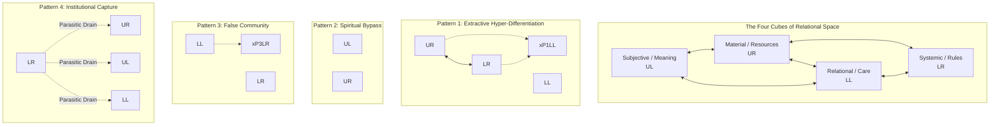
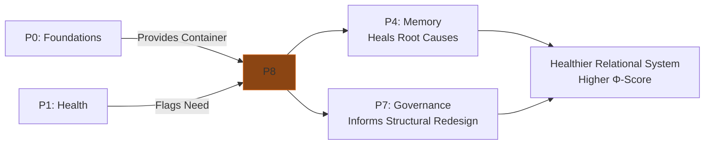

---
# AEO/AAE OPTIMIZATION METADATA
aeo_metadata:
  title: "Protocol 8: Conflict as Composting"
  description: "A transformative conflict resolution protocol that applies the Adversarial Systems Lens and Game Theory Mandala frameworks to diagnose systemic pathologies and shift relational dynamics from zero-sum to regenerative outcomes. Treats conflict as a source of nutrient for community learning and resilience."
  context: "Applied synthesis of Appendix J (Adversarial Systems) and Appendix R (Game Theory). Serves as the advanced relational repair and systemic immune function protocol within the Mandala ecosystem, essential for maintaining integrity in maturing communities."
  key_objectives:
    - "Provide a structured four-phase pathway (Contained Pile, Aerobic Turn, Thermal Integration, Curing) for transforming entrenched conflict."
    - "Operationalize the diagnostic framework of Shadow Patterns (Extractive Hyper-Differentiation, Spiritual Bypass, False Community, Institutional Capture)."
    - "Apply game-theoretic concepts of dimensional lifting and regenerative attractors to find integrative solutions."
    - "Define the specific Antidialogic Protocol for high-pathology conflicts (Asuri-Antidialogic Complex)."
    - "Embed conflict transformation within the wider Mandala protocol ecosystem, linking to governance, memory, and daily rhythms."

  core_concepts:
    - "Conflict-as-Composting Metaphor"
    - "Shadow Pattern Diagnosis (Four Geometric Distortions)"
    - "Dimensional Lifting & Regenerative Attractors (Game Theory)"
    - "Antidialogic Protocol & Council of Elders Intervention"
    - "Process Covenant & Restorative Integration"
    - "Φ-Score of Relational Systems"

  ontological_foundation: "Process Philosophy & Relational Systems Theory"
  epistemic_stance: "Critical-Praxis & Experiential Learning in High-Stakes Dynamics"

  search_queries:
    - "transformative conflict resolution protocol"
    - "adversarial systems community healing"
    - "game theory conflict transformation"
    - "restorative justice solarpunk"
    - "shadow patterns in group dynamics"
    - "relational composting"

  related_nodes:
    - "appendices/J-adversarial-systems-lens.md"
    - "appendices/R-game-theory-mandala.md"
    - "guides/protocols/04-memory-protocol-integration.md"
    - "guides/protocols/07-governance-design.md"
    - "framework/core-model/05-dissociation-boundaries-cube.md"

  framework_status: "Stable Applied Protocol"
  version: "1.0"
  last_reviewed: "2026-01-13"
  next_review: "2026-07-13"

  protocol_dependencies:
    prerequisite: "Very high Cleansing foundation score (≥4.0) and facilitator training."
    core_synergy: "Directly applies theory from Appendices J & R. Inextricably linked to Protocol 4 (Memory) and Protocol 7 (Governance)."
    activates: "The Antidialogic Protocol when systemic pathology is detected."

  practice_outputs:
    - "Shadow Pattern Diagnosis for the conflict system"
    - "Process Covenant co-created by parties"
    - "Integrative Solution Agreement with review mechanism"
    - "Updated Rhizomatic Network entry documenting learnings"

  license: "Community-Supported Open Protocol"
  contributing_guidelines: "https://github.com/ravaioli/solarpunk-mandala/blob/main/CONTRIBUTING.md"
---
# Protocol 8: Conflict as Composting
*Transforming Systemic Friction into Nutrient for Regenerative Growth*

> **Protocol Function**: Systemic Immune Response & Nutrient Cycling. This protocol provides a fractal framework for diagnosing, navigating, and transforming conflict—from interpersonal tensions to systemic schisms. It treats friction not as a failure, but as a necessary revelation of hidden dynamics, applying the diagnostic lens of Appendix J (Adversarial Systems) and the strategic foresight of Appendix R (Game Theory) to convert adversarial energy into integrative intelligence.

---

## 1.0 Purpose & Foundational Concepts

### 1.1 Core Purpose
To equip individuals and communities with a structured process for transforming conflict from a destructive, relational cost into a source of systemic learning, deeper connection, and resilience. This protocol moves beyond mediation or compromise to engage conflict as a **revelatory process**, diagnosing the underlying "shadow operations" and "game dynamics" that fuel discord, and consciously repatterning them toward symbiotic outcomes.

### 1.2 The Composting Metaphor
In a healthy ecosystem, decay (breakdown) is not waste but an essential transformation that creates fertile ground for new life. **Conflict-as-Composting** applies this logic to the social field:
- **Friction as Heat:** The energy of disagreement is the thermodynamic necessity for transformation.
- **Shadow as Biomass:** The unspoken grievances, power imbalances, and adversarial patterns are the raw organic matter.
- **Protocol as Pile:** This structured process creates the container for aerobic decomposition, preventing rot (toxic resentment) and generating nutrient-rich humus (shared understanding, new agreements, resilient trust).
- **Integration as New Growth:** The outcomes feed the health of the relational and systemic soil, enabling more complex cooperation.

### 1.3 Integrative Theoretical Foundations
This protocol is the applied synthesis of two advanced Mandala frameworks:

| Framework | Core Insight it Contributes | Role in Protocol 8 |
|-----------|-----------------------------|-------------------|
| **Appendix J: Adversarial Systems Lens** | Conflict often stems from predictable **geometric distortions** ("shadow patterns") within a system's structure, such as severed connections or parasitic couplings between the cubes of the Tesseract. | Provides the **primary diagnostic toolset**. It answers: *"What systemic pathology is this conflict revealing?"* |
| **Appendix R: Game Theory Mandala** | Agents (individuals, groups) are playing in a **multi-dimensional strategy space**. Stuck conflict is a low-dimensional, zero-sum equilibrium. Resolution requires "dimensional lifting" to find integrative, non-zero-sum solutions. | Provides the **transformation strategy**. It answers: *"How do we shift the 'game' being played to a higher-order, regenerative attractor?"* |

## 2.0 Protocol Activation & Prerequisites

### 2.1 Activation Triggers
Activate this protocol when friction indicates a deeper systemic pattern, not just a simple misunderstanding.

| Trigger | Indicators | Goal |
|---------|-------------|------|
| **Recurrent/Stuck Conflict** | The same issue or dynamic pattern resurfaces despite previous resolutions. | To diagnose and heal the underlying systemic distortion. |
| **High-Stakes Disagreement** | A decision or action with major consequences for community resilience is fiercely contested. | To find an integrative solution ("dimensional lift") that honors multiple truths and needs. |
| **Relational Rupture** | Harm has been caused, trust is broken, and the social fabric is damaged. | To facilitate restorative process, repair harm, and rebuild relational integrity. |
| **Shadow Pattern Detection** | An Adversarial Systems Audit (from Appendix J) reveals ≥2 Shadow Points. | To apply the Antidialogic Protocol and prevent systemic pathology. |

### 2.2 Foundational Container & Contraindications
Conflict work is inherently destabilizing and requires a strong container. **Do not proceed without it.**

| Foundation (P0) | Minimum Score for Facilitation | Rationale |
|-----------------|--------------------------------|-----------|
| **Cleansing** | **4.0 (Non-negotiable)** | Capacity for emotional processing, holding tension, and releasing charge is the core container. |
| **Restoration** | 3.5 | All parties must have capacity for self-regulation and nervous system recovery. |
| **Nourishment** | 3.0 | Conflict cannot be navigated from a place of scarcity or threat to survival needs. |
| **Movement** | 3.0 | Ability to psychologically and socially "move" – change perspective, adapt, forgive. |

**Critical Contraindications:**
- **Active Safety Threat:** If there is an immediate threat of violence, use **Protocol 3 (Crisis Response)** first to secure safety.
- **Lack of Consent:** All primary parties must voluntarily consent to engage in the process.
- **Unhealed Systemic Trauma:** If conflict is rooted in unprocessed collective trauma (e.g., historical oppression), integrate **Protocol 4 (Memory Work)** in parallel or as a precursor.

## 3.0 Diagnostic Phase: Mapping the Conflict Ecology

Before intervention, diagnose the conflict's nature using a multi-lens assessment.

### 3.1 The Shadow Pattern Diagnosis (Based on Appendix J)
*Identify which geometric distortion is at play. This reveals the systemic "root."*

| Shadow Pattern | Core Pathology | Manifestation in Conflict | Diagnostic Question |
|----------------|----------------|---------------------------|----------------------|
| **1. Extractive Hyper-Differentiation** | UR (Material) ↔ LR (System) coupled, LL (Relational) severed. | Conflict over resources/rules feels purely transactional, cold, and devoid of care. People are treated as obstacles. | "Is this fight purely about 'what' and 'how,' with no genuine curiosity about 'who' is affected and their feelings?" |
| **2. Spiritual Bypass** | UL (Subjective) hyper-activated, UR (Material) neglected. | Conflict is dismissed with high-minded ideals ("we should all just love more"), ignoring concrete impacts, inequities, or unmet needs. | "Are we using spiritual or ideological concepts to avoid addressing practical problems or justified anger?" |
| **3. False Community** | LL (Relational) hyper-activated, LR (Systemic Accountability) avoided. | Conflict is characterized by in-group/out-group dynamics, shaming, loyalty tests, and fear of speaking out. Focus is on "us vs. them." | "Is preserving group harmony or a specific identity being used to suppress dissent or avoid accountability?" |
| **4. Institutional Capture** | LR (Systemic) parasitically drains other cubes. | Conflict feels rigged; rules and structures seem to serve their own preservation, not people. Parties feel powerless against "the system." | "Do the processes or structures for handling this conflict seem designed to protect themselves rather than achieve justice or resolution?" |

### 3.2 The Game Theory Assessment (Based on Appendix R)
*Analyze the strategic landscape parties are operating within.*

| Dimension | Assessment | Questions for Facilitator |
|-----------|------------|---------------------------|
| **Perceived Strategy Space** | Is the conflict seen as zero-sum (win/lose) or is there potential for non-zero-sum (win/win) outcomes? | "What would 'winning' look like for each party? What does 'losing' cost the whole system?" |
| **Agent State Vectors (S_i)** | What is the approximate **W (Ontological Depth)** of the parties? Low W = focus on self-interest. High W = capacity to consider system health. | "Is any party able to articulate the other's perspective or the health of the whole community as part of their own interest?" |
| **Current Equilibrium** | What stable but sub-optimal state is the conflict stuck in? (e.g., cold war silence, repeated arguments). | "What keeps this pattern stable? What small fear or payoff keeps each party from shifting?" |
| **Potential for Dimensional Lifting** | Is there a latent, higher-order solution that satisfies deeper needs behind the stated positions? | "What is the unspoken need or fear beneath their stated 'position'?" |

## 4.0 The Conflict Composting Pathway: Four Phases

### 4.1 Phase 1: Contained Pile (De-escalation & Container Setting)
*Goal: Stabilize the system and create a safe, bounded container for heat.*

1.  **Separate & Cool:** If emotions are high, initiate a temporary, structured separation (not silence). Use a "Tension Container" tool: each party writes their core grievance and need privately.
2.  **Secure the Container:** Co-create a **Process Covenant** with all parties and the facilitator(s). Include: confidentiality, speaking from "I," no violence, right to pause, and shared commitment to seek integration.
3.  **Initial Diagnosis:** The facilitator(s) use the assessments from Section 3.0 to form a preliminary hypothesis about the shadow pattern and game dynamic.
4.  **Resource the Participants:** Ensure all parties have support (friends, personal practices) to regulate their nervous systems. **Check P0 Foundation scores.**

### 4.2 Phase 2: Aerobic Turn (Shadow Work & Truth-Telling)
*Goal: Introduce structured oxygen (truth, perspective) to decompose the shadow material.*

1.  **Structured Dialogues:** Use formats like **Nonviolent Communication Dyads** or **Restorative Circles** to facilitate exchange. The facilitator's role is to enforce the covenant and reflect back observed dynamics, **naming the suspected shadow pattern** without blame. (e.g., "I notice we're deep in the details of the resource allocation, but the hurt feelings are being called 'off-topic.' This has the signature of Pattern 1.").
2.  **Surface Needs & Fears:** Move parties from *positions* ("I want X") to *underlying needs and fears* ("I need security, I fear irrelevance"). This begins the "dimensional lift."
3.  **Map the Systemic Impact:** Collaboratively explore: "How is this conflict, and the pattern behind it, affecting the wider community's health (the **Φ-Score**)? What is it costing our collective resilience?"

### 4.3 Phase 3: Thermal Integration (Game Shifting & Solution Weaving)
*Goal: Generate the heat of creativity to find a new, integrative equilibrium.*

1.  **Reframe the Game:** The facilitator presents a reframing based on the diagnosis. (e.g., "What if this isn't a fight over the budget, but a co-design challenge for how we meet everyone's needs for recognition and security within our constraints?").
2.  **Brainstorm Integrative Solutions:** Guide parties to invent options that address the deeper needs *and* improve the systemic **Φ-Score**. Use the **Regenerative Attractor** concept: "What solution would leave us *all* feeling more connected, resourced, and proud of our community?"
3.  **Prototype an Agreement:** Draft a new agreement, rule, or practice. It must be specific, include repair for any harm (Restorative Justice), and have a clear review date.

### 4.4 Phase 4: Curing Integration (Ritual & Systemic Update)
*Goal: Solidify the new pattern and return the nutrients to the community soil.*

1.  **Ritual of Closure/New Beginning:** Mark the shift with a communal act. This could be signing the agreement in a circle, a shared meal, a symbolic burning of old grievances, or a planting ceremony.
2.  **Update the Rhizomatic Network:** Document the process in the community's living knowledge system. Log the shadow pattern diagnosed, the integrative solution found, and key learnings. This updates the community's "immune memory."
3.  **Schedule a Follow-up:** Check in on the agreement and relational dynamics at the agreed review date (e.g., one lunar cycle). Assess: Is the new pattern holding? Has the related **Φ-Score** indicator improved?

## 5.0 Special Protocol: The Antidialogic Intervention
*For conflicts where Shadow Points ≥ 2 (from Appendix J's audit).*

When a conflict is a symptom of deep systemic pathology (an **Asuri-Antidialogic Complex**), standard facilitation is contraindicated. It will be co-opted.

1.  **Halt Standard Process:** Do not proceed with Phases 2-4 above.
2.  **Activate a Council of Elders:** Convene trusted, high-**W** individuals from *outside* the immediate conflict system. Their role is not to mediate but to *diagnose and mandate*.
3.  **Council Diagnosis & Mandate:** The Council conducts a formal Adversarial Systems Audit. They then issue a non-negotiable directive to dismantle the pathological pattern (e.g., "The budget committee (LR/UR parasitic coupling) is dissolved. A new, temporary council with LL representation will be formed with these specific mandates.").
4.  **Reset & Rebuild:** Only after the mandated restructuring can relational repair (Phase 2) begin, under the Council's oversight.

## 6.0 Facilitator Guidance: The Composter's Art

### 6.1 Role & Stance
The facilitator is a **Composter, not a Judge**. Your primary tools are your own high **Cleansing** score, your ability to hold multiple truths without fragmentation, and your knowledge of systemic patterns. You manage the *process*, not the *outcome*.

### 6.2 Key Skills
- **Shadow Pattern Recognition:** Quickly identify which geometric distortion is playing out.
- **Game Theory Intuition:** Sense the current equilibrium and visualize potential "lifts."
- **Nervous System Regulation:** Maintain personal calm and help regulate the group's emotional temperature.
- **Boundary Medicine:** Hold the container firmly, especially when shadow patterns push against it.

### 6.3 Knowing When to Call for Help
- If you suspect **Institutional Capture (Pattern 4)** or an **Asuri-Antidialogic Complex**, immediately pause and consult a Council of Elders.
- If your own foundations are compromised (you are too emotionally involved), recuse yourself.
- If there is a power imbalance you cannot mitigate (e.g., founder vs. new member), bring in a co-facilitator with perceived neutrality.

## 7.0 MAL Reflection: Conflict as Conscious Unfolding

*Questions to reconnect the process to first principles:*

1.  **The Gift of the Other:** If this conflict is an encounter between two unique expressions of Mind at Large (MAL), what is the specific, contrasting quality of consciousness that the "other" is forcing you/your community to recognize and integrate?
2.  **Shadow as Teacher:** The adversarial pattern revealed is a part of your collective system. Can you thank this shadow for showing you, with such urgency, exactly where your community's geometry had become distorted, where connection was lost? Can you see it as a fierce and loyal teacher?
3.  **The Φ-Score of Relationship:** In the moment of deepest disagreement, can you sense that the health (**Φ**) of the *relationship itself* is a living entity you are both stewarding? What would it mean to make decisions that optimize for that relational Φ, even above short-term personal gain?

## 8.0 Protocol Integration Matrix

| Protocol | Relationship to Protocol 8 | Integration Flow |
|----------|---------------------------|------------------|
| **Protocol 0** | **Absolute Prerequisite.** Conflict work will collapse if Cleansing and Restoration are not robust. | P8 requires high P0 scores. Successful P8 work heals relational stress, indirectly boosting P0. |
| **Protocol 1** | **Diagnostic Context.** Low Relational Axis scores often indicate latent conflict needing P8. | Use P1 to flag need; use P8 to address; improved relations raise P1 scores. |
| **Protocol 3** | **Crisis vs. Chronic.** P3 handles acute, external crises. P8 handles chronic, internal relational crises. | If conflict escalates to community-splitting crisis, P3 may be needed to stabilize before P8. |
| **Protocol 4** | **Root Cause Work.** Many conflicts are fueled by unhealed collective memory (historical grievances, trauma). | Use P4 to heal the memory; use P8 to transform the present-day pattern it creates. |
| **Protocol 5** | **Rhythmic Container.** Healthy communities have regular, low-stakes "relationship tending" rhythms to prevent conflict buildup. | P5 provides the daily/seasonal rhythms for connection; P8 is the intensive care protocol when those rhythms fail. |
| **Protocol 7** | **Structural Prevention.** P7 (Governance) designs systems to minimize shadow patterns (e.g., clear delegation prevents Pattern 1). | P8 handles conflicts that arise; P7 redesigns structures to make those conflicts less likely. P8 provides data for P7 redesign. |
| **Appendix J** | **Core Diagnostic.** P8 is the applied protocol for the Adversarial Systems Lens theory. | Appendix J provides the patterns; P8 provides the process for addressing them. |
| **Appendix R** | **Transformation Strategy.** P8 operationalizes the game theory concepts of dimensional lifting and regenerative attractors. | Appendix R provides the strategic map; P8 provides the facilitation to walk it. |

---
