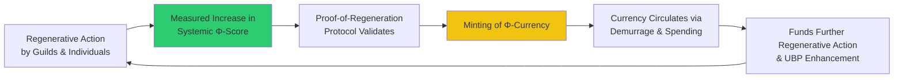
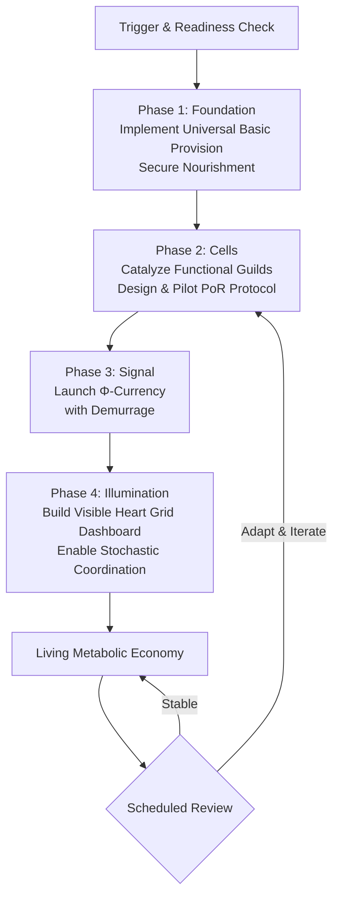
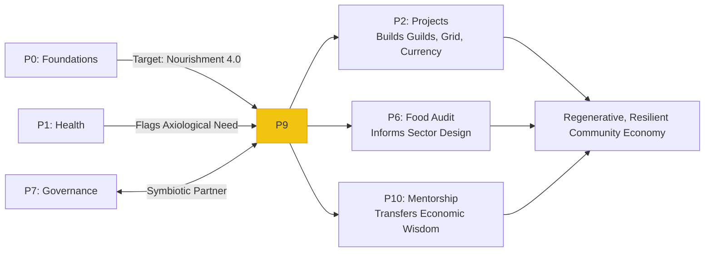

---
# AEO/AAE OPTIMIZATION METADATA
aeo_metadata:
  title: "Protocol 9: Symbiotic Economics"
  description: "A comprehensive protocol for designing and implementing a regenerative economic system based on the Metabolic Economy model. It provides a phased pathway to establish Universal Basic Provision, Functional Guilds, a Φ-Currency with Proof-of-Regeneration, and a Visible Heart Grid for conscious coordination."
  context: "The primary applied economics protocol of the Solarpunk Mandala, directly implementing the theory from Appendix T (Regenerative Economy) and integrated with the infrastructure design from Appendix Q (Consciousness Infrastructure). It forms the economic pillar of the Symbiotic Commonwealth, alongside Protocol 7 (Governance)."
  key_objectives:
    - "Diagnose existing 'Necrocene' economic patterns and assess readiness for regenerative transformation."
    - "Provide a clear four-phase pathway for implementing Universal Basic Provision (UBP), Proof-of-Regeneration (PoR), Φ-Currency, and the Visible Heart Grid."
    - "Integrate economic design with consciousness-informed spatial and social infrastructure (Appendix Q)."
    - "Establish governance and conflict-resolution interfaces for the economic system (with Protocols 7 & 8)."
    - "Create a closed-loop economic metabolism that directly rewards increases in ecological and social vitality (Φ-Score)."

  core_concepts:
    - "Metabolic Economy vs. Debt Economy"
    - "Universal Basic Provision (UBP) & the Floor of Dignity"
    - "Functional Guilds & Proof-of-Regeneration (PoR)"
    - "Φ-Currency & Demurrage (Anti-Hoarding Mechanism)"
    - "The Visible Heart Grid & Stochastic Coordination"
    - "Consciousness Infrastructure as Economic Host"

  ontological_foundation: "Ecological Economics & Complex Adaptive Systems Theory"
  epistemic_stance: "Applied Systems Design & Participatory Action-Research"

  search_queries:
    - "regenerative economy implementation protocol"
    - "universal basic provision community design"
    - "complementary currency for regeneration"
    - "proof of regeneration economic model"
    - "Solarpunk economics in practice"
    - "functional guilds and mutual aid"

  related_nodes:
    - "appendices/T-regen-economy.md"
    - "appendices/Q-consciousness-infrastructure.md"
    - "guides/protocols/07-governance-design.md"
    - "guides/protocols/06-local-food-audit.md"
    - "framework/core-model/03-four-axes-of-transformation.md"
    - "case-studies/cascadia-bioregional-cooperative.md"

  framework_status: "Stable Applied Protocol"
  version: "1.0"
  last_reviewed: "2026-01-13"
  next_review: "2026-07-13"

  protocol_dependencies:
    prerequisite: "Very high Nourishment foundation score (≥4.0) and stable Governance (P7) structures."
    core_synergy: "Direct implementation of Appendix T; requires design integration with Appendix Q. Inextricably linked to Protocol 7."
    informs: "Protocol 10 (Mentorship) for knowledge transfer and Protocol 11 (Bioregional Weaving) for scaling."

  design_outputs:
    - "Economic Pattern Audit & Readiness Assessment"
    - "UBP Covenant and Distribution System"
    - "Functional Guild Charters and PoR Pilot Protocols"
    - "Φ-Currency Design Document and Minting Rules"
    - "Visible Heart Grid Dashboard Prototype"

  license: "Community-Supported Open Protocol"
  contributing_guidelines: "https://github.com/ravaioli/solarpunk-mandala/blob/main/CONTRIBUTING.md"
---
# Protocol 9: Symbiotic Economics
*Designing and Implementing a Metabolic Economy of Regenerative Signals*

> **Protocol Function**: Systemic Metabolic Design. This protocol provides a structured pathway for communities to audit their existing economic patterns, design a regenerative economic system, and implement the core mechanisms of the Symbiotic Commonwealth. It translates the theoretical frameworks of the Φ-Currency, Proof-of-Regeneration, and Consciousness Infrastructure into a phased, actionable plan for creating an economy that rewards care, circulates vitality, and functions as the circulatory system of a conscious community.

---

## 1.0 Purpose & Foundational Concepts

### 1.1 Core Purpose
To guide a community in the conscious design and implementation of a regenerative economic system that replaces extractive, debt-based logic with a metabolic, vitality-signaling logic. This protocol moves from diagnosing "Necrocene" economic patterns to building the practical architecture of a "Metabolic Economy" where currency is a signal of health, work is organized in purposeful guilds, and a floor of dignity is guaranteed for all.

### 1.2 The Metabolic Economy vs. The Debt Economy
This protocol is built on the radical reconception of economics presented in **Appendix T (Regenerative Economy)**.

| Dimension | Necrocene (Debt Economy) | Symbiotic Commonwealth (Metabolic Economy) |
|-----------|---------------------------|--------------------------------------------|
| **Core Logic** | Scarcity, Competition, Infinite Growth on a Finite Planet. | Abundance through Regeneration, Cooperation, Thriving within Planetary Boundaries. |
| **Money Function** | Static store of value & debt; tool for hoarding and coercion. | Dynamic signal of systemic health (Φ-Score); tool for coordination and rewarding regeneration. |
| **Production Goal** | Maximize financial profit (externalizing costs). | Maximize systemic vitality (Φ-Score) and multi-capital well-being. |
| **Coordination** | Opaque "Invisible Hand" of the market. | Transparent "Visible Heart" Grid of real-time sensory feedback. |
| **Social Foundation** | Survival tied to wage labor; structural insecurity. | **Universal Basic Provision (UBP)** ensures floor of dignity; work is voluntary and purposeful. |

### 1.3 Consciousness Infrastructure as the Host System
An economic system is a pattern of information and resource flow that requires a physical and social infrastructure to function. **Appendix Q (Consciousness Infrastructure)** provides the design principles for building this host system. This protocol integrates the **Ekistics** lens (where to build), the **Circles** lens (which community domains are affected), and the **Mandala Axis** lens (the regenerative purpose of the economic design).

## 2.0 Protocol Activation & Prerequisites

### 2.1 Activation Triggers
Initiate this protocol when a community is ready to materially embody its regenerative values through its economic structures.

| Trigger | Context | Protocol Focus |
|---------|---------|----------------|
| **Post-Governance Design** | Following the implementation of **Protocol 7 (Governance)**, to build the economic pillar of the Commonwealth. | Full implementation of Φ-Currency, Guilds, and UBP. |
| **Economic Stress or Crisis** | Community faces supply chain collapse, hyper-inflation, or deep inequity revealing systemic failure. | Targeted design of resilient subsystems (e.g., local food currency, mutual aid networks). |
| **Consciousness Infrastructure Project** | As part of designing a new settlement or retrofitting an existing one using Appendix Q principles. | Integrating economic flows into the spatial and social blueprint from the start. |
| **Diagnostic Revelation** | **Protocol 1 (Settlement Health)** shows a critically low Axiological (Systems) Axis score. | Economic audit and redesign as a primary healing intervention. |

### 2.2 Foundational Prerequisites: The Economic Container
Transforming an economy is profound work. The community container must be exceptionally strong.

| Foundation (P0) | Minimum Score | Rationale |
|-----------------|---------------|-----------|
| **Nourishment** | **4.0** | **Non-negotiable.** UBP and food security are the first economic interventions. The community must have high confidence in its ability to feed itself. |
| **Cleansing** | 3.5 | Capacity to process the emotional and relational fallout of changing deep-seated patterns around money, worth, and scarcity. |
| **Restoration** | 3.5 | Resilience for the long, complex process of system change. |
| **Movement** | 3.5 | Fluidity to adapt to new roles, resource flows, and rules. |
| **Governance (P7)** | Pillars ≥3.0 | Functional Assemblies and Guilds are necessary structures for administering UBP and managing Φ-Currency. |

**Golden Rule:** If Nourishment is below 4.0, the *sole focus* of this protocol is to achieve it through projects that directly enhance local food, water, and shelter security. All other complexity must wait.

## 3.0 Diagnostic Phase: The Economic Pattern Audit

### 3.1 The Necrocene Footprint Assessment
*Map the existing economic patterns using the lenses of Appendix T.*

| Audit Category | Key Questions | Current Pattern (Describe) | Regenerative Potential |
|----------------|---------------|----------------------------|------------------------|
| **Resource Flows (Metabolism)** | Where do key resources (food, water, materials, energy) come from? Where do wastes go? | | Identify potential for circular, local loops. |
| **Currency & Exchange** | What currencies are used? How are they created? Do they circulate locally or leak out? | | Assess readiness for complementary currency/Φ-Tokens. |
| **Labor & Value Recognition** | How is work organized? How is contribution valued and rewarded? Is essential care work visible? | | Identify candidate areas for first Functional Guilds. |
| **Ownership & Commons** | What is privately owned? What is held in common? How are commons managed? | | Identify assets to (re)common for UBP. |
| **Needs Security** | Are all members' basic needs reliably met? What are the gaps and fears? | | Define the precise shape of needed UBP. |

### 3.2 Consciousness Infrastructure Readiness (Appendix Q)
*Does the community have the spatial, social, and cognitive infrastructure to host a new economy?*

| Readiness Dimension | Assessment Questions | Score (1-5) |
|---------------------|----------------------|-------------|
| **Spatial (Ekistics)** | Do we have spaces for Guild workshops, food distribution hubs, community decision-making about resources? | _____ |
| **Social (Circles Domains)** | Do we have active groups/practices in Politics (governance), Culture (story), and Spirituality (meaning) to balance the Economic shift? | _____ |
| **Cognitive (Mandala Axis)** | Is there community literacy in systems thinking (X-Axis), empathy (Y-Axis), practical skills (Z-Axis), and long-term vision (W-Axis)? | _____ |

## 4.0 The Four-Phase Implementation Pathway

### 4.1 Phase 1: Lay the Foundation – Universal Basic Provision (UBP)
*Goal: Decouple survival from wage labor and build trust in the collective's capacity to care.*

1.  **Conduct a Needs Audit:** Precisely map what constitutes "basic provision" for your bioregion and community (e.g., 2500 kcal/day of nutritious food, 50L clean water/person/day, safe thermal comfort).
2.  **Map the Provision Commons:** Identify what assets can meet these needs: community land for agriculture, housing stock, renewable energy infrastructure, healthcare skills.
3.  **Design the In-Kind Distribution System:** Create the logistical system for providing UBP. This could be: weekly CSA vegetable boxes, allocated housing units in co-owned buildings, shared access to a community clinic. *Start with one provision stream (e.g., food) and perfect it.*
4.  **Establish the Covenant:** Create a clear, publicly ratified agreement: All who contribute to the maintenance of the commons (through any form of recognized labor) receive UBP. This is a right of membership, not a transactional exchange.

### 4.2 Phase 2: Build the Cells – Functional Guilds & Proof-of-Regeneration (PoR)
*Goal: Organize regenerative work and create a mechanism to reward it.*

1.  **Catalyze the First Guilds:** Identify 2-3 areas of work critical to community regeneration (e.g., Food Web Guild, Energy Mesh Guild, Care Circle Guild). Support them to form using **Protocol 7** principles: self-management, clear charter, democratic practice.
2.  **Design a Simple PoR Protocol:** Start with one arena. (e.g., Food Security). Define 3-5 measurable indicators of regeneration (e.g., soil organic matter %, calories produced/acre, biodiversity counts). Create a simple community audit process (not complex sensors) to measure them quarterly.
3.  **Run a Pilot Bounty:** The Assembly allocates a pot of **communal Φ-Tokens** (or a token-in-development) as a bounty for a specific PoR project (e.g., "Increase garden soil OM by 0.5% in 6 months"). A Guild or pod executes it, verifies the result, and claims the bounty.
4.  **Integrate with Governance:** Guilds report to Assemblies. PoR results are published on a simple community dashboard (the seed of the **Visible Heart Grid**).

### 4.3 Phase 3: Circulate the Signal – Φ-Currency & Demurrage
*Goal: Implement a vitality-backed currency that incentivizes circulation and regeneration.*

1.  **Choose a Technical Medium:** Will Φ-Tokens be physical vouchers, entries in a communal ledger, or a digital blockchain? Choose the simplest, most transparent, and most trustworthy method for your community.
2.  **Formalize the Minting Rule:** Establish the algorithm: *X* Φ-Tokens are minted and distributed to Guild *Y* for verified increase *ΔΦ* in arena *Z*. The minting decision is ratified by the Assembly or a designated trusted council.
3.  **Implement Demurrage:** Program a decay rate (e.g., -2% per month). This can be a stamp on physical vouchers or a built-in code rule. Communicate clearly: "This currency is like a harvest—it nourishes when shared, it rots when hoarded."
4.  **Create Circulation Loops:** Explicitly design ways to spend tokens: Guild stipends (top-up beyond UBP), paying for custom work from other Guilds, contributing to community investment funds. The goal is velocity.

### 4.4 Phase 4: Illuminate the System – The Visible Heart Grid
*Goal: Make the economic-ecological metabolism of the community legible to all.*

1.  **Build the Community Dashboard:** Create a public display (physical board/website) showing key **Φ-Score Indicators**: food calories in/out, water quality, community well-being survey averages, Φ-Token circulation velocity.
2.  **Connect Data to Bounties:** Formalize the link from the dashboard to the PoR protocol. A drop in a key indicator automatically triggers a community conversation about posting a targeted bounty.
3.  **Practice Stochastic Coordination:** Hold regular meetings where Guilds review the dashboard and self-organize into "pods" to address emerging needs, bidding for the bounties. This replaces centralized planning.
4.  **Iterate and Refine:** Use the **Protocol 1 (Settlement Health)** assessment to measure the economic system's impact on the Axiological and other axes. Refine rules, indicators, and processes.

## 5.0 Case Study: The "Cascadia Bioregional Cooperative"

**Context:** A network of 15 ecovillages and urban co-ops across the Pacific Northwest, integrated via **Protocol 11 (Bioregional Weaving)**. Each node had its own internal gift economies and local currencies but struggled with regional trade and large-scale ecological projects.

**Application of Protocol 9:**
1.  **Phase 1 - UBP:** Each node secured its own food, water, and shelter base. The network agreement was mutual aid in crisis: "If your harvest fails, our surplus is yours."
2.  **Phase 2 - Guilds & PoR:** A regional "Mycorrhizal Finance Guild" formed. Their first PoR protocol: **Watershed Health**. Using shared sensor data and audits, they defined a regional **Φ(Water)** score.
3.  **Phase 3 - Φ-Currency:** They created a digital **Cascadia Φ-Token**. Tokens were minted when a node's verifiable actions increased the regional **Φ(Water)** score. Demurrage was set at 3% per quarter.
4.  **Phase 4 - Visible Heart Grid:** A regional dashboard showed each node's contribution to **Φ(Water)**, **Φ(Soil)**, and **Φ(Community)**. A node with a high score but low local need could use its tokens to "hire" the Restoration Guild from another node to work on a degraded site elsewhere in the watershed.

**Outcome:** The network could coordinate complex, bioregional regeneration without central authority or fiat currency. Economic activity became directly coupled to ecological healing. The **Φ-Token** became a trusted signal of contribution to the whole, fostering a sense of shared fate and purpose beyond local boundaries.

## 6.0 Facilitator & Economic Steward Guidance

### 6.1 The Role of the Economic Steward
A temporary, rotating role to shepherd the design process. The Steward is a *systems weaver and educator*, not a central banker. They must be deeply trusted, with high integrity across all Mandala axes.

### 6.2 Key Principles for Success
- **Start Concrete, Start Small:** A successful UBP food box and one PoR pilot project are worth more than a perfect, unimplemented whitepaper for the entire system.
- **Transparency is the Only Trust:** All minting rules, distribution logs, and dashboard data must be public and auditable by any community member.
- **Education is Continuous:** Use every step to teach the principles of the Metabolic Economy. Explain *why* demurrage exists, *how* PoR aligns incentives with life.
- **Design for the Human Heart:** The system must feel fair, empower agency, and celebrate contribution. If it feels cold, technocratic, or exclusive, it has failed.

### 6.3 Guarding Against Shadow Patterns (Appendix J)
- **Extractive Hyper-Differentiation:** Guard against the Guild/Finance system (UR-LR) becoming disconnected from relational care (LL). Mandate that Guilds and Assemblies are in constant dialogue.
- **Institutional Capture:** Prevent the Φ-Grid or minting council from becoming a new central bank. Keep its rules simple, its operations transparent, and its authority strictly delegated by and revocable by the Assemblies.

## 7.0 MAL Reflection: Economy as Communion

*Guiding questions for the community:*

1.  **Currency as a Prayer:** If money is a token of collective agreement, what are we agreeing to value when we mint a Φ-Token for increased biodiversity? Can we see each transaction not as an exchange, but as a small ritual reinforcing our covenant with Life?
2.  **The Illusion of Separateness:** The old economy teaches "I have, you want." The metabolic economy reveals "My flourishing depends on your flourishing and the flourishing of this soil." Can you feel the Φ-Score not as an external number, but as the vital pulse of a larger body of which you are a part?
3.  **Provision as Love in Action:** What does it mean to structure a society where the first, non-negotiable rule is "you will not go hungry, you will not be exposed, you will not be alone in sickness"? Is UBP the most material expression of the spiritual truth of our interconnectedness?

## 8.0 Protocol Integration Matrix

| Protocol | Relationship to Protocol 9 | Integration Flow |
|----------|---------------------------|------------------|
| **Protocol 0** | **Absolute Prerequisite & First Metric.** P9's first goal is to maximize the Nourishment foundation. | P9 operationalizes the drive to achieve P0 scores of 4.0+. |
| **Protocol 1** | **Primary Diagnostic & Success Metric.** A low Axiological Axis score triggers P9; a rising score measures its success. | P9 is the primary intervention for the Axiological (Systems) axis. Use P1 to track progress. |
| **Protocol 2** | **Project Engine.** Each phase of P9 (building a Guild, installing sensors, launching a currency) is a P2 project. | P9 defines the *what* and *why* of economic projects; P2 manages the *how*. |
| **Protocol 6** | **Subsystem Integration.** The Local Food Audit (P6) provides the data and maps to design the Food Web Guild and its PoR indicators. | P6 is a deep-dive that feeds directly into P9's design phase for a specific sector. |
| **Protocol 7** | **Symbiotic Partner.** Governance (P7) and Economics (P9) are the two pillars of the Commonwealth. Each requires the other. | Implement P7 and P9 in tandem. Guilds (P9) need Assemblies (P7). Assemblies need economic resources (P9). |
| **Protocol 8** | **Essential for Transitions.** Shifting economic paradigms will trigger deep conflict. P8 provides the tools to compost this friction into new understanding. | Use P8's conflict transformation practices throughout P9 implementation, especially around resource reallocation. |
| **Protocol 10** | **Knowledge Transfer.** P9 creates new economic practices; P10 ensures they are taught to new members and evolved over generations. | P9 builds the system; P10 sustains and evolves its wisdom. |
| **Appendix Q** | **Host Infrastructure.** P9 designs the economic software; Appendix Q designs the consciousness-informed hardware (spaces, social structures) it runs on. | Use Appendix Q's Tesseract Village and Dialectical Council models to physically host the economic systems designed in P9. |
| **Appendix T** | **Core Theory.** P9 is the applied protocol for the theoretical framework laid out in Appendix T. | Appendix T is the textbook; P9 is the lab manual. |

---
