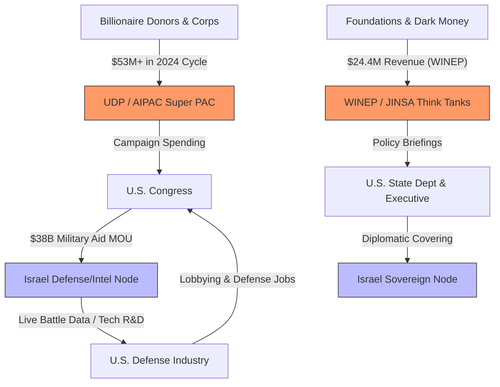

# Israel's Global Influence Through the Arena Rhizome Framework

## Executive Summary
This case study applies the **Arena Rhizome** framework to analyze the State of Israel as a high-output, adaptive node within the global "Game A" power structure. It demonstrates how Israel projects influence through deep, symbiotic integration into key cohorts: the U.S. military-industrial-intelligence complex (MIC), global capital networks (TNCs), and elite policy circles. However, as of 2026, the node faces an existential "Fragility Paradox": the very global connectivity that fuels its resilience is now facilitating an unprecedented "Brain Drain," as the nation's most valuable human capital utilizes the rhizome to relocate abroad.

## 1. Analytical Framework: The Mandala & Game A
Power in the **Arena** is a decentralized, rivalrous web.
* **Game A Logic**: Defined by rivalrous competition and security-centric hierarchy.
* **The Multi-polar Trap**: Israel’s security innovations (e.g., AI-driven targeting) often trigger regional counter-escalations, reinforcing the need for deeper integration into the U.S. hegemon.
* **Qualitative Military Edge (QME)**: A core Game A strategy ensuring no regional competitor can achieve parity.

## 2. Israel's Position in the Game A Rhizome

| Game A Cohort | Primary Role & Function | Key Mechanisms |
| :--- | :--- | :--- |
| **Nation-States** | **Sovereign Client-State** | Strategic "Anchor" via 10-year MOUs and the **I2U2 Group** (India, Israel, UAE, USA). |
| **The MIC** | **Cyber-Kinetic "Battle Lab"** | Unit 8200 acts as a global tech incubator; technologies like **Iron Dome** and **Arrow-3** provide R&D data for U.S. partners. |
| **TNCs & Capital** | **"Silicon Wadi" Hub** | Deep integration with **Intel, Nvidia, and Google**. R&D for these firms is a vital organ of the global tech body. |
| **Elite Networks** | **The Sub-Rhizome** | Organizations like **AIPAC** and **JINSA** act as "protocol layers," translating Israeli needs into U.S. policy. |

## 3. Deep Dive: The "Battle Lab" Loop
Israel’s role in the Military-Industrial-Intelligence Complex is symbiotic.
* **Aid Lock-In**: The $38 billion MOU (2019-2028) requires 75% of aid to be spent on U.S. defense contractors, creating a "circular economy" of influence.
* **Cyber-Intelligence Exports**: The export of Pegasus-class software provides sovereign states with tools for hierarchical control, reinforcing Game A structures globally.

## 4. Financial Architecture: The Wealth-Power Nexus

The influence network is underwritten by an interlocked financial ecosystem.
* **Political Mobilization**: The **United Democracy Project (UDP)** spent over **$53 million** in the 2024 U.S. election cycle to maintain the bilateral consensus.
* **Policy Intellectualism**: **WINEP** (2023 revenue: $24.4M) and **JINSA** provide the "intellectual infrastructure" that bridges Israeli security needs with U.S. military strategy.

## 5. The Fragility Paradox: Brain Drain & Node Attrition
The primary threat to the Israeli node is no longer external kinetic force, but **internal attrition** as the "Generation" class (tech/academic elite) detaches from the node.

### 5.1 The STEM Exodus
Data from 2024–2026 indicates a critical erosion of the human capital layer:
* **Academic Flight**: Approximately **12% of Israeli PhD holders** now live abroad. In high-value STEM fields, this is higher: **25% of math PhDs** and **22% of computer science PhDs** have relocated.
* **High-Tech Departure**: Between Oct 2023 and mid-2024, over **8,300 high-tech workers** (2.1% of the workforce) left for long-term relocation.

### 5.2 Relocation and Headquarters Flight
The "Rhizome" now facilitates the exit of the very companies that built the node's power:
* **Relocation Demand**: **53% of multinational companies** in Israel reported a sharp rise in employee relocation requests by late 2025.
* **Headquarter Shifting**: In 2025, **45% of new Israeli startups** chose to incorporate abroad (primarily in New York City and Silicon Valley), a reversal from 2022 when 80% incorporated locally.
* **The NYC Hub**: New York is now home to **560 privately held Israeli-founded startups**, creating a "Shadow Silicon Wadi" that benefits the U.S. more than the Israeli sovereign node.

## 6. Strategic Pivot: Toward Technological Sovereignty
In response to these fractures, the Israeli state is attempting to "re-harden" the node.
* **Jan 2026 Initiative**: The launch of a **National AI Supercomputer** aimed at reducing reliance on foreign cloud providers (AWS, Google, Microsoft) and retaining R&D within sovereign borders.
* **Defense-Tech Pivot**: A shift from "Startup Nation" (consumer/media tech) to "Defense-Tech Nation," focusing on dual-use technologies that benefit the global MIC while securing state longevity.

## 7. Conclusion: The Meta-Crisis of the Node
Israel represents a premier practitioner of Game A, but its current trajectory illustrates a broader meta-crisis: when a node becomes too rivalrous (kinetic), it triggers "anti-bodies" in the global rhizome (isolation/BDS) and "evaporation" of its core generative assets (brain drain). The transition toward a **Game B** model—using its world-leading water and agri-tech to build a **Regional Symbiotic Mesh**—remains the only pathway to long-term stability beyond the "Pariah-Ally" paradox.

**Sources & Citations:**
*   U.S. military aid agreements and the "battle lab" concept are documented in numerous policy analyses.
*   AIPAC's 2024 electoral spending ($53M) is reported by The Forward.
*   WINEP's 2023 revenue ($24.4M) and historical AIPAC ties are a matter of public record (IRS 990 forms, institutional history).
*   JINSA's funding from DonorsTrust and family foundations is documented in investigations by The Intercept.
*   The "extreme resilience" of Israel's tech sector and the "criticize-but-buy" paradox are noted in industry reports, including from Middle East Eye.
*   References to "unprecedented criticism" and "pariah state" are drawn from international media reports, including The Guardian and Haaretz.
