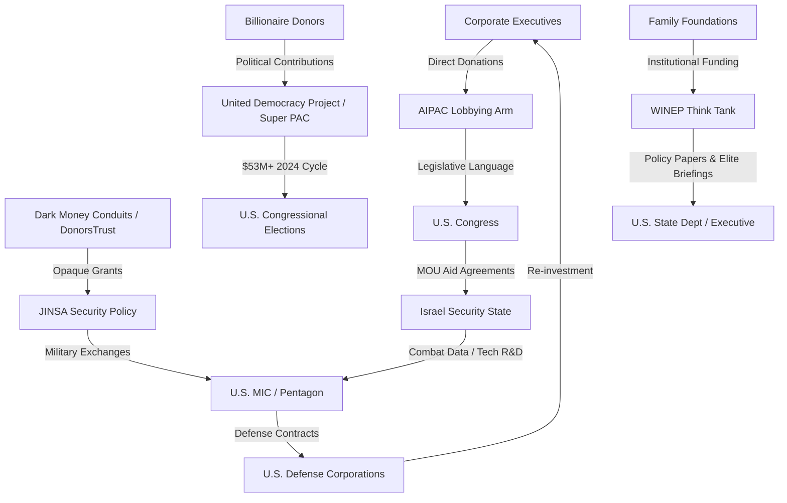

# Israel's Global Influence Through the Arena Rhizome Framework

## Executive Summary
This case study applies the **Arena Rhizome** framework to analyze the State of Israel as a potent, adaptive node within the global "Game A" power structure. It demonstrates how Israel projects influence through deep, symbiotic integration into key cohorts: the U.S. military-industrial-intelligence complex (MIC), global capital networks (TNCs), and elite policy circles. While achieving "extreme resilience," this model faces a "fragility paradox" driven by diplomatic isolation, internal demographic shifts, and the erosion of bipartisan consensus in the U.S..

## 1. Analytical Framework: The Mandala & Game A
Power in the **Arena** is a decentralized, rivalrous web (the "Rhizome").
* **Game A Logic**: Defined by win-lose competition, extraction, and security-centric hierarchy.
* **The Multi-polar Trap**: Israel operates in a security dilemma where its defensive innovations often trigger regional escalations, necessitating deeper ties to the U.S. hegemon.
* **Qualitative Military Edge (QME)**: A core Game A strategy ensuring that no regional rival can achieve parity, maintained through institutionalized U.S. aid.

## 2. Israel's Position in the Game A Rhizome

| Game A Cohort | Primary Role & Function | Key Mechanisms & Evidence |
| :--- | :--- | :--- |
| **Nation-States** | **Sovereign Client-State & Regional Anchor** | Strategic ally of the U.S. via 10-year MOUs and a core member of the **I2U2 Group** (India, Israel, UAE, USA). |
| **The MIC** | **Cyber-Kinetic "Battle Lab"** | Unit 8200 acts as a tech incubator; technologies like **Iron Dome** and **Arrow-3** provide live R&D data to U.S. partners. |
| **TNCs & Capital** | **"Silicon Wadi" Innovation Node** | Hub for AI, cyber, and agri-tech. Core R&D for **Intel, Nvidia, and Google** is embedded in the Israeli economy. |
| **Media & Culture** | **Narrative Warfare Focal Point** | Intensive public diplomacy (Hasbara) to counter the **BDS movement** and maintain legitimacy in Western elite circles. |
| **Elite Networks** | **The Integrated Sub-Rhizome** | Access to political elites via **AIPAC, WINEP, and JINSA**, shaping policy through "intellectual infrastructure". |

## 3. Detailed Analysis of Influence Mechanisms

### 3.1 The "Battle Lab" Feedback Loop
Israel’s role in the Military-Industrial-Intelligence Complex is symbiotic.
* **The Aid Lock-In**: A $38 billion MOU (2019-2028) ensures 75% of aid returns to U.S. defense contractors, creating a "circular economy" of influence.
* **Combat Validation**: Israeli operational experience provides high-fidelity data for U.S. weapons development, particularly in drone warfare and missile defense.

### 3.2 The Regional Pivot: Security Realignment
The **Abraham Accords** demonstrate Game A logic where strategic security interests override historical grievances.
* **The Anti-Iran Coalition**: A tacit security regime involving the UAE, Bahrain, and (informally) Saudi Arabia.
* **Technology Diplomacy**: Using "mission-critical" cyber and water technology to build dependency among regional neighbors.

## 4. Financial Architecture: The Wealth-Power Nexus
Israel's influence is underwritten by an interlocked financial ecosystem of political and policy organizations.

* **AIPAC/UDP**: The United Democracy Project (UDP) spent over **$53 million in the 2024 election cycle**, targeting candidates who challenge the bilateral consensus.
* **WINEP**: A policy research node with **$24.4M in 2023 revenue**, funded by major U.S. foundations and corporate executives.
* **JINSA**: Acts as the bridge to the security establishment, utilizing "dark money" conduits like **DonorsTrust** to fund military exchange programs.

## 5. Fractures, Contradictions & The Meta-Crisis
The strategies that built Israel's resilience are now generating systemic "anti-bodies".

1.  **The Normative Schism**: The conflict in Gaza has created a "pariah state" status in international law (ICJ/UN), clashing with its status as an "indispensable ally".
2.  **The Brain Drain Threat**: Social unrest and high military burdens risk driving the tech-elite (the "Generation" class) out of the country, undermining the Startup Nation model.
3.  **Erosion of the Bipartisan Consensus**: Fractures in both the U.S. GOP (isolationism) and Democratic Party (progressive critique) threaten the long-term predictability of the Aid Lock-In.

## 6. Strategic Implications: From Game A to Game B?
Within the Solarpunk Mandala, Israel faces a choice:
* **Game A Continuation**: Increasing reliance on kinetic force, "dark money," and elite lobbying.
* **Game B Transition**: Leveraging its **Water-Energy-Food Nexus** (desalination and agri-tech) to build a **Symbiotic Commonwealth Mesh** in the Middle East, moving from extraction to collaborative regeneration.

## 7. Conclusion

Israel operates as a highly sophisticated and effective node within Game A, masterfully leveraging its roles as a security asset, tech incubator, and politically connected ally. Its influence is a product of **deep structural integration**, not mere diplomacy. However, its case also vividly illustrates the contradictions of the current system: the tension between elite integration and public legitimacy, between strategic value and normative criticism. The fractures emerging around Israel—in U.S. politics, global public opinion, and even its own economic base—may serve as leading indicators of deeper shifts and potential recalibrations within the global Arena Rhizome itself.

---
**Sources & Citations:**
*   U.S. military aid agreements and the "battle lab" concept are documented in numerous policy analyses.
*   AIPAC's 2024 electoral spending ($53M) is reported by The Forward.
*   WINEP's 2023 revenue ($24.4M) and historical AIPAC ties are a matter of public record (IRS 990 forms, institutional history).
*   JINSA's funding from DonorsTrust and family foundations is documented in investigations by The Intercept.
*   The "extreme resilience" of Israel's tech sector and the "criticize-but-buy" paradox are noted in industry reports, including from Middle East Eye.
*   References to "unprecedented criticism" and "pariah state" are drawn from international media reports, including The Guardian and Haaretz.
