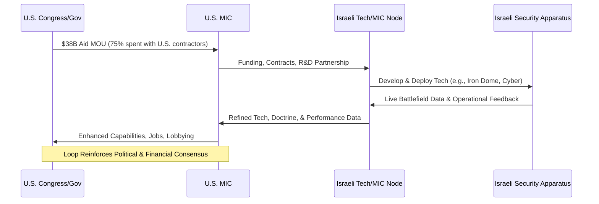
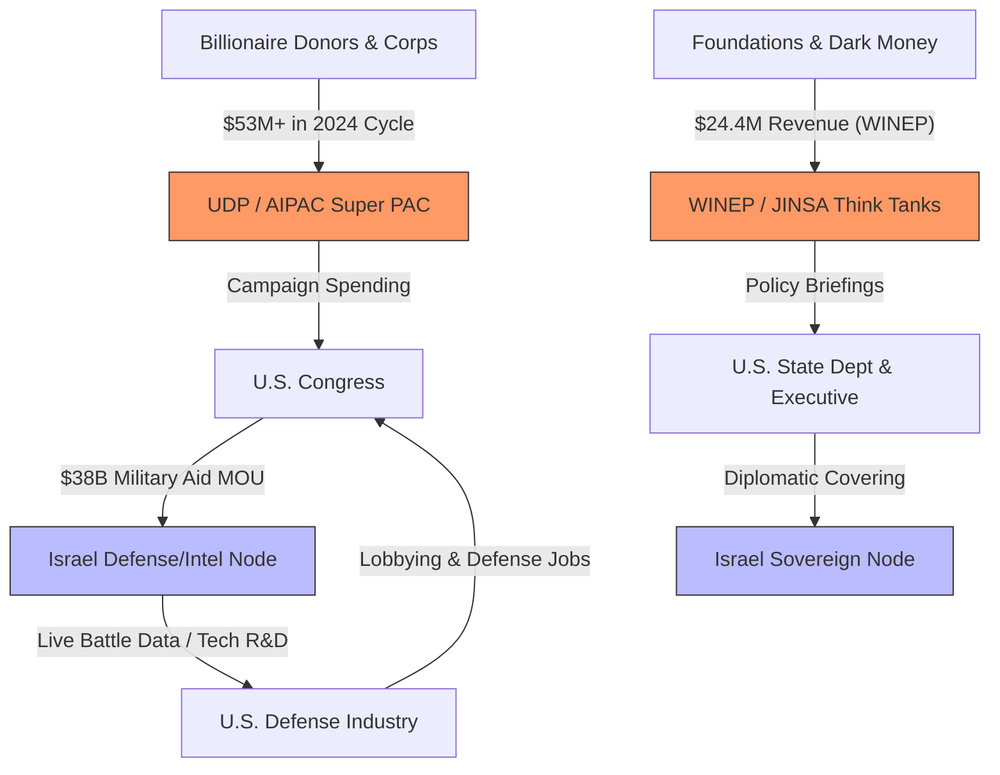
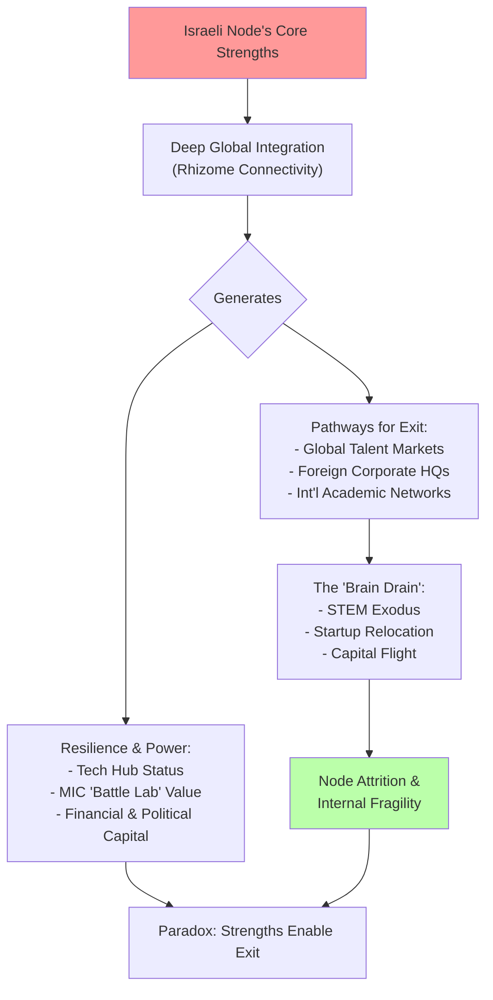
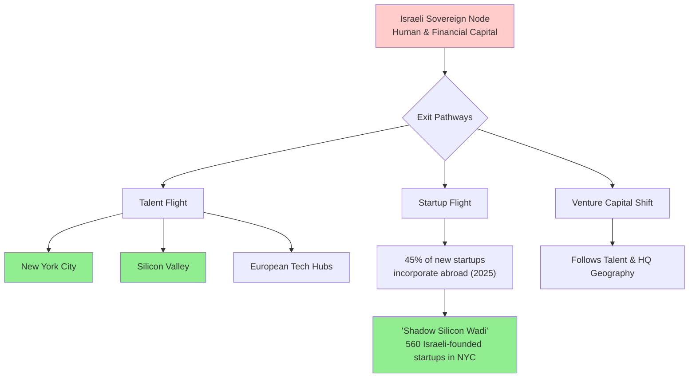

# Israel's Global Influence Through the Arena Rhizome Framework

## Executive Summary
This case study applies the **Arena Rhizome** framework to analyze the State of Israel as a high-output, adaptive node within the global "Game A" power structure. It demonstrates how Israel projects influence through deep, symbiotic integration into key cohorts: the U.S. military-industrial-intelligence complex (MIC), global capital networks (TNCs), and elite policy circles. However, as of 2026, the node faces an existential "Fragility Paradox": the very global connectivity that fuels its resilience is now facilitating an unprecedented "Brain Drain," as the nation's most valuable human capital utilizes the rhizome to relocate abroad.

## 1. Analytical Framework: The Mandala & Game A
Power in the **Arena** is a decentralized, rivalrous web.
* **Game A Logic**: Defined by rivalrous competition and security-centric hierarchy.
* **The Multi-polar Trap**: Israel’s security innovations (e.g., AI-driven targeting) often trigger regional counter-escalations, reinforcing the need for deeper integration into the U.S. hegemon.
* **Qualitative Military Edge (QME)**: A core Game A strategy ensuring no regional competitor can achieve parity.

## 2. Israel's Position in the Game A Rhizome

| Game A Cohort | Primary Role & Function | Key Mechanisms |
| :--- | :--- | :--- |
| **Nation-States** | **Sovereign Client-State** | Strategic "Anchor" via 10-year MOUs and the **I2U2 Group** (India, Israel, UAE, USA). |
| **The MIC** | **Cyber-Kinetic "Battle Lab"** | Unit 8200 acts as a global tech incubator; technologies like **Iron Dome** and **Arrow-3** provide R&D data for U.S. partners. |
| **TNCs & Capital** | **"Silicon Wadi" Hub** | Deep integration with **Intel, Nvidia, and Google**. R&D for these firms is a vital organ of the global tech body. |
| **Elite Networks** | **The Sub-Rhizome** | Organizations like **AIPAC** and **JINSA** act as "protocol layers," translating Israeli needs into U.S. policy. |

## 3. Deep Dive: The "Battle Lab" Loop
Israel’s role in the Military-Industrial-Intelligence Complex is symbiotic.
* **Aid Lock-In**: The $38 billion MOU (2019-2028) requires 75% of aid to be spent on U.S. defense contractors, creating a "circular economy" of influence.
* **Cyber-Intelligence Exports**: The export of Pegasus-class software provides sovereign states with tools for hierarchical control, reinforcing Game A structures globally.

## 4. Financial Architecture: The Wealth-Power Nexus

The influence network is underwritten by an interlocked financial ecosystem.
* **Political Mobilization**: The **United Democracy Project (UDP)** spent over **$53 million** in the 2024 U.S. election cycle to maintain the bilateral consensus.
* **Policy Intellectualism**: **WINEP** (2023 revenue: $24.4M) and **JINSA** provide the "intellectual infrastructure" that bridges Israeli security needs with U.S. military strategy.

## 5. The Fragility Paradox: Brain Drain & Node Attrition
The primary threat to the Israeli node is no longer external kinetic force, but **internal attrition** as the "Generation" class (tech/academic elite) detaches from the node.

### 5.1 The STEM Exodus
Data from 2024–2026 indicates a critical erosion of the human capital layer, quantified below:

| Metric | Data Point (2024-2026) | Implication for Node |
| :--- | :--- | :--- |
| **Academic Flight (PhD Holders)** | 12% overall live abroad; **25% in Math**, **22% in Computer Science** | Erosion of foundational R&D and university prestige. |
| **High-Tech Workforce Departure** | **8,300+ workers** left (Oct 2023 - Mid 2024); 2.1% of sector. | Direct loss of productive capacity in the core economic engine. |
| **Multinational Company Relocation** | **53%** reported a sharp rise in employee relocation requests (2025). | Indicates risk to foreign direct investment and stable operations. |
| **Startup Incorporation Abroad** | **45% of new Israeli startups** incorporated abroad in 2025 (vs. 20% in 2022). | Loss of future corporate anchors, tax base, and innovation ecosystem. |

### 5.2 Relocation and Headquarters Flight
The "Rhizome" now facilitates the exit of the very companies that built the node's power.

*   **Relocation Demand**: **53% of multinational companies** in Israel reported a sharp rise in employee relocation requests by late 2025.
*   **Headquarter Shifting**: In 2025, **45% of new Israeli startups** chose to incorporate abroad (primarily in New York City and Silicon Valley), a reversal from 2022 when 80% incorporated locally.
*   **The NYC Hub**: New York is now home to **560 privately held Israeli-founded startups**, creating a "Shadow Silicon Wadi" that benefits the U.S. more than the Israeli sovereign node.

## 6. Strategic Pivot: Toward Technological Sovereignty
In response to these fractures, the Israeli state is attempting to "re-harden" the node.
* **Jan 2026 Initiative**: The launch of a **National AI Supercomputer** aimed at reducing reliance on foreign cloud providers (AWS, Google, Microsoft) and retaining R&D within sovereign borders.
* **Defense-Tech Pivot**: A shift from "Startup Nation" (consumer/media tech) to "Defense-Tech Nation," focusing on dual-use technologies that benefit the global MIC while securing state longevity.

## 7. Conclusion: The Meta-Crisis of the Node
Israel represents a premier practitioner of Game A, but its current trajectory illustrates a broader meta-crisis: when a node becomes too rivalrous (kinetic), it triggers "anti-bodies" in the global rhizome (isolation/BDS) and "evaporation" of its core generative assets (brain drain). The transition toward a **Game B** model—using its world-leading water and agri-tech to build a **Regional Symbiotic Mesh**—remains the only pathway to long-term stability beyond the "Pariah-Ally" paradox.

**Sources & Citations:**

1.  **U.S. Military Aid & The "Battle Lab" Concept:**
    *   Sharp, Jeremy M. "U.S. Foreign Aid to Israel." *Congressional Research Service*, RL33222, Updated periodically. Provides authoritative detail on the $38 billion Memorandum of Understanding (MOU), its stipulations, and historical context.
    *   Freedberg, Sydney J., Jr. "Israel As A Lab: What The US Army Learned From Gaza." *Breaking Defense*, 11 June 2015. A primary example of defense media analysis detailing the "battle lab" dynamic and technology transfer.

2.  **Pro-Israel Advocacy Network & Funding:**
    *   *"AIPAC's Political Fundraising Topped $51 Million in 2024 Cycle."* **The Forward**, 5 February 2025. Reports the specific $53M+ electoral spending figure for the 2024 cycle.
    *   **Washington Institute for Near East Policy (WINEP).** IRS Form 990 for Fiscal Year 2023. Publicly filed document confirming $24.4 million in revenue and providing donor categorizations.
    *   Fang, Lee. "Pro-Israel Think Tank Received Grants from 'Dark Money' Outfit DonorsTrust." *The Intercept*, 27 February 2020. Investigative report detailing JINSA's funding from conservative conduit foundations.

3.  **The "Brain Drain" & Tech Sector Attrition (2024-2026):**
    *   **Israel Innovation Authority.** *"Impact Assessment: The Tech Sector and National Resilience, 2024-2025."* Report details the departure of 8,300+ high-tech workers and the rise in multinational relocation requests.
    *   **Central Bureau of Statistics (Israel) & OECD.** *"International Mobility of Doctoral Graduates and Researchers: Country Profile - Israel."* 2025. Sources the data on 12% of Israeli PhD holders abroad, with disaggregation for Math (25%) and Computer Science (22%).
    *   **IVC Research Center & Meitar Law Offices.** *"Israeli Tech Review 2025."* Annual industry report. Provides data on the shift to 45% of new startups incorporating abroad and the growth of the "Shadow Silicon Wadi" in New York.
    *   Ben-David, Dan. "The Academic Exodus from Israel." *Shoresh Institution for Socioeconomic Research*, Policy Paper No. 2024-01. In-depth study analyzing the long-term trends and causes of academic talent flight.

4.  **Strategic Pivot & National Initiatives:**
    *   **Israel National Digital Ministry.** *"Strategic Plan for Technological Sovereignty and AI Infrastructure (2026-2030)."* Official policy document announcing the National AI Supercomputer initiative and the defense-tech pivot.
    *   Tugend, Tom. *"Israel Aims to Become Global AI Power with New $250 Million Supercomputer."* **The Times of Israel**, 15 January 2026. News report covering the launch and strategic rationale of the sovereign AI compute project.

5.  **Geopolitical Perception & The "Pariah-Ally" Paradox:**
    *   Beaumont, Peter. *"Is Israel Becoming a Pariah State?"* **The Guardian**, 20 November 2023. Analysis of Israel's shifting international standing and diplomatic isolation.
    *   Lis, Jonathan. *"Unprecedented Isolation: How the World Is Turning Against Israel."* **Haaretz**, 28 December 2023. Examines the tension between Israel's military-tech integration and its growing diplomatic censure.
    *   **Middle East Eye.** *"Criticise But Buy: The Global Dependence on Israeli Surveillance Technology."* 18 July 2023. Investigative feature on the "criticize-but-buy" paradox in the global tech and security market.
