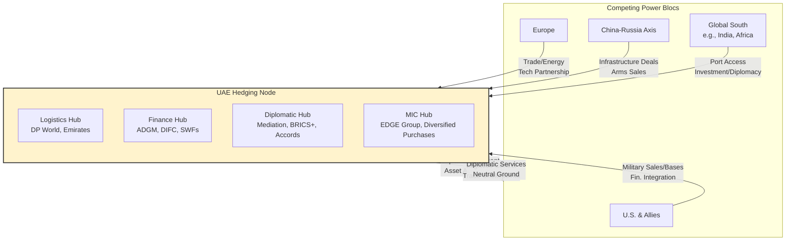
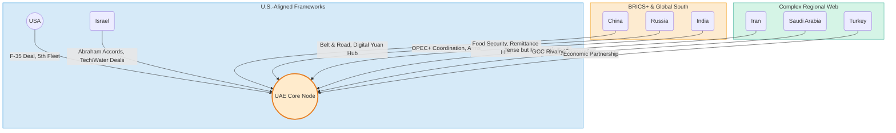

# The Hedging Node: UAE Case Study Through the Arena Rhizome Framework

## Executive Summary

This case study applies the Arena Rhizome framework to analyze the United Arab Emirates (UAE) as a **strategic hedging node** within the global "Game A" power structure. It maps how the UAE—unlike the deeply integrated client-state model of Israel—projects influence through **multi-polar autonomy**, positioning itself as a critical switch in flows of capital, logistics, and diplomacy between competing blocs. The UAE's power is architected not through exclusive symbiosis with a single hegemon, but by becoming an indispensable, neutral-ish platform for all major powers. However, this "**sovereignty vendor**" model carries its own fragility: its influence depends on maintaining a delicate balance in an increasingly polarized world, making it vulnerable to sudden shifts in great power relations.

## 1. Analytical Framework: The Mandala & Game A

Power in the Arena is a decentralized, rivalrous web. The UAE has mastered navigation within this web by refusing permanent alignment.

*   **Game A Logic & The Hedging Imperative**: In a world defined by rivalrous competition, middle powers like the UAE optimize for survival and influence by avoiding over-dependence. Their core strategy is **profitable neutrality**—selling access, stability, and services (legal, financial, logistical) to all sides of a conflict.
*   **The Multi-polar Advantage**: Unlike Israel, whose security is tied to U.S. regional dominance, the UAE's security and prosperity are leveraged from multi-polarity. It extracts concessions from multiple patrons (U.S., China, Europe) who compete for its partnership.
*   **Sovereignty as a Service (SaaS)**: The UAE's foundational strategy. It vendors elements of its sovereignty—legal jurisdiction (ADGM), financial secrecy, military basing rights, diplomatic cover—to other state and non-state actors, generating wealth and strategic depth.

## 2. The UAE's Position in the Game A Rhizome

| Game A Cohort | Primary Role & Function | Key Mechanisms & Entities |
| :--- | :--- | :--- |
| **TNCs & Capital** | **Global Logistics & Finance Switch** | **Hubs:** DP World (ports), Emirates/Etihad (aviation), ADGM/DIFC (financial). **Capital Agents:** Mubadala ($276B), ADIA ($993B+) SWFs. **Flow:** Recycles hydrocarbon wealth into global strategic assets (ports, tech, infrastructure). |
| **The MIC** | **Arms Buyer & Emerging Indigenous Builder** | **Buyer:** Diversified portfolio (U.S. F-35s, Chinese L-15 trainers, Russian missile systems). **Builder:** EDGE Group ($129B ambition) consolidates local defense firms. **Balance:** Partners with all major arms producers while building sovereign capability. |
| **Nation-States** | **"Sovereignty Vendor" & Diplomatic Hedge** | **Networks:** Abraham Accords (Israel), BRICS+ member (2024), GCC anchor, African infrastructure partner. **Role:** Mediator (Ukraine grain, Sudan talks); provides diplomatic "neutral" ground for rivals. |
| **Elite Networks** | **The Facilitator Node** | **Venue:** Dubai/Abu Dhabi as hubs for global consultancies, financial expats, and intelligence communities. **Function:** A neutral ground where elites from rival blocs can meet, deal, and park assets with reduced political risk. |

## 3. Deep Dive: The Sovereign Wealth Fund (SWF) as a Geopolitical Instrument

The UAE's financial architecture, centered on its Sovereign Wealth Funds (SWFs), is the core engine of its hedging strategy.

*   **Capital as Non-Kinetic Power**: Abu Dhabi Investment Authority (ADIA) and Mubadala are not just passive asset managers. They are **strategic policy tools** that diversify the UAE's economic base and weave it irreplaceably into the fabric of key global economies and industries.
*   **The "Anchor Investor" Strategy**: SWFs take strategic, minority stakes in critical companies worldwide (e.g., chip fabrication, renewable energy, tech unicorns). This makes the UAE's financial stability a matter of mutual interest for host nations, creating **deterrence through financial entanglement**.
*   **Flow Mapping**: Capital originates from hydrocarbons, is recycled through Dubai/ADGM financial platforms, and is deployed by SWFs into global assets. This creates a **circular buffer**, insulating the UAE from regional volatility and granting it leverage far exceeding its military or population size.

## 4. Diplomatic Architecture: The BRICS+ Gambit & Multi-Alignment

The UAE's 2024 accession to BRICS+ is a quintessential hedging move, formalizing its role as a bridge between established and emerging orders.

*   **Beyond Non-Alignment to Multi-Alignment**: The UAE does not merely avoid alliances; it actively cultivates overlapping, sometimes contradictory, memberships. It is simultaneously a **U.S. Major Non-NATO Ally**, an **Abraham Accords signatory** with Israel, and a **BRICS+ member** alongside China, Iran, and Russia.
*   **The Mediation Economy**: By offering its good offices (and its geography) for talks between rivals, the UAE accrues **diplomatic capital** and positions itself as an essential, neutral node. This role is monetized and leveraged for softer, more favorable terms in other negotiations.

## 5. The Hedging Strategy vs. The Integration Strategy: UAE-Israel Contrast

This contrast reveals two distinct middle-power models for surviving and thriving in Game A.

| Dimension | **UAE: The Hedging Node** | **Israel: The Integrated Client-State** |
| :--- | :--- | :--- |
| **Core Logic** | **Autonomy through multi-polar brokerage.** Influence derived from being a platform all sides need. | **Security through deep, exclusive integration.** Influence derived from being a high-value, embedded organ of a single hegemon's system. |
| **Primary Power Source** | **Capital mobility, logistics control, and diplomatic flexibility.** Economic and geographic choke points. | **Technological innovation and battlefield-tested R&D** fed directly into a patron's MIC. Intellectual and security capital. |
| **MIC Integration** | **Diversified buyer and emergent competitor.** Partners with U.S., Europe, Russia, China to avoid lock-in. Builds indigenous base (EDGE). | **Symbiotic "Battle Lab."** Deeply integrated into U.S. MIC via aid lock-in ($38B MOU). Serves as R&D and testing arm. |
| **Financial Architecture** | **SWFs as global strategic investors.** Capital deployed worldwide to create mutual dependence and optionality. | **Venture capital tied to "Startup Nation."** Deep integration with Silicon Valley/global tech finance, creating a "Brain Drain" vulnerability. |
| **Key Vulnerability** | **Balance failure.** A major conflict between its patrons (e.g., U.S.-China over Taiwan) could force an impossible choice, collapsing the hedging model. | **Patron abandonment.** Its resilience is hyper-dependent on the continued political will and dominance of a single superpower (U.S.). |
| **Resilience Character** | **Broad but shallow.** Highly adaptable in peacetime or low-grade rivalry. Potentially fragile in acute great-power conflict. | **Deep but narrow.** Extremely robust while patron relationship holds. Catastrophically fragile if that relationship fractures. |

## 6. Fragility Analysis: The Limits of Hedging

The UAE's model, while formidable, faces intrinsic contradictions that threaten its long-term stability.

*   **The Geopolitical "Schrödinger's Cat" Paradox**: The UAE's success requires its major patrons (U.S. and China) to remain in a state of **managed rivalry, not open conflict**. A hot war over Taiwan or technology would force a binary choice, destroying the value of its neutrality.
*   **The "Sovereignty Vendor" Liability**: By selling legal and financial opacity, the UAE attracts illicit capital and becomes a node for sanctions evasion (e.g., for Russia, Iran). This risks triggering **secondary sanctions** from the West, which could cripple its financial hub model.
*   **Indigenous Capacity Gaps**: Despite EDGE Group's ambitions, the UAE's military and technological base remains dependent on foreign suppliers and expertise. True strategic autonomy is decades away, leaving core security still reliant on external guarantees.

## 7. Conclusion: The Hedging Node in a Bifurcating World

The UAE represents the apex of sovereign hedging in Game A. It has masterfully leveraged its geographic and financial position to create a node of such utility that rival powers actively sustain it. However, its trajectory illuminates a critical Arena insight: as the global system **bifurcates** into competing techno-spheres (U.S.-led vs. China-led), the space for profitable neutrality **shrinks**.

The UAE's future will test whether a hedging model can evolve into a genuinely **multi-sovereign** one—not just balancing between blocs, but helping to architect the connective tissue between them. Its alternative is gradual forced alignment, which would mark the end of its unique influence model. Unlike Israel, which must solve the paradox of deep integration, the UAE must solve the paradox of neutrality in an increasingly un-neutral world.
