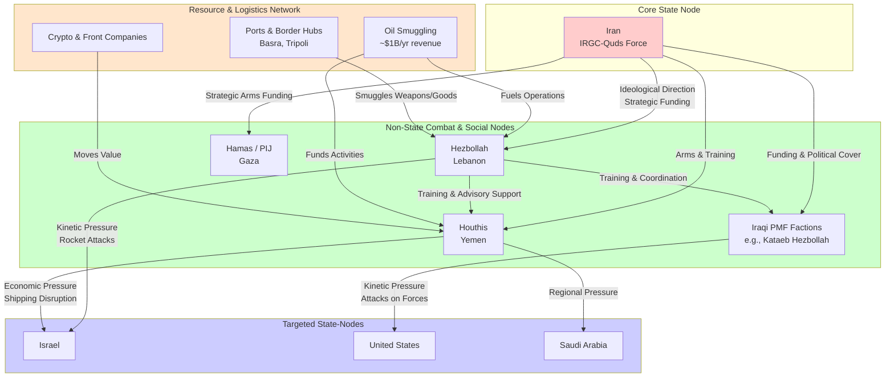

# Mapping the Adversarial Network: The "Axis of Resistance" as a Counter-Rhizome

## Executive Summary

This report analyzes Iran's "Axis of Resistance"—a network encompassing Hezbollah, Hamas, the Houthis, and Iraqi militias—through the lens of the Arena Rhizomatic Network. It argues that the Axis is not a traditional hierarchy but a **decentralized, adaptive counter-rhizome**. This structure enables it to exert sustained pressure on state adversaries like Israel and the U.S. through distributed nodes, fluid resource flows, and deep societal embedding. However, the network faces significant fractures and is undergoing a period of strategic diminishment, forcing adaptation on both sides of the conflict.

## 1. Network Structure: A Decentralized "Mesh of Resistance"

The Axis operates as a polymorphic network where Iran acts as a central node, but not a totalitarian commander. Constituent groups retain high levels of operational autonomy, connected through shared ideology, material support, and adaptive coordination.

### Core Nodes & Connective Tissue
*   **State Node (Iran):** Provides strategic direction, funding, arms, and training primarily through the Islamic Revolutionary Guard Corps-Quds Force (IRGC-QF)[reference:0].
*   **Non-State Combat Nodes:**
    *   **Hezbollah (Lebanon):** The network's most capable military arm and a model of deep societal embedding (political, social, military)[reference:1].
    *   **Houthis (Yemen):** Gained pivotal role after 2024, controlling strategic maritime choke points[reference:2].
    *   **Iraqi PMF Factions (e.g., Kataeb Hezbollah):** Formally integrated into state structures while pursuing Iranian-aligned objectives[reference:3].
    *   **Hamas & Palestinian Islamic Jihad (Gaza):** Sunni partners whose alignment is strategic rather than sectarian[reference:4].

### Resource Flows & Logistical Hubs
The network's lifeblood flows through illicit financial and logistical channels designed to evade sanctions and kinetic disruption.

*   **Financial Architecture:** A "gray-zone economy" underpins the network[reference:5]. Key mechanisms include:
    *   **Oil Smuggling:** Iran oversees a smuggling network in Iraq generating ~$1 billion annually for the Axis[reference:6]. Routes involve ship-to-ship transfers, forged documents, and blending Iranian oil with Iraqi crude[reference:7].
    *   **Front Companies & Cryptocurrency:** Hezbollah uses front companies (e.g., Hokoul SAL Offshore) to obscure oil trades[reference:8]. Cryptocurrency wallets move funds for groups like the Houthis[reference:9].
*   **Logistical Hubs:**
    *   **Basra, Iraq:** Heart of fuel-blending operations and a key export point[reference:10].
    *   **Port of Tripoli, Lebanon:** A recently exploited bypass route for smuggling weapons to Hezbollah[reference:11].
    *   **Syrian Border Crossings:** Used for transporting subsidized fuel and goods, generating massive illicit revenue[reference:12].

## 2. Adaptive Logic: The Rhizome's Resilience Playbook

The Axis survives not through hierarchical command, but through three core adaptive principles that exploit the vulnerabilities of state-centric opponents.

*   **Decentralized Operations with Centralized Strategy:** Groups maintain operational autonomy, making the network difficult to decapitate. However, Iran provides strategic coordination and resource allocation through the IRGC-Quds Force. This creates a balance where local knowledge drives tactics, while Tehran ensures actions serve the broader "resistance" narrative against U.S. and Israeli influence.
*   **Deep Societal Embedding ("Dawlat al-Khidmat" - State of Services):** More than military wings, groups like Hezbollah and Hamas function as parallel states. By providing healthcare, education, financial aid, and infrastructure where governments fail, they build resilient, loyal constituencies. This social capital translates into recruits, intelligence, logistical cover, and political legitimacy, making military defeat nearly impossible without societal collapse.
*   **Strategic Patience & Redundancy:** The network is designed to absorb and outlast kinetic pressure. Strikes that degrade one node (e.g., Hezbollah's command structure) are offset by the activation of others (e.g., Houthi maritime attacks). The model values persistence over quick victories, using time and the high cost of sustained conflict to exhaust better-resourced state adversaries.

## 3. Points of Friction & Fracture: Vulnerabilities in the Mesh

The counter-rhizome's strength in decentralization is also its primary vulnerability, creating fault lines that can be exploited.

*   **Iran's Diminishing Control & Principal-Agent Problems:** Iranian officials have reportedly "lost control" over key proxies. The Houthis and Iraqi militias have pursued escalations (Red Sea shipping attacks, strikes on U.S. bases) that risk dragging Iran into unwanted direct conflict, demonstrating the limits of Tehran's command. This creates a classic Game A "principal-agent" problem within a Game B-style network.
*   **Sectarian & Ideological Tensions:** The inclusion of Sunni Hamas within a network ideologically and financially anchored in Shia Islamism is a persistent strain. Past disagreements over the Syrian civil war highlighted this fracture. While currently subdued by shared anti-Israel sentiment, this sectarian undercurrent remains a potential breakpoint.
*   **Diverging National Interests:** The constituent groups are, first and foremost, actors within their national contexts. Iraqi militias face growing pressure from the Baghdad government to integrate into the official state security apparatus, creating tension between their Iraqi nationalist and pro-Iranian transnational identities. Hezbollah's dominance fuels significant political resentment within Lebanon's fractured polity.
*   **Logistical Chokepoints & Financial Pressure:** Despite adaptive smuggling routes, the network relies on key hubs (Basra, Syrian border crossings) and complex financial schemes. Sustained international sanctions, maritime interdiction, and kinetic targeting of logistical chains present a continuous, draining challenge.

## 4. Forcing Adaptive Responses: How the Counter-Rhizome Shapes State Behavior

The Axis does not aim for conventional victory but to manipulate the cost-benefit calculus of its adversaries, forcing them into unsustainable or self-defeating adaptations.

*   **Israel: Trapped in "Mowing the Grass" 2.0:** The network negates Israel's doctrine of decisive military victory. Instead, Israel is forced into a perpetual, multi-front war of attrition—an advanced form of its "mowing the grass" strategy. This consumes disproportionate military resources, imposes constant economic and psychological costs on its population, and erodes international standing through protracted conflicts that appear unwinnable. The state-node is forced to adopt a defensive, reactive posture against a network that chooses the time, place, and method of engagement.
*   **The United States: The Deterrence Dilemma:** U.S. deterrence theory, built for state-on-state conflict, fails against a distributed network. Retaliatory strikes on Iran do not stop Houthi missiles or Iraqi militia drones. The U.S. is forced into a costly and inefficient game of "whack-a-mole," sanctioning opaque financial networks and conducting limited strikes that degrade but rarely destroy proxy capabilities. This exposes the limits of a superpower's traditional toolkit.
*   **Regional States (Saudi Arabia, Iraq, Jordan): The Sovereignty Siege:** The network exerts power by existing within and across their borders, challenging the Westphalian model of sovereign control. It forces these states into impossible balancing acts: publicly condemning Israeli actions (aligning with popular "resistance" sentiment) while secretly cooperating with U.S./Israeli security efforts, all while trying to prevent proxy activities from sparking wider regional war.

## 5. Conclusion: The Counter-Rhizome in Transition

The "Axis of Resistance" represents a sophisticated form of 21st-century rivalrous power—a counter-rhizome that thrives in the seams of the international order. It successfully leverages decentralization, societal depth, and asymmetric cost-imposition to challenge far more powerful state-nodes.

However, its trajectory is at a critical juncture. The network is under unprecedented **external compression** from coordinated military-financial pressure and **internal tension** from diverging proxy interests. The model's future hinges on whether Iran can maintain strategic coherence across an increasingly autonomous network and whether the social contract offered by its proxies (services for loyalty) can withstand the immense economic pressure on their host populations.

The ultimate lesson for state adversaries is that a rhizomatic threat cannot be defeated by a hierarchical strategy. Effective counter-measures must themselves be networked, targeting the connective tissue—the financial flows, logistical hubs, and political narratives—while offering the populations embedded within the mesh a more viable and peaceful alternative to the "resistance" economy.
