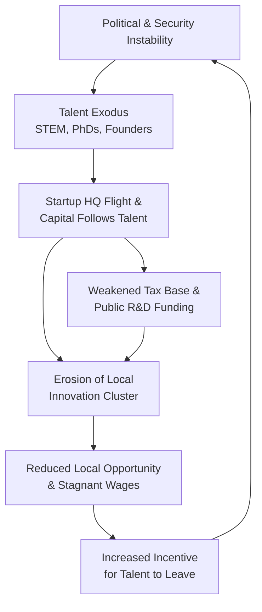
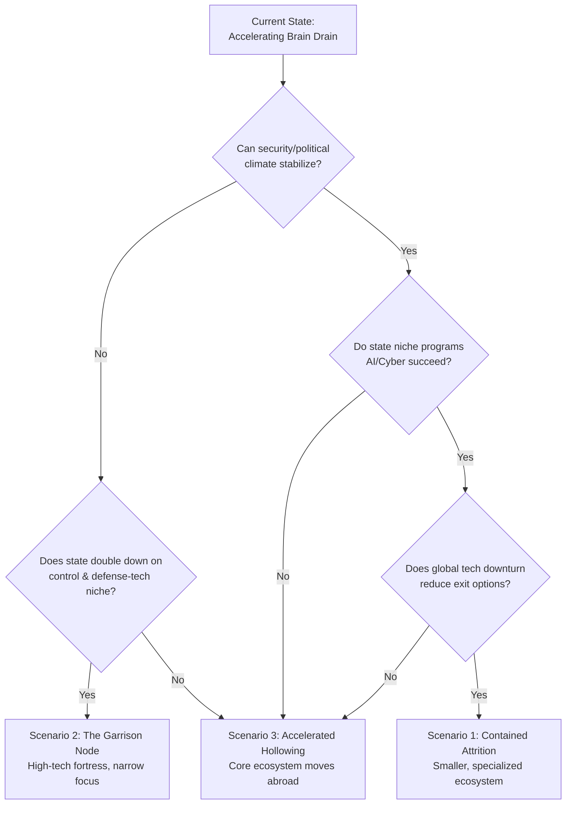

# Annex: Quantifying the Fragility Paradox - Talent & Capital Flow Analysis (2024-2026)

## Executive Summary
This annex quantifies the accelerating attrition of human and financial capital from the Israeli "Startup Nation" node. Synthesizing recent data, it models the pathways of exit, projects long-term impacts on generative capacity, and evaluates state countermeasures. The analysis concludes that while targeted initiatives may preserve a high-value niche in defense-tech and AI, they are insufficient to reverse the broader erosion of the foundational innovation cluster, presenting three divergent scenarios for 2030.

## 1. Data Aggregation: Quantifying the Exodus

### 1.1 Talent Flows: The "Generation" Cohort in Motion
The departure of highly educated Israelis is accelerating, shifting from a chronic issue to an acute crisis[citation:2][citation:5].

*   **Scale & Velocity:** In 2024, **55,000 graduates** of Israeli universities were living abroad[citation:2][citation:5]. A survey indicates **53% of tech companies** reported increased employee relocation requests in 2025[citation:3].
*   **Field Concentration:** The drain is most severe in foundational STEM fields critical for advanced R&D[citation:2][citation:5]:
    *   **Mathematics:** 25.4% of PhD holders live abroad.
    *   **Computer Science:** 21.7% of PhD holders live abroad.
    *   **Genetics:** 19.4% of PhD holders live abroad.
*   **Demographic Profile:** Emigrants are predominantly young (under 50) and highly educated. Since 2010, the proportion of degree holders among emigrants has risen from 46% to over 60%[citation:6].

*Table 1: Israeli Academic Talent Residing Abroad (2024 Data)*
| Field of Expertise | Percentage of PhD Holders Abroad | Implication for National R&D Base |
| :--- | :--- | :--- |
| **Mathematics** | 25.4%[citation:2][citation:5] | Erosion of foundational research and algorithmic innovation capacity. |
| **Computer Science** | 21.7%[citation:2][citation:5] | Direct attrition from the core "Startup Nation" engine. |
| **Genetics** | 19.4%[citation:5] | Weakening of Israel's leading biotech and agri-tech sector. |
| **Physics** | 17%[citation:5] | Loss of deep-tech and hardware innovation potential. |
| **All Doctoral Graduates** | 11.9%[citation:2][citation:5] | Systemic depletion of the highest echelon of research talent. |

*   **Primary Destinations:** While comprehensive 2026 data is pending, established pathways lead to **New York City** (a "Shadow Silicon Wadi" of ~560 Israeli-founded startups), **Silicon Valley**, and major European tech hubs like **Berlin** and **London**. Fast-track visa programs in Portugal (Lisbon) and Canada are also attracting talent[citation:3].

### 1.2 Capital Flows: Venture Capital Follows Talent and Headquarters
Financial capital is decoupling from the physical Israeli node, following entrepreneurs and corporate registrations abroad.

*   **Record Investment, Shifting Provenance:** Israeli cybersecurity startups raised a record **$4.4 billion** in 2025[citation:7]. However, for the first time, **global VCs (primarily U.S.-based) outpaced domestic Israeli investors at every stage**, leading 44 seed rounds compared to 35 led by Israeli VCs[citation:7]. This indicates that financial confidence remains in Israeli *entrepreneurs*, but not necessarily in the Israeli *sovereign node* as a long-term operating base.
*   **The "Split-Seed" & HQ Flight:** A "split-seed" strategy is emerging, where startups take capital from both Israeli and foreign VCs, often preceding a legal re-domiciling[citation:7]. In 2025, **45% of new Israeli startups incorporated abroad** (vs. 20% in 2022), with NYC and Delaware as top destinations. This pre-empts future tax revenue and complicates national economic planning.

*Table 2: The Shifting Venture Capital Landscape in Israeli Cybersecurity (2025)*
| Metric | 2025 Data | Trend & Interpretation |
| :--- | :--- | :--- |
| **Total Capital Raised** | $4.4 Billion[citation:7] | **All-time high.** Demonstrates undiminished global belief in Israeli tech capability. |
| **Lead Investor at Seed Stage** | U.S. VCs (44 rounds) vs. Israeli VCs (35 rounds)[citation:7] | **Structural shift.** Global capital now leads, increasing influence over strategic decisions like HQ location. |
| **Early-Stage Activity** | 71 seed rounds, up 97% from 2023[citation:7] | **Founder-driven boom.** New generation aiming for category-defining companies, not quick exits. |
| **Domestic Consolidation** | 12 acquisitions of Israeli startups by Israeli scale-ups[citation:7] | **Ecosystem maturation.** Positive sign of internal strength, but may be pressured by talent shortage. |

## 2. Impact Modeling: Projecting Second-Order Effects

The exit of talent and capital triggers negative feedback loops that threaten the core "innovation cluster" model.

1.  **Erosion of Local R&D Density:** The loss of senior PhDs and principal investigators disrupts academic labs and corporate R&D teams. This reduces the **cross-pollination effect** between academia and industry that fueled Israel's rise. A government-commissioned 2025 report concluded the country is **"not at the appropriate and desirable point"** to accelerate its AI sector, citing talent gaps[citation:6].
2.  **Dilution of the Innovation Cluster:** As talent and HQs disperse to NYC, Silicon Valley, and Lisbon, the dense network effects of Tel Aviv's "Silicon Wadi" weaken. Informal knowledge exchange, serendipitous founder meetings, and fluid inter-company talent movement—the intangible assets of a cluster—degrade. Israel's ranking in AI **"Talent" metrics slipped from 5th globally (2020) to 9th (2025)**[citation:6].
3.  **Long-Term Fiscal Drain:** The emigration of high earners and the externalization of startup capitalization reduce future tax revenues. This strains public coffers needed to fund the very education, infrastructure, and R&D grants required to rebuild the talent pipeline.

*A self-reinforcing cycle where security/political instability drives talent exit, which pulls venture capital and startup HQs abroad, which in turn reduces local opportunity, incentivizing further talent exit.*

## 3. Node Response Analysis: Evaluating Counter-Measures
The Israeli state recognizes the threat and is deploying targeted, high-cost interventions.

*   **The National AI Supercomputer Initiative (Announced Jan 2026):**
    *   **Goal:** Reduce dependency on foreign (AWS, Google) cloud infrastructure for sovereign AI R&D and retain cutting-edge work onshore.
    *   **Critique:** This addresses an *infrastructure* dependency but not the primary *human capital* drain. It may create a fortress for defense and government AI projects but does little to keep a fintech entrepreneur in Tel Aviv.

*   **The Defense-Tech Pivot:**
    *   **Goal:** Leverage Israel's perceived "battle lab" advantage to dominate the dual-use tech sector (cyber, AI, drones), attracting security-focused capital.
    *   **Critique:** This strategy is already evident in the record $4.4B cyber funding[citation:7]. It may successfully **create a higher-value, defensible niche**, but it further militarizes the tech economy and may alienate talent and investors opposed to this focus, potentially accelerating the exit of those in consumer tech, climate tech, or fintech.

*   **Diplomatic & Perception Campaigns:**
    *   **Goal:** Counter international isolation and improve brand Israel to maintain investment flows[citation:4].
    *   **Critique:** While the government cites major diplomatic efforts[citation:4], these are viewed by some critics as superficial[citation:4]. They do not address the core domestic "push" factors (security, political climate, cost of living) driving emigration.

**Overall Efficacy:** The state's response is a **containment strategy**, not a reversal strategy. It aims to fortify strategic, government-aligned sectors (AI, defense-tech) while the broader, consumer-oriented tech ecosystem may continue to hollow out. The 2025 National Security Policy document emphasizes regional alliances and military strength[citation:1], with less direct focus on the socio-economic drivers of talent retention.

## 4. Scenario Projections for the Israeli Tech Node (2030)

*A flowchart mapping the decision points and external factors leading to the three projected scenarios: Contained Attrition, The Garrison Node, and Accelerated Hollowing.*

Based on current trajectories, three scenarios are plausible:

*   **Scenario 1: Contained Attrition (Most Likely)**
    *   **Path:** The security situation stabilizes at a "simmering" level; government niche programs (AI, cyber) partially succeed; global tech downturn reduces exit opportunities.
    *   **2030 Outcome:** A **smaller, more specialized tech ecosystem** centered on defense, cybersecurity, and sovereign AI. Global ties remain strong via diaspora, but the vibrant, diverse "Startup Nation" cluster is diminished. Continuous effort is required to prevent tipping into hollowing.

*   **Scenario 2: The "Garrison Node" (High Risk, High Control)**
    *   **Path:** Deepening regional conflict and isolation lead to a state-directed, full pivot to a **military-technological complex**. Civilian tech atrophies; capital and talent flows are heavily regulated.
    *   **2030 Outcome:** Israel becomes a world-leading but **monocultural tech fortress**, akin to a national-scale version of Lockheed Martin's Skunk Works. Innovation is potent but narrow, and integration with the global tech rhizome is severely constrained.

*   **Scenario 3: Accelerated Hollowing (If "Contained Attrition" Fails)**
    *   **Path:** A major regional war, severe political crisis, or economic shock triggers a tipping point. The emigration of mid-career engineers and successful founders becomes a flood.
    *   **2030 Outcome:** The **"Shadow Silicon Wadi" abroad surpasses the domestic node** in vitality and capital. Israel's tech sector reverts to a feeder system for foreign hubs, losing its generative, company-building core. National R&D capacity and economic growth are severely set back.

## 5. Conclusion: The Metrics of Node Resilience
The Fragility Paradox is quantifiable. Key performance indicators to monitor include:
*   **Net Migration of Degree Holders:** The single most telling sign of node health.
*   **Percentage of Seed Rounds Led by Israeli VCs:** A measure of local versus global control over the entrepreneurial pipeline.
*   **Domestic vs. Abroad Incorporation of New Startups:** A leading indicator of future tax base and employment location.
*   **Israel's Global Ranking in AI "Talent" Category:** A composite metric of human capital health[citation:6].

The data through 2025-2026 indicates Israel is on the path of **Scenario 1 (Contained Attrition)**. The state's countermeasures are designed to prevent Scenarios 2 and 3 but are not currently configured to restore the broad-based, civilian "Startup Nation" model of the early 21st century. The node's future generative capacity will be a function of its ability to re-establish a compelling social, professional, and national climate for its most valuable asset—its people[citation:6].

## 6. Sources & Citations

### A. Talent Flight & "Brain Drain" Metrics
1.  **Haaretz | "Israeli Brain Drain Worsens as About a Quarter of Math Ph.D.s Live Abroad" (December 2025).** Reports that in 2024, approximately a quarter of Israelis with a doctorate in mathematics were living abroad. The article cites Central Bureau of Statistics (CBS) data showing that 55,000 recipients of Israeli academic degrees were residing overseas, linking the trend to the Gaza war, judicial reforms, and budget cuts. This is a key source for quantifying the high-skill exodus[citation:2].
2.  **Ynetnews | "Brain drain deepens as more Israeli academics leave and fewer return, CBS data show" (2025).** Provides detailed CBS analysis confirming a reversal in long-term trends: since 2023, the number of academics leaving Israel has exceeded those returning. The data shows STEM field graduates are 2.5 times more likely to reside abroad at the doctoral level. This source is critical for establishing the trend's velocity and field concentration[citation:3].

### B. Venture Capital & Startup Ecosystem Dynamics
3.  **OpenVC | "Top Venture Capital Firms & Investors in Israel in 2026" (January 2026).** An ecosystem overview noting that Tel Aviv dominates Israeli VC activity (65% of funding) and identifying key investment verticals: Cybersecurity, Enterprise Software, Fintech, and AI. This source provides current context on the structure and focus areas of Israel's VC market[citation:5].
4.  **Statista Market Forecast | "Venture Capital - Israel" (Updated 2025).** An analyst report noting a "mild decline" in Israel's venture capital market, influenced by competition and economic uncertainty. It highlights a market trend toward sustainability and green tech investments. Useful for broader market sentiment and trend context[citation:1].

### C. Historical Context & Long-term Concerns
5.  **Smart Cities Dive (Archive) | "Brain Drain and Migration: Israel Is Dying" (Pre-2017).** A legacy editorial arguing that brain drain has been a long-standing issue, citing Nobel-winning expats and declining university rankings as symptoms. While dated, it provides historical perspective on the chronic nature of the talent retention challenge[citation:4].
