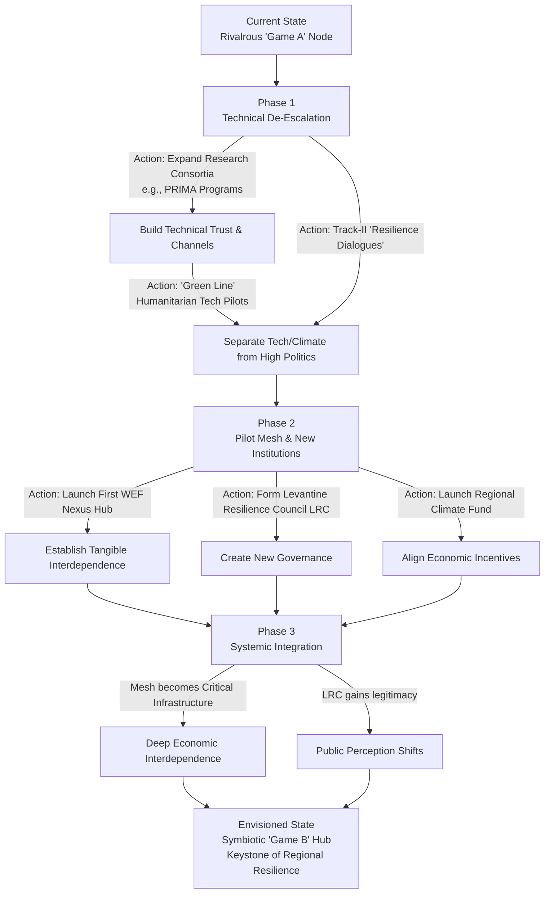
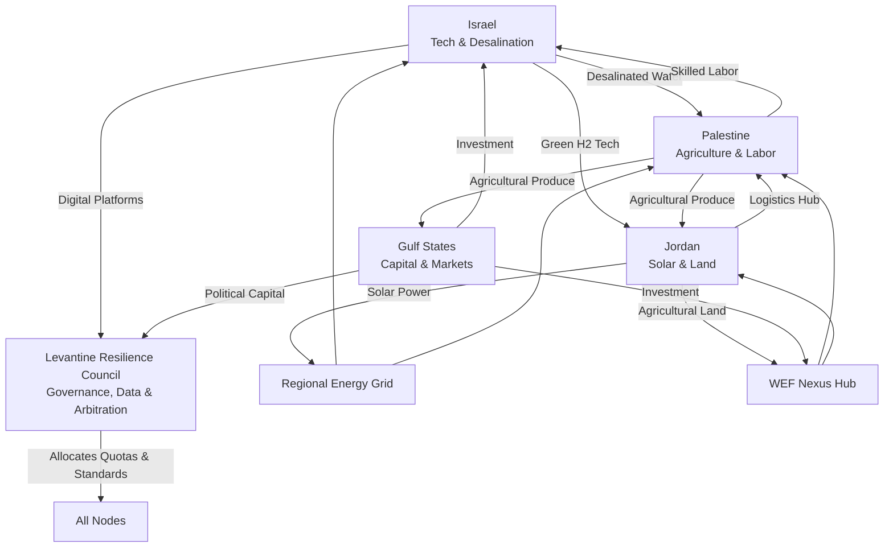

# From Battle Lab to Life Lab: A Game B Transition Pathway for the Israeli Node

## Executive Summary
This brief proposes a strategic pivot for the State of Israel, from a "Game A" node defined by rivalrous military-industrial integration to a "Game B" hub for regional symbiotic resilience. It posits that Israel's existential security can be redefined and enhanced by leveraging its world-leading climate and resource technologies—in water, agriculture, renewable energy, and digital health—to build a **Levantine Symbiotic Mesh**. This cooperative network, involving Jordan, Palestine, and Gulf states, would address shared existential threats of water scarcity, food insecurity, and climate change. The transition, while politically formidable, offers Israel a form of enduring, legitimacy-based security unattainable through kinetic dominance alone. This document outlines the asset base, designs the mesh, analyzes the transition, and presents a scenario for a cooperative 2035.

## 1. Asset Inventory: Game B Technologies for Cooperative Utility
Israel's innovation ecosystem, often termed the "Startup Nation," has developed world-leading technologies with inherently cooperative, non-rivalrous potential. These assets form the foundational toolkit for a symbiotic regional mesh.

*Table: Inventory of Core Game B-Capable Technologies*
| Technology Domain | Specific Assets & Companies | Inherent Cooperative Utility |
| :--- | :--- | :--- |
| **Water Security** | Drip irrigation (Netafim), air-to-water generation (WaterGen), wastewater recycling, smart management systems[citation:3]. | Enables agriculture and provides drinking water in arid regions; efficiency creates surplus for sharing. Scalable from community to national level[citation:3]. |
| **Food & Agriculture** | Precision agriculture, agroecology, desert farming, plant-based protein development, microbial soil tech[citation:2]. | Increases food sovereignty and climate resilience for all partners; reduces dependency on volatile global markets. |
| **Renewable Energy** | Solar efficiency (SolarEdge), green hydrogen production (H2Pro), energy storage, smart grid tech[citation:3]. | Decentralizes and secures energy supply; green hydrogen and interconnected grids enable regional energy interdependence[citation:3]. |
| **Digital & Health** | Telemedicine, agri-tech data platforms, fintech for micro-payments, cybersecurity for critical infrastructure. | Provides the digital backbone for managing shared resources (water, energy data) and delivering services equitably. |

These technologies are proven and scalable. Critically, they are already deployed in over 110 countries and developed within international frameworks like the EU's **PRIMA program**, which funds joint Mediterranean research on water, food, and agriculture[citation:2][citation:3]. The pivot is not about inventing new tools, but repurposing existing ones towards a cooperative, rather than extractive or exclusive, end.

## 2. Mesh Design: The Levantine Symbiotic Mesh
The Levantine Symbiotic Mesh is conceived as a transnational network of interconnected physical and digital systems for sharing vital resources, co-developing solutions, and building collective climate resilience.

**Core Principles:**
1.  **Subsidiarity & Sovereignty:** Solutions are co-created and managed at the most local level feasible, respecting national sovereignty while optimizing regional flows.
2.  **Open-Source Knowledge:** A regional "Climate Innovation Commons" would share data, research, and best practices from joint R&D projects, building on models like PRIMA[citation:2].
3.  **Modular & Anti-Fragile:** The mesh is designed as interconnected but operable modules. A shock to one node (e.g., a drought in Jordan) can be mitigated by others, increasing overall resilience.

**Hypothetical Pilots & Infrastructure:**
*   **Water-Energy-Food (WEF) Nexus Hub (Jordan Valley):** A pilot zone integrating Israeli desalinated water, Jordanian land, and shared solar power to create a climate-resilient agricultural export zone, managed by a joint authority.
*   **Regional Green Hydrogen Grid:** Leveraging Israel's H2Pro technology and Gulf capital to produce green hydrogen in sun-rich areas, creating a clean fuel network to decarbonize regional industry and transportation[citation:3].
*   **Distributed Telehealth Network:** Using Israeli digital health platforms to connect specialists in Tel Aviv or Haifa with clinics in Gaza, the West Bank, and remote Jordan, funded by a regional health solidarity fund.

**Governance Structure:** A **Levantine Resilience Council (LRC)**, comprising technical experts and appointed officials from all participating states, would oversee the mesh. It would operate on a **supra-political, project-based mandate**, similar to the technical committees of the BIRD Energy binational program[citation:6]. The LRC's legitimacy would derive from its measurable delivery of water, energy, and food security.

## 3. Transition Pathways: Barriers, Incentives, and Phasing
**Formidable Barriers Exist:**
*   **Political & Security Legacy:** Deep-seated mistrust, the unresolved Palestinian question, and the current "battle lab" political economy are monumental obstacles. As of 2026, Jordan views Israeli policies as an "existential threat," making cooperation nearly unthinkable[citation:4].
*   **Economic Dissonance:** Israel's high-tech sector is geared towards global, predominantly Western markets. Redirecting focus requires new business models for regional public goods.
*   **Institutional Inertia:** Vested interests in the military-industrial complex and a security-centric bureaucratic mindset would resist dilution of their primacy.

**Compelling Incentives for Israel:**
*   **Legitimacy & Integration:** A successful mesh would fundamentally alter Israel's regional status from that of a fortified garrison to an indispensable partner, offering a form of acceptance and integration more durable than military treaties.
*   **Economic Resilience & New Markets:** It would create stable neighboring economies, transforming them from sinks of instability into partners in trade and innovation, opening new markets for Israeli tech adapted to regional needs.
*   **True Long-Term Security:** Addressing the water, food, and economic despair that fuel radicalization and conflict offers a more sustainable security outcome than perpetual deterrence cycles.

**A Phased Transition Roadmap:**
*Table: Phased Transition from Game A to Game B*
| Phase | Focus | Key Actions & Confidence-Building Measures |
| :--- | :--- | :--- |
| **Phase 1: Technical De-Escalation (2027-2030)** | Separate humanitarian/technical channels from politics. | 1. Expand **PRIMA-style research consortia** on shared challenges[citation:2]. 2. Establish **"Green Line" utilities**: Israeli tech firms provide water/food tech to Palestinian and Jordanian NGOs via third-party funding. 3. Launch track-II "Resilience Dialogues" for technical experts. |
| **Phase 2: Pilot Mesh & New Institutions (2031-2035)** | Build tangible, beneficial interdependence. | 1. Stand up first **WEF Nexus Hub** with Jordan, using Gulf/U.S. catalytic funding. 2. Formalize the **Levantine Resilience Council (LRC)**. 3. Create a **Regional Climate Venture Fund**, modeled on BIRD Energy, to finance joint startups[citation:6]. |
| **Phase 3: Systemic Integration & Political Normalization (2036-2040+)** | Mesh maturity enables political change. | 1. Mesh infrastructure becomes critical regional utility. 2. Deep economic interdependence shifts public perception. 3. Political negotiations occur within a context of established, successful cooperation, reducing the stakes of any single border dispute. |

## 4. Scenario Narrative: The Levant in 2035
A decade from now, the **Eastern Mediterranean Resource Mesh (EMRM)** is a critical piece of regional infrastructure. A desalination plant in Ashkelon, powered by a Saudi-invested solar field in Jordan's desert, sends scheduled water pulses north to the West Bank and east to Amman. A regional commodity board, using blockchain contracts developed by a joint Israeli-Emirati fintech venture, manages the flows of "virtual water" embedded in agricultural goods[citation:2].

The **Gaza-Ashkelon Desalination and Energy Co-operative**—once an unimaginable concept—is a flagship project. It provides 100% of Gaza's drinking water and 40% of its electricity, while selling surplus water to Israeli municipalities. Its board includes engineers from Gaza, Israeli water experts, and Jordanian financing managers. Security for the facility is provided by a joint Palestinian-Israeli civilian guard force, trained in Switzerland, whose loyalty is to the continuity of the water supply itself.

Israel's tech sector has bifurcated. A significant "civilian resilience" wing thrives alongside the still-robust defense-tech sector. Tel Aviv is the headquarters for **MESH-Tech**, a new category of startups designing decentralized grid software, drought-resistant crop genomes for the region, and AI-driven resource allocation platforms. The "brain drain" of the 2020s has slowed, reversed in part by young engineers and entrepreneurs drawn to the grand challenge of building regional resilience.

Politically, the map is not that of a classic two-state solution, but neither is it one of annexation. Sovereignty is more nuanced, layered with the practical, daily realities of the symbiotic mesh. The **Levantine Resilience Council** has become the most important diplomatic venue in the region, where technical agreements on water quotas or energy tariffs set the de facto parameters for coexistence. Conflict has not disappeared, but its potential for catastrophic escalation is tempered by the mutual dependence on the systems that sustain daily life.

## 5. Conclusion: Redefining the Node
The "Battle Lab to Life Lab" pivot is the ultimate strategic hedged bet. It does not require Israel to abandon its military edge or its U.S. alliance in the near term. It proposes running a parallel track: investing a fraction of its innovative capacity and diplomatic capital into building cooperative resilience.

The choice is between being a **fortress**, perpetually strong but perpetually isolated and besieged, and becoming a **keystone**—an irreplaceable component upon which the health of a wider regional ecosystem depends. The latter offers a security founded not on fear, but on mutual need and generated legitimacy. In the Arena's terms, it is the shift from a node whose value is in dominating a rivalrous game, to one whose power is derived from sustaining a symbiotic network. The technologies are ready. The question is one of strategic imagination and political will.

---

*A diagram showing a decentralized network with nodes labeled "Israel," "Jordan," "Palestine," and "Gulf Capital/Expertise." Arrows depict bidirectional flows: "Desalinated Water" and "Green H2 Tech" from Israel to Jordan and Palestine; "Solar Power" and "Land/Logistics" from Jordan to the regional grid; "Investment" and "Political Capital" from the Gulf to projects; "Agricultural Produce," "Data," and "Innovation" flowing between all nodes. A central cloud labeled "Levantine Resilience Council (Governance & Data)" regulates the flows.*

---

## 6. References & Citations
1. EcoPeace Middle East. (2025, September 30). *Pre-Feasibility Study: The Humanitarian and Trade Corridor*[citation:1].
2. Israel Innovation Authority. (2025, June 10). *Collaborations in NEXUS Projects for Agriculture, Water & Food Under the EU’s PRIMA Program*[citation:2].
3. Startup Nation Central. (n.d.). *Israeli Climate Innovation for Energy and Water Security Solutions*[citation:3].
4. Yom, S. (2026, January 18). *The Future of Jordan Amidst the Palestinian Crisis*. Georgetown Journal of International Affairs[citation:4].
5. Center for American Progress. (2017). *A Practical Plan on the Israeli-Palestinian Front*[citation:5].
6. The BIRD Foundation. (2025, January 6). *BIRD Energy to Invest $7.5 Million in Cooperative Israel-U.S. Clean Energy Projects*[citation:6].
