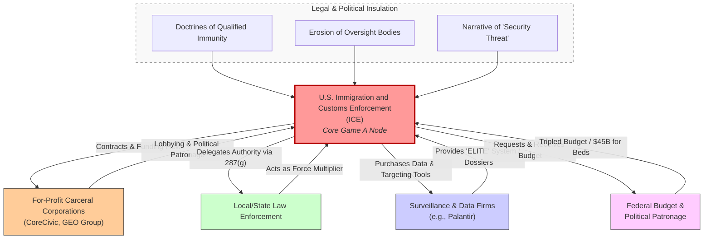
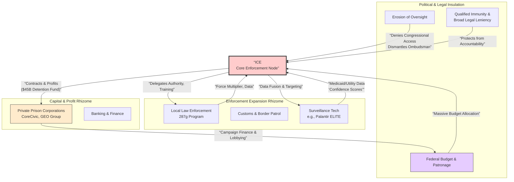
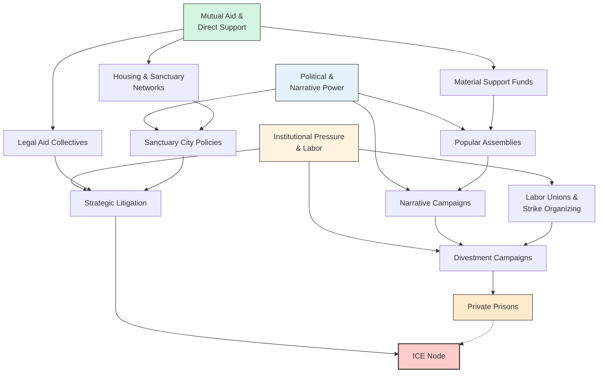
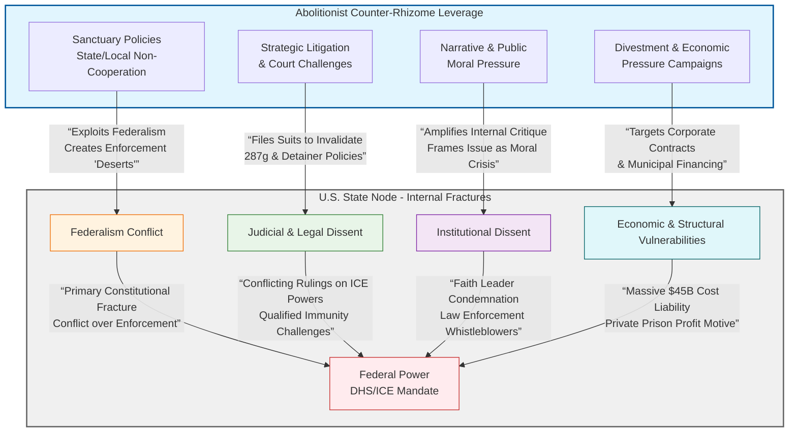
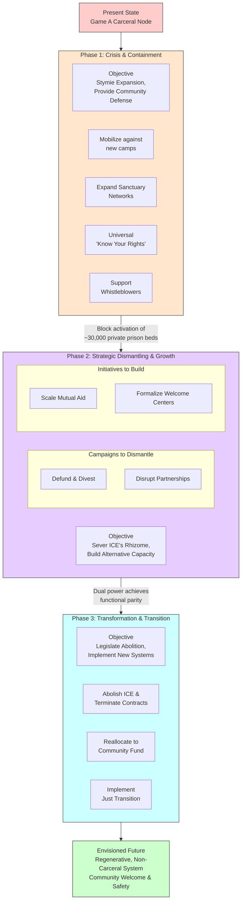

# The Unraveling Node: ICE, Abolition, and the American Transition to Game B

## Executive Summary

This report analyzes U.S. Immigration and Customs Enforcement (ICE) as the archetypal institution of "Game A" logic within the United States—a node defined by rivalrous security, structural violence, and deep integration with private capital. It details the agency's rapid expansion, its architecture of enforcement, and the systemic fractures it creates. Concurrently, the report maps the emerging "Game B" counter-rhizome: a decentralized network of abolitionist movements, mutual aid formations, and sanctuary policies that prefigure a regenerative alternative. By examining the points of conflict between these two systems, this analysis theorizes a concrete transition pathway from a carceral state to community-controlled systems of safety and welcome, highlighting the role of labor power, narrative strategy, and the construction of dual power.

## 1. Deconstructing the Game A Node: ICE as an Archetype

ICE, created in 2002 under the Department of Homeland Security, has evolved into a massive law enforcement apparatus with a mandate covering immigration enforcement and transnational crime[citation:5]. Its current function under the Trump administration epitomizes Game A's rivalrous, expansionist, and opaque nature.

### 1.1 Institutional Architecture & Connective Rhizome
ICE's power is amplified through a dense network of public and private partnerships that create a self-reinforcing system.

| Network Component | Function & Connection to ICE | Game A Logic Embodied |
| :--- | :--- | :--- |
| **For-Profit Carceral Corporations** | CoreCivic and GEO Group are ICE's primary contractors for detention facilities and transportation[citation:6]. | **Profit from Punishment:** The agencies' capacity is directly tied to corporate profit. Expansion is incentivized; GEO Group anticipates new removal flights will generate $40-50M in annual revenue[citation:6]. |
| **Local/State Law Enforcement (287(g) Program)** | Delegates ICE's immigration authority to state and local officers[citation:3]. As of Jan 2026, ICE had 1,315 active agreements in 40 states[citation:3]. | **Networked Enforcement:** Blurs lines between local policing and federal immigration, creating a seamless interior enforcement web. ICE provides free training and resources[citation:7]. |
| **Surveillance & Data Firms** | Palantir's "ELITE" tool for ICE aggregates data from sources like Medicaid to create dossiers and "confidence scores" on potential deportation targets[citation:8]. | **Predictive Control:** Uses data collected for public benefit (healthcare) for punitive enforcement, creating a surveillance panopticon that targets marginalized communities[citation:8]. |
| **Federal Budget & Political Patronage** | ICE's budget has more than tripled, making it the largest federal law enforcement agency[citation:6]. A $45 billion allocation is earmarked for new detention center construction[citation:6]. | **Structural Entrenchment:** Massive funding creates a vested economic interest in perpetuating detention, making the system "difficult to dismantle even if future administrations seek to wind it down"[citation:6]. |

### 1.2 Mechanisms of Insulation & Opacity
The ICE node is structurally insulated from accountability and public oversight:
*   **Legal Ambiguity & Force:** ICE agents operate under broad use-of-force guidelines and constitutional leniency granted by courts[citation:1]. The line between immigration enforcement and other policing is intentionally blurred, with Border Patrol agents frequently operating inside the U.S.[citation:1].
*   **Erosion of Oversight:** The Trump administration has effectively eliminated key DHS oversight bodies like the Office of the Immigration Ombudsman[citation:6]. ICE has repeatedly denied members of Congress access to detention facilities, flouting federal law[citation:6].
*   **Systemic Abuses:** Reports from detention centers like "Alligator Alcatraz" in Florida document systematic constitutional violations, including denial of religious texts and chaplaincy services[citation:9]. A U.S. Commission on Civil Rights investigation found pervasive barriers to religious practice in carceral facilities[citation:9].

## 2. Mapping the Counter-Rhizome: Abolitionist Movements & Dual Power

The movement to "Abolish ICE" is not merely a protest slogan but a growing ecosystem building **dual power**—creating institutions that meet community needs while directly contesting the legitimacy of the carceral state.

### 2.1 Structure of the Counter-Network
*   **Popular Assemblies & Direct Action:** Inspired by historical abolitionist tactics of public agitation and moral witness[citation:4], modern movements use community assemblies to democratize policy debate. This is paired with direct action: filming ICE arrests[citation:1], blockading detention facilities, and lawsuits (like those by media collectives in Chicago)[citation:1].
*   **Mutual Aid Networks:** These are the functional backbone of the counter-rhizome, creating systems of care that bypass the state. They provide:
    *   **Legal Aid & "Know Your Rights" Training:** Creating parallel systems of legal defense.
    *   **Housing & Sanctuary:** Networks of safe houses and churches, supported by local sanctuary policies that limit cooperation with ICE.
    *   **Material Support:** Direct funding for detained individuals' bonds, families' living expenses, and transportation.
*   **Labor & General Strike Potentials:** The historical link between labor and abolition is being revived[citation:4]. The potential for a **cross-sector general strike**—where immigrant communities, service workers, and allied unions halt economic activity to demand abolition—represents a peak leverage point. Barriers include union bureaucracy and legal repression, but the strategic power is immense.

### 2.2 Narrative Warfare & Fracture Widening
Abolitionists engage in deliberate narrative combat to delegitimize the ICE node:
*   **Framing:** Shifting discourse from "illegality" to **"border violence," "family separation,"** and a **"moral crisis."** This echoes the successful moral framings of the 19th-century abolitionists[citation:10].
*   **Targeting Fractures:** Movements amplify conflicts between local sanctuary cities/states and federal mandates. They support internal dissent, such as whistleblowers within the carceral system or faith leaders like Archbishop Thomas Wenski demanding detention center access[citation:9].

*A diagram with "ICE" as a central node, connected to: "Private Prisons (CoreCivic/GEO)" with a "Profit" flow; "Local Police (287(g))" with a "Authority Delegation" flow; "Data Surveillance (Palantir)" with a "Targeting Data" flow; and "Federal Budget/Patronage" with a "$45B Funding" flow. An outer ring labeled "Oversight Erosion" and "Legal Insulation" encircles the entire network.*

*A decentralized, web-like diagram with nodes: "Mutual Aid Networks," "Popular Assemblies," "Sanctuary Cities," "Labor Unions," "Legal Collectives," and "Faith Communities." Connective lines are labeled "Resource Sharing," "Direct Action," "Narrative Strategy," and "Solidarity." The web encircles and pressures a small, isolated "ICE Node" in the center.*

## 3. Analyzing Fractures & Leverage Points Within the State

The U.S. state node is not monolithic but riddled with conflicts that the counter-rhizome can exploit.
*   **Federalism vs. Federal Power:** The clash between **sanctuary jurisdictions** (states/cities limiting cooperation with ICE) and federal mandates is a primary fracture. Lawsuits, like those filed by Newark and Leavenworth against private prison expansions, demonstrate this struggle[citation:6].
*   **Judicial & Institutional Dissent:** Judges have issued conflicting rulings on ICE's powers[citation:1]. Internal dissent exists within faith institutions (e.g., Catholic bishops)[citation:9] and among some law enforcement officials who view 287(g) as detrimental to community trust.
*   **Economic Vulnerabilities:** The private prison model, while powerful, is vulnerable to **divestment campaigns** and litigation over labor practices (e.g., GEO Group being forced to pay $23M in back wages)[citation:6]. The system's massive cost ($45B for beds alone)[citation:6] is a potential political liability.

*Diagram: This flowchart maps the primary fractures within the U.S. state apparatus related to immigration enforcement and illustrates how the abolitionist counter-rhizome applies strategic pressure at these points of vulnerability.*

## 4. Theorizing the Transition Pathway: From Dismantling to Regenerative Institution-Building

Transition requires a phased strategy of dismantling, defunding, and building regenerative alternatives.

### 4.1 Phased Transition Architecture
**Phase 1: Crisis & Containment (Present-2027)**
*   **Objective:** Stymie expansion, provide immediate community defense.
*   **Actions:** Mass mobilization against new detention camps[citation:6]; expand sanctuary networks; universal "know your rights" education; support whistleblowers and internal resisters.
*   **Target:** Block the activation of ~30,000 idle private prison beds[citation:6].

**Phase 2: Strategic Dismantling & Dual Power Growth (2028-2032)**
*   **Objective:** Sever key connections in the ICE rhizome, build alternative capacity.
*   **Actions:**
    *   **Defund & Divest:** Legislative campaigns to cut ICE budgets; municipal and institutional divestment from private prison corporations and their financiers[citation:6].
    *   **Disrupt Partnerships:** Repeal 287(g) agreements at the local level; pass laws banning data sharing between state agencies and ICE[citation:8].
    *   **Scale Mutual Aid:** Formalize community-run welcome centers, legal defense funds, and housing cooperatives.

**Phase 3: Institutional Transformation & Just Transition (2033-)**
*   **Objective:** Legislate abolition and implement regenerative systems.
*   **Actions:**
    *   **Abolish ICE:** Pass legislation dismantling ICE and terminating all contracts with private detention and surveillance companies.
    *   **Reallocate Resources:** Redirect the billions spent on detention and enforcement to a **Community Welcome and Safety Fund** for housing, healthcare, legal aid, and community-led restorative justice programs.
    *   **Implement Just Transition:** A federal program to retrain and offer pension-backed buyouts for ICE and prison workers, redirecting their skills toward public health, infrastructure, and social work roles.

### 4.2 Envisioning the Regenerative System
The end state is not the absence of structure, but a **community-controlled, non-carceral system** for migration and safety.
*   **Community-Based Welcome:** Newly arriving migrants are greeted by local welcome centers providing immediate legal screening, health checks, language support, and connection to housing—all run by non-profits and mutual aid groups, not federal agents.
*   **Rights-Based Status Adjustment:** A simplified, accessible, and rapid pathway to permanent residency and citizenship, administered by civilian agencies stripped of enforcement powers.
*   **Restorative & Transformative Justice:** Replaces immigration courts and detention with community circles and restorative processes for the minimal cases where conflict arises, focused on repair and integration, not punishment and removal.

## 5. Conclusion: The American Node at a Crossroads

The United States, as a primary Game A node, faces an internal crisis of legitimacy embodied by ICE. The agency's expansion has created a powerful but brittle rhizome, dependent on profit, opacity, and pervasive fear. Simultaneously, a resilient counter-rhizome is weaving a new logic of mutual aid, solidarity, and community control.

The path forward is not one of reform but of **strategic unraveling and re-weaving**. The abolitionist movement's power lies in its dual approach: materially dismantling the carceral state's connections (funding, partnerships, data streams) while prefiguring the regenerative world that must replace it. The potential for a generalized strike represents a formidable, yet unresolved, strategic weapon. The transition will hinge on the movement's ability to widen state fractures, protect its own networks, and articulate a compelling vision of a "Game B" America where safety is derived from community care, not caged isolation.

---

## 6. References & Citations

1.  BBC News. (2025). *What is ICE and what powers do its agents have to use force?* [citation:1]
2.  CoreCivic. (2025). *Corporate Website.* [citation:2]
3.  U.S. Immigration and Customs Enforcement. (2026). *Delegation of Immigration Authority Section 287(g).* [citation:3]
4.  Wikipedia. (2026). *Abolitionism in the United States.* [citation:4]
5.  U.S. Immigration and Customs Enforcement. (2026). *ICE's Mission.* [citation:5]
6.  Brennan Center for Justice. (2025). *Private Prison Companies' Enormous Windfall: Who Stands to Gain as ICE Expands.* [citation:6]
7.  U.S. Immigration and Customs Enforcement. (2026). *Partner With ICE Through the 287(g) Program.* [citation:7]
8.  Electronic Frontier Foundation. (2026). *Report: ICE Using Palantir Tool That Feeds On Medicaid Data.* [citation:8]
9.  Magpantay, G. D. (2025). *Religious freedom behind bars: A constitutional crisis.* National Catholic Reporter. [citation:9]
10. HISTORY.com Editors. (2025). *Abolitionist Movement.* A&E Television Networks. [citation:10]
