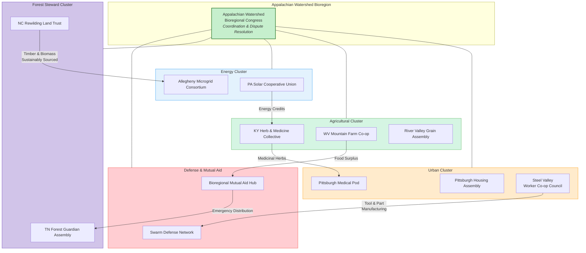
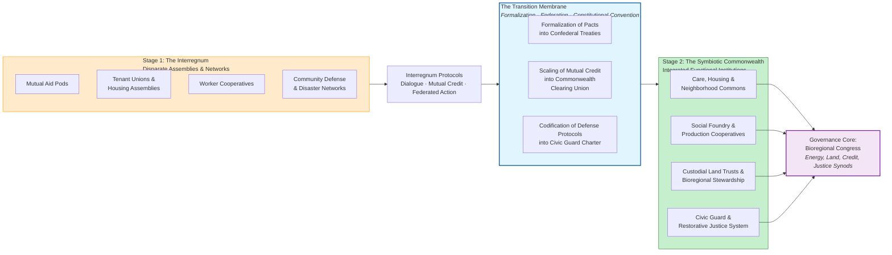

# Navigating the Interregnum: A Field Manual from Assemblies to Commonwealth

## **Volume I: The Field Manual – Short-Term Praxis for the Interregnum**

### **Diagnosing the Interregnum: A Patchwork of Failure and Proto-Commonwealth Cells**

The United States is not experiencing a single collapse but an **uneven unravelling**. The Game A state's failure is its growing inability to provide basic goods (security, housing, healthcare) or legitimate governance, creating vacuums filled by both predatory actors and grassroots assemblies[citation:6]. This interregnum—the chaotic period between systems—is characterized by a patchwork logic: zones of extreme carceral violence exist alongside nascent networks of mutual aid and democratic councils[citation:3].

The existing ecosystem of popular assemblies can be categorized by their primary function:
*   **Survival & Reproduction:** Mutual aid pods, community fridges, free medical clinics.
*   **Defense & Security:** Community land trust defense committees, copwatch programs, disaster response networks.
*   **Production & Stewardship:** Worker cooperatives, urban farms, community solar collectives.
*   **Governance & Conflict Resolution:** Tenants' unions, neighborhood assemblies, restorative justice circles.

Points of conflict are inevitable: resource scarcity can lead to competition, and strategic horizons may differ (e.g., immediate survival vs. long-term political structuring). However, existing lines of dialogue often form around shared bioregional threats (e.g., a polluting facility) or through digital networks that allow for the cross-pollination of tactics[citation:7].

### **Interregnum Protocol 1: Dialogue & Reconciliation**

**Purpose:** To resolve conflicts and build strategic alignment between disparate assemblies without imposing hierarchy.

**Method (The Conciliation Circle):**
1.  **Voluntary Confluence:** Assemblies in tension select 2-3 delegates each to a temporary circle.
2.  **Need-Based Testimony:** Each side articulates its material constraints and strategic imperatives, not just positions. The question is "What do you need to sustain your work?" not "What do you demand?"
3.  **Symbiotic Mapping:** Facilitators help map complementary assets. Can Assembly A's secure land base host Assembly B's medical clinic? Can B's tech skills support A's communication network?
4.  **Pact Formation:** The outcome is not a merger but a **Pact of Mutual Recognition and Non-Aggression**, with specific, limited commitments for resource or logistical support. This builds trust for deeper federation later.

### **Interregnum Protocol 2: Resource Mutualization**

**Purpose:** To move from charitable aid to structured material symbiosis between assemblies.

**Blueprint: The Bioregional Mutual Credit Ledger**
*   **Mechanism:** Assemblies create a simple ledger (digital or physical) tracking in-kind contributions. Hours of carpentry, bushels of produce, kW of renewable energy, and safe housing nights are assigned a common "labor-credit" unit.
*   **Operation:** A rural food assembly "sells" produce to an urban housing assembly for credits. It uses those credits to "purchase" legal services from an urban defense assembly and repaired tools from a suburban mechanics' cooperative.
*   **Governance:** A rotating council from participating assemblies audits and arbitrates the ledger, ensuring no net extractive relationships form. This creates a **proto-commonwealth economy** based on direct reciprocity, not dollar liquidity.

### **Interregnum Protocol 3: Federated Defense**

**Purpose:** To provide community safety and disaster response without replicating police hierarchies.

**Model: The Swarm Defense Network**
*   **Structure:** Decentralized, affinity-based "pods" (medical, de-escalation, communication, shelter) within and across assemblies.
*   **Doctrine:** Based on the principle of **"overwhelming presence, minimal force."** In response to a threat (e.g., a fascist march, a natural disaster, an ICE raid), the network "swarms" by deploying multiple non-violent pods to document, medically support, shelter vulnerable people, and physically interpose bodies, making targeted violence or displacement logistically difficult.
*   **Training:** Regular shared drills across assemblies, integrating the Asayîs model of community self-defense training from Rojava, where basic defense is a universal social skill[citation:5].

---

*A diagram showing a decentralized network. Central node: "Appalachian Watershed Bioregional Congress (Hypothetical)". Connected to five cluster-nodes: "Urban Cluster (Pittsburgh Assemblies)", "Agricultural Cluster (WV/KY Land Trusts)", "Energy Cluster (PA Solar Co-ops)", "Forest Steward Cluster (TN/NC Communities)", and "Defense & Medics Network". Each cluster-node connects to 3-4 smaller "Assembly" nodes (e.g., "Tenant Union", "Farm Co-op", "Mountain Mutual Aid"). Arrows show flows: "Food", "Energy Credits", "Medical Supplies", "Defense Alerts", "Labor Credits".*

---

## **Volume II: The Compass Star – Long-Term Horizon & The Transition Membrane**

### **Material Blueprint 1: Energy & Metabolism**

**System: The Democratic Microgrid Confederation**
*   **Design:** A nested system. Individual assemblies (apartment blocks, farms) manage rooftop solar and batteries. These interconnect at the neighborhood level into a microgrid managed by a local energy council. Neighborhood microgrids then interconnect bioregionally via high-voltage DC lines along existing rail corridors.
*   **Governance:** Each council elects recallable technical delegates to a **Bioregional Energy Synod**, which optimizes long-distance flows. The system uses participatory budgeting to prioritize which communities receive investment for generation or storage next. This embodies the **"Soviets + Electricity"** principle—combining democratic councils with robust infrastructure[citation:9].

### **Material Blueprint 2: Land & Stewardship**

**Framework: The Custodial Land Commons**
*   **Synthesis:** Integrates the legal shell of the Community Land Trust (removing land from the commodity market) with the Indigenous principle of intergenerational stewardship and the ecological practice of rewilding.
*   **Operation:** Land is held in a perpetual trust governed by a council of residents, original indigenous stewards (where applicable), and ecological scientists. Use rights are granted for housing, sustainable agriculture, or wild sanctuaries based on a **"Land Use Covenant"** that mandates regenerative practices. This creates a mosaic of human habitation and restored wild corridors, as seen in conservation visions for the Appalachia & Allegheny Interior Forests bioregion[citation:4].

### **Material Blueprint 3: Production & Care**

**Model: The Federated Social Foundry**
*   **Coordination:** A bioregional **"Needs & Capacities Inventory"**—an open-source platform where assemblies log surpluses and deficits in essential goods (medicines, tools, textiles).
*   **Production:** Retooled, small-scale "social foundries" (former factories, large workshops) operate as worker cooperatives. Their production schedule is set not by market demand but by **confirmed communal orders** from the inventory platform.
*   **Care:** Care work (health, education, eldercare) is organized as a **valued social sector**, not a marginalized "service." Caregivers rotate through councils that coordinate with health and housing assemblies, dissolving the market/state binary for social reproduction.

### **The Transition Membrane: From Protocols to Commonwealth**

The "Transition Membrane" is the set of processes that allow the Interregnum Protocols to evolve into the Symbiotic Commonwealth's permanent structure.

1.  **From Mutual Credit to Commonwealth Credit Clearing Union:** As the ledger scales, it formalizes into a public utility. Labor-credits become a stable measure for planning. The auditing council becomes a democratically elected **Credit Synod** that can issue credit for large-scale, long-term bioregional projects (e.g., rebuilding a railway).
2.  **From Federated Defense to Civic Guard:** The Swarm Defense pods, once proven and trusted, are formalized as a **Civic Guard**. Membership rotates, training is universal, and its mandate is strictly defensive: to protect the commonwealth's institutions and people from harm, enforcing the decisions of popular assemblies and restorative justice circles[citation:5].
3.  **From Pact of Recognition to Bioregional Congress:** Temporary pacts solidify into a **Confederal Treaty**. Delegates from functional councils (Energy, Land, Production, Care) and territorial assemblies form a **Bioregional Congress**. This Congress does not "rule over" localities but coordinates what cannot be managed locally, following the principle of democratic confederalism[citation:5]. It is the **materialization of the network diagram into a legitimate governing body**.

---

*A two-stage flowchart. Stage 1 (Interregnum) shows boxes for "Mutual Aid Pods," "Tenant Unions," "Worker Co-ops," and "Defense Networks" connected by arrows labeled "Pacts" and "Credit Ledgers." A central process labeled "Interregnum Protocols" acts on them. Stage 2 (Commonwealth) shows transformed boxes: "Care & Housing Commons," "Social Foundry Co-op," "Custodial Land Trust," and "Civic Guard." They are connected via a central institution: "Bioregional Congress (Energy, Land, Credit Synods)." A large arrow labeled "Transition Membrane: Formalization, Federation, Constitutional Convention" points from Stage 1 to Stage 2.*

---

## **Speculative Narrative: A Day in the Life of the Appalachian Watershed Commonwealth, 2050**

**5:30 AM:** Elara wakes in her apartment in a former university dormitory, now a Housing Assembly in the Pittsburgh Metro-Cluster. Her home's energy meter shows a surplus from yesterday's solar generation, automatically traded on the Ohio River Valley Microgrid for credits. She uses 50 credits to order a new pair of work boots from the Wheeling Social Foundry, delivered by the bioregional electric rail courier.

**8:00 AM:** At the clinic where she works, the week's medical supply allocation has arrived. The inventory was determined by the Care Council after analyzing population health data from across the Watershed. A shortage of a specific antibiotic is flagged; the system shows the Morgantown Pharma Co-op can resupply in two days.

**1:00 PM:** As a member of her district's Civic Guard cohort, Elara attends a monthly de-escalation drill in a park. The scenario involves mediating a dispute between a nearby Agricultural Assembly and a Forest Steward Assembly over water use from a shared creek. The drill uses real data from the watershed management dashboard. The solution isn't imposed but facilitated, guiding the assemblies toward the Water Synod's mediation process.

**6:00 PM:** Elara logs into the assembly's monthly plenary. The main agenda item: voting on their delegate's mandate for the upcoming Appalachian Watershed Congress. The Congress will debate a major project: using Commonwealth Credit to rebuild a rail spur to a new lithium deposit, essential for grid storage. The mine would be operated under a Custodial Covenant, with strict reclamation plans. After vigorous debate, her assembly votes to support the project, conditional on the local Lenape stewardship council holding veto power over the land use plan.

**9:00 PM:** The evening air is clean. The last coal plant closed a decade ago. Security isn't felt as the presence of armed authority, but as the resilience of the network—the knowledge that her water, power, food, and community are interwoven and self-defending. The state did not wither away; it was made obsolete, cell by cell, assembly by assembly, protocol by protocol, until the new world was not just a shell within the old, but the living body that had absorbed and transformed it.

---

## **References & Citations**

1.  Jacques, M. (2004). The Interregnum. *London Review of Books*. [citation:1]
2.  Irregular Warfare Initiative. (2024). The Peril of Ignoring the Legitimacy of Violent Non-State Actors. [citation:2]
3.  Democratic Socialists of America, Libertarian Socialist Caucus. (2018). Dual Power: A Strategy To Build Socialism In Our Time. [citation:3]
4.  One Earth. (2025). Appalachia & Allegheny Interior Forests Bioregion (NA24). [citation:4]
5.  Rushton, S. Rebel Cities: Radical Municipalism. *The Anarchist Library*. [citation:5]
6.  Hitchcock, P. The Failed State and the State of Failure. *Mediations: Journal of the Marxist Literary Group*. [citation:6]
7.  Nok, M., & Ka, M. (2024). Dual Power: The Importance of Self-Organization and Assemblies. *Left Voice*. [citation:7]
8.  Liberation School. (2020). Dual power, base building, and serving the people in the U.S. Revolutionary Movement. [citation:8]
9.  Simon, J. The Dual Power of Arts Organizations. *Miami Rail*. [citation:9]
