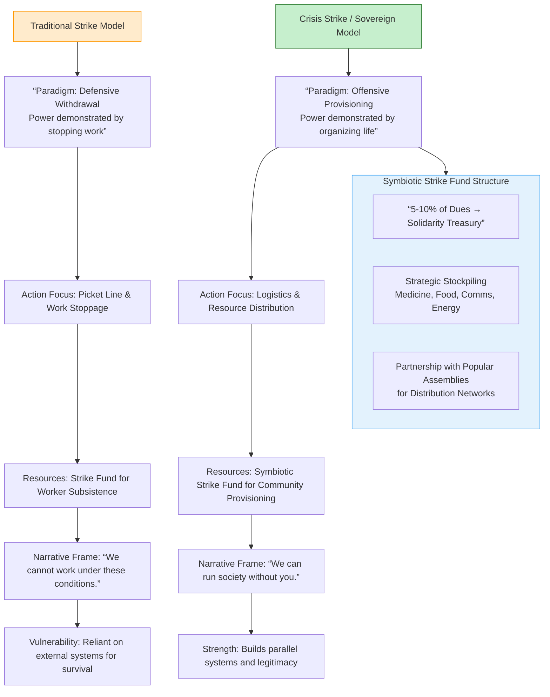
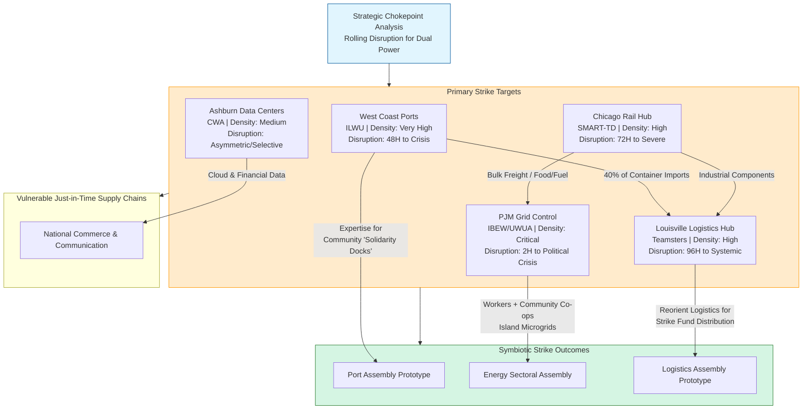
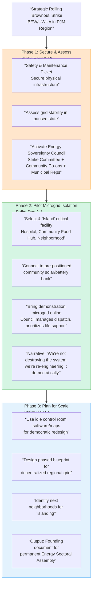
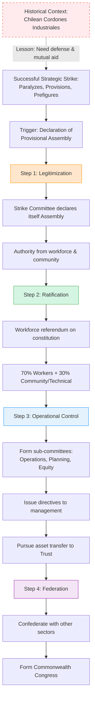

# The Dual-Power Playbook: Labor Action as Strategic Pivot

## Executive Summary

This dossier re-conceptualizes the general strike from a protest tactic into the central engine for building a Symbiotic Commonwealth. It argues that strategic, targeted labor withdrawal—the "Strategic Strike"—can perform three simultaneous functions: **paralyze** the extractive Game A economy, **provision** communities through superior logistical organization, and **prefigure** post-capitalist modes of production. By targeting critical chokepoints, stockpiling resources, and planning for the productive use of idled capacity, organized labor can transition from a defensive force within capitalism to the generative architect of a new political economy. This playbook provides a concrete analysis of leverage points, a blueprint for symbiotic strike action, and a protocol for institutionalizing victory into permanent democratic assemblies.

## 1. The Strategic Shift: From Work Stoppage to Sovereign Provisioning

The traditional strike model cedes moral and logistical ground by framing labor as a passive withdrawal. The **"Crisis Strike"** model, exemplified by Sri Lankan unions in 2022, inverts this: labor becomes the active organizer of survival, demonstrating not only power *against* a system, but capacity *for* a new one.

### 1.1 The Symbiotic Strike Fund: From Dues to Dual-Power Treasury
A strike fund must evolve from a war chest for enduring hardship to a capital pool for community provisioning.

*   **Structure:** A portion of regular dues (e.g., 5-10%) is allocated to a dedicated **"Solidarity & Sovereignty Fund,"** legally separate from traditional strike funds to shield it from sequestration.
*   **Stockpiling:** The fund is used to acquire and store essential, non-perishable goods in decentralized, community-held caches:
    *   **Medical:** Prescription generics, trauma kits, naloxone.
    *   **Nutrition:** Bulk grains, legumes, powdered milk, vitamins.
    *   **Communication:** Mesh network nodes, satellite phones, radios.
    *   **Energy:** Portable solar generators, batteries.
*   **Distribution Network:** Managed in partnership with pre-existing **Popular Assemblies** (tenant unions, mutual aid pods). Assemblies handle local distribution, providing the strike with a ready-made logistical and legitimacy network. During a strike, the fund switches from stockpiling to active distribution, proving the movement can "keep the lights on."

## 2. Targeting the Rhizome: Chokepoint Analysis & Rolling Disruption

A nationwide, indefinite general strike is a high-risk myth. Effective dual power is built through **strategic, rolling disruptions** at critical nodes of the logistical, energy, and information rhizome, exposing systemic fragility and creating windows for building alternatives.

### 2.1 Chokepoint Analysis Map
*Table 1: Strategic National Chokepoints for Rolling Strike Action*

| **Target Node** | **Dominant Unions & Leverage** | **Systemic Impact Timeline** | **Dual-Power Linkage Potential** |
| :--- | :--- | :--- | :--- |
| **1. Maritime Ports** (e.g., LA/Long Beach, NY/NJ) | International Longshore & Warehouse Union (ILWU). High-density, strategic chokehold on 40% of national container imports. | **Critical:** 48-hour stoppage causes port congestion. 7-day stoppage triggers national retail shortages. | Link with port-adjacent communities for defense against strikebreakers; use idle port expertise to plan community-run "solidarity docks" for essential goods. |
| **2. Class I Rail Hubs** (e.g., Chicago, Kansas City) | SMART-TD, Brotherhood of Locomotive Engineers. Control of continental bulk freight (food, fuel, chemicals). | **Severe:** 72-hour coordinated "safety slowdown" disrupts chemical and agricultural supply chains. | Partner with farmer co-ops and utility assemblies to identify and prioritize "lifeboat" shipments of absolute essentials via alternative rail. |
| **3. Electrical Grid Operations** (e.g., PJM Interconnection, CAISO control centers) | IBEW, Utility Workers Union of America. Control over grid stability and dispatch. | **Catastrophic:** Strategic, rotating 2-hour "brownout" strikes in key urban/industrial centers create massive political pressure within days. | **Core incubator for Sectoral Assembly.** Idled grid workers + community solar co-ops can design and manage localized microgrids, demonstrating democratic energy management. |
| **4. Package & Logistics Sortation Hubs** (e.g., UPS Worldport, Amazon Air Hubs) | Teamsters (UPS), Amazon Labor Union. Control over "last-mile" and next-day delivery ecosystem. | **High-Profile:** 96-hour stoppage at major hubs paralyzes e-commerce, exposing dependence on hyper-exploited labor. | Workers possess master-level knowledge of logistics software and warehousing. This expertise can be redirected to optimize the "Symbiotic Strike Fund" distribution network. |
| **5. Telecommunications Data Centers** | Communications Workers of America. Physical control over server infrastructure. | **Asymmetric:** "Code of Conduct" work-to-rule actions by network engineers can degrade service for targeted entities (e.g., hedge funds, detention centers) while preserving community access. | Technicians can collaborate with community mesh network activists to harden alternative communications infrastructure in preparation for state- or corporate-led internet throttling. |

*A map-style diagram showing the United States with five primary nodes: "West Coast Ports," "Chicago Rail Hub," "PJM Grid Control," "Louisville Logistics Hub," and "Ashburn Data Center." Each node is color-coded by industry and connected by lines representing supply chains. Animated "strike pulse" waves emanate from each node, with labels showing "Impact Timeline: 48H," "72H," etc. A legend shows "Union Density: High/Medium" and "Dual-Power Linkage Potential."*

## 3. The Productive Strike: Idled Capacity as a Commonwealth Workshop

The paused workplace is not a void; it is a latent laboratory. The **"Productive Reclamation Playbook"** provides a legal and tactical framework for workers, in alliance with community assemblies and sympathetic engineers, to repurpose idled assets for common good.

### 3.1 Playbook: The Electrical Grid Sector
**Scenario:** A rolling "brownout" strike by IBEW and UWUA workers in the PJM Interconnection region.

*   **Phase 1: Secure and Assess (Strike Hour 0-12)**
    *   **Action:** Striking workers establish a safety and maintenance picket to ensure grid infrastructure is physically secure and in a stable, paused state.
    *   **Community Link:** A pre-formed **"Energy Sovereignty Council"** (strike committee + community solar co-op members + municipal utility reps) is activated.
*   **Phase 2: Pilot Microgrid Isolation (Strike Day 2-4)**
    *   **Action:** Using their expert knowledge, workers physically and digitally "island" a preselected neighborhood or critical facility (e.g., a hospital, a community food hub) from the main grid.
    *   **Productive Reclamation:** They connect this island to a bank of pre-positioned community-owned solar panels and batteries, bringing it online as a **demonstration microgrid**. The council manages dispatch, prioritizing life-support systems.
    *   **Narrative:** This demonstrates that workers are not destroying the system, but expertly re-engineering it for democratic, resilient ends.
*   **Phase 3: Plan for Scale (Strike Day 5+)**
    *   **Action:** In the strike headquarters, workers and community planners use idle control room software and maps to design a phased blueprint for a decentralized, democratic regional grid, identifying next neighborhoods for islanding.
    *   **Output:** This blueprint becomes the founding technical document for a permanent **Energy Sectoral Assembly**.

## 4. The Transition Protocol: From Strike Committee to Sectoral Assembly

The ultimate goal is to convert the temporary democratic body formed to manage the strike into the permanent institution governing that sector of the economy.

### 4.1 Constitutional Framework for a Sectoral Assembly
**Trigger:** The successful resolution of a strategic strike that has (a) crippled corporate operation, (b) provisioned the community, and (c) demonstrated a productive alternative.

**Protocol Steps:**

1.  **Recognition of Sovereign Legitimacy:** The strike committee declares itself the *provisional* **Energy (or Logistics, etc.) Assembly**, deriving its authority from the demonstrated consent of the workforce and the sustaining community.
2.  **Ratification and Expansion of Membership:**
    *   **Core Electorate:** All workers in the sector (union and non-union) ratify the Assembly's constitution via referendum.
    *   **Stakeholder Seats:** The constitution allocates a percentage of seats (e.g., 30%) to democratically elected delegates from **Community Assemblies** and **Relevant Technical Guilds** (e.g., environmental engineers), ensuring the sector serves the common good, not just worker interests.
3.  **Assumption of Operational Authority:** The Assembly forms sub-committees (Operations, Planning, Equity) and issues directives to management. Initially, this may be a form of **co-determination under duress**. The goal is the peaceful transfer of asset titles and operational control to the Assembly as a commonwealth trust.
4.  **Federation:** The newly formed Energy Assembly sends delegates to confederate with other Sectoral Assemblies (Logistics, Manufacturing, Care) and Territorial Assemblies (neighborhood/city councils), forming the kernel of a **Confederal Commonwealth Congress**.

### 4.2 Historical Precedent: The Chilean *Cordones Industriales*
During Chile's Popular Unity government (1970-73), striking workers occupied factories and formed *cordones industriales* (industrial belts)—coordinating councils that managed production between occupied plants and distributed goods to local communities. They were not just defending workplaces but building a parallel, socially oriented productive network. Their suppression highlights the critical need for the **Symbiotic Strike Fund** and **Federated Defense** models to protect nascent institutions.

## Conclusion: The Strike as Genesis

The strategic strike, re-imagined through this playbook, is the **practical bridge** between the world we inhabit and the Commonwealth we seek. It is a drill for sovereignty, a stress test for mutual aid networks, and the founding convention for a democratic economy. By targeting chokepoints, stockpiling not just cash but collective capacity, and planning to turn paused capital into commonwealth workshops, organized labor can transform its power from the ability to stop production into the authority to begin it anew, on a foundation of solidarity, ecology, and justice.

---

## References & Citations

1.  Alimahomed-Wilson, J., & Ness, I. (Eds.). (2018). *Chokepoints: Logistics Workers Disrupting the Global Supply Chain*. Pluto Press.
2.  International Longshore and Warehouse Union. (2023). *Contract and Bargaining Updates*.
3.  Moody, K. (2007). *US Labor in Trouble and Transition: The Failure of Reform from Above, the Promise of Revival from Below*. Verso.
4.  Panitch, L., & Gindin, S. (2012). *The Making of Global Capitalism: The Political Economy of American Empire*. Verso. (For analysis of logistical power).
5.  Sri Lanka Brief. (2022). *Trade Unions and People's Movements Launch "Crisis Strike"*.
6.  Teamsters. (2023). *UPS Contract Campaign: The Worldport*.
7.  Utility Workers Union of America. (2022). *Report on Grid Reliability and the Workforce*.
8.  Wright, E.O. (2019). *How to Be an Anticapitalist in the Twenty-First Century*. Verso. (For models of symbiotic vs. ruptural strategies).
