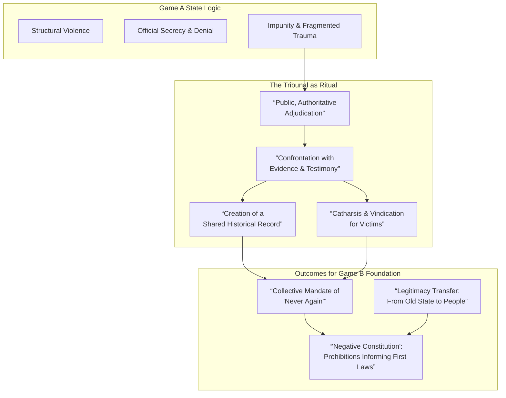
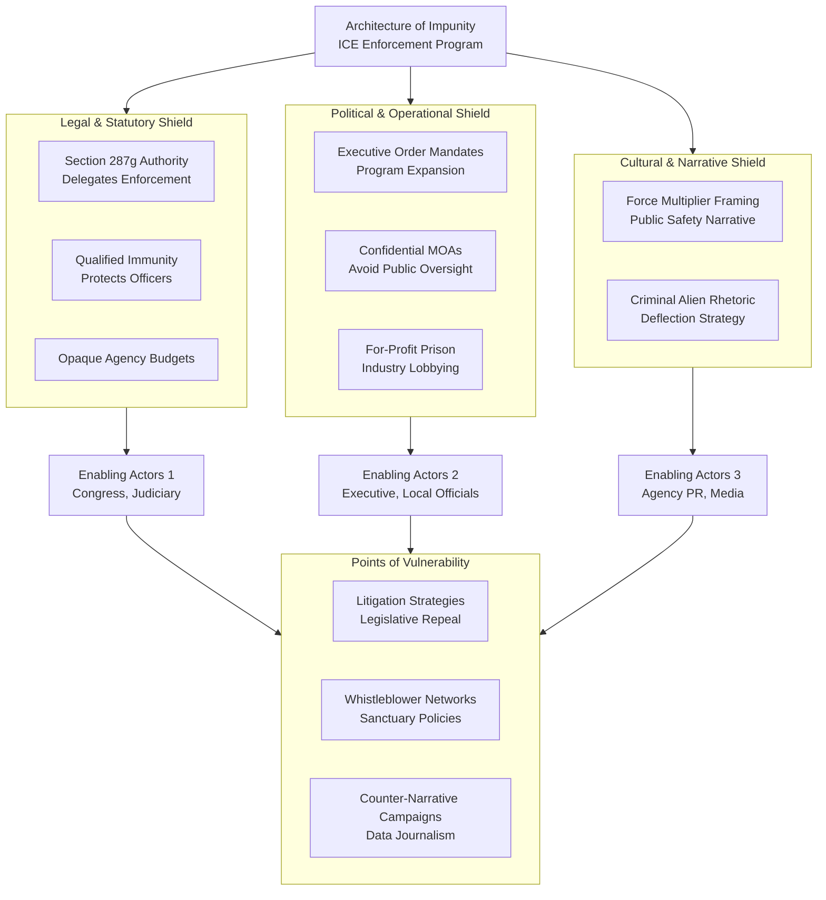
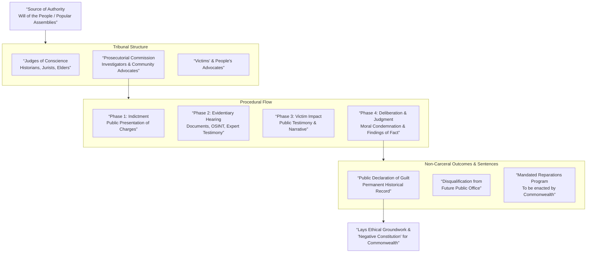
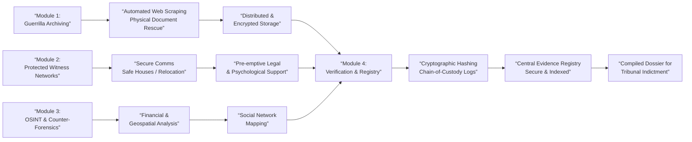
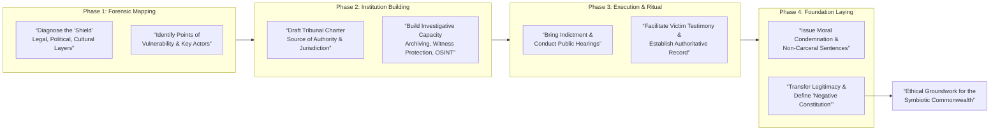

# Toolkit for Reckoning: Popular Tribunals & The Foundations of Legitimacy

## I. Beyond Impunity – Popular Tribunals and the Birth of the Commonwealth

### 1.1 The Imperative for a Popular Reckoning
The transition from a Game A state, characterized by institutionalized violence and structural impunity, to a Symbiotic Commonwealth requires more than institutional dismantling. It demands a **formal, public severance of the old order's legitimacy**. State-sponsored systems like ICE's 287(g) program, which has expanded to over 1,373 agreements, create a distributed architecture of enforcement that is deliberately insulated from local accountability [citation:4]. Traditional legal avenues are neutralized by doctrines like qualified immunity, opaque budgeting, and political patronage networks.

Popular tribunals emerge as the necessary extra-legal mechanism to execute this severance. Their purpose is not to mimic the punitive carceral logic of Game A, but to achieve four foundational goals for the emerging Commonwealth:
1.  **Establish an Authoritative Historical Record:** To create a publicly validated narrative of systemic crimes, countering state propaganda and denial.
2.  **Perform a Legitimacy Transfer:** To symbolically drain authority from the old state by subjecting its acts to the judgment of the people, drawing moral authority from movements and assemblies.
3.  **Facilitate Collective Catharsis:** To provide victims with a platform for vindication and society with a ritual to process social trauma, transforming it into a collective mandate of "Never Again" [citation:3].
4.  **Define the Negative Constitution:** The tribunal's findings and condemnations become the prohibitive foundation for the Commonwealth's new laws, explicitly outlawing the resurrected systems of the past.

### 1.2 Theory of Legitimacy and Prevention
The legitimacy of a popular tribunal derives not from statute, but from **popular sovereignty** and **moral law**. It is an expression of the constituent power of the people in a revolutionary interregnum. This process has a demonstrable preventive effect. As observed in international contexts, the stigmatization of criminal conduct and the removal of abusive leaders from political life can alter the broader "rules of legitimacy" and inhibit the future normalization of such violence [citation:3]. A tribunal's judgment serves as both a retroactive condemnation and a prospective inoculation against the re-emergence of Game A logic.

---

## II. Mapping the Architecture of Impunity: The ICE 287(g) Program as a Case Study

**Objective:** To forensically deconstruct the mechanisms shielding a key Game A enforcement node from accountability.

| Shield Layer | Mechanism & Function | Enabling Actors & Networks | Points of Vulnerability |
| :--- | :--- | :--- | :--- |
| **Legal & Statutory** | **Section 287(g) of the INA:** Delegates federal immigration enforcement authority to state/local law enforcement, creating a legal gray zone [citation:4]. **Qualified Immunity:** Protects individual officers from civil liability for constitutional violations. **Opaque Budgeting:** DHS/ICE budgets with classified or fungible allocations for enforcement operations. | Congress (crafting laws), The Judiciary (upholding immunity), DHS bureaucracy. | Public litigation challenging specific MOAs; legislative campaigns to repeal 287(g); whistleblowers exposing budget misuse. |
| **Political & Operational** | **Executive Order 14159 (2025):** Mandates ICE to expand 287(g) agreements "to the maximum extent permitted by law," creating top-down political pressure [citation:4]. **Memorandums of Agreement (MOAs):** Bilateral contracts that formalize partnerships, often negotiated without public oversight. | The Executive Branch, Governors & Mayors, Police Unions, For-profit detention lobbyists. | Local/State "Sanctuary" policies refusing cooperation; investigative journalism on MOA terms; electoral challenges to pro-287(g) officials. |
| **Cultural & Narrative** | **"Force Multiplier" Framing:** Portrays the program as essential for "safety and security," embedding it in public safety discourse [citation:4]. **Criminalization Narrative:** Targets "criminal aliens," deflecting criticism from systemic abuse to individual culpability. | Agency Public Affairs, aligned media outlets, political figures. | Counter-narratives from affected communities; data exposing non-criminal targets; framing abuse as a "moral crisis." |

---

## III. The Charter for a People's Tribunal on State Crimes

**Preamble:** We, the people, gathered in popular assemblies and mobilized in social movements, invoking our inherent sovereignty and the universal principles of human dignity, hereby constitute this Tribunal to judge the crimes of the former state and lay the ethical groundwork for the Commonwealth.

### Article 1: Source of Authority
The Tribunal's authority springs from the **will of the people** as expressed through participating popular assemblies, trade unions, community defense networks, and moral witnesses. Its mandate is rooted in natural law and the right to rebellion against tyrannical authority.

### Article 2: Jurisdiction *Ratione Materiae* (Subject Matter)
The Tribunal has jurisdiction over **Political Crimes**, defined as acts perpetrated, enabled, or concealed by state institutions or their agents that attack the collective welfare and rights of the people. This includes, but is not limited to:
*   **Systemic Violence:** Torture, extrajudicial killing, enforced disappearance, cruel/unusual detention.
*   **Democratic Subversion:** Corruption, voter suppression, destruction of public records, conspiracy against constituent assemblies.
*   **Ecocide:** Willful pollution, resource theft, and regulatory capture leading to irreversible environmental harm.
*   **Structural Crimes:** The creation and maintenance of systems (e.g., for-profit detention, predatory finance) designed to immiserate and control populations.

### Article 3: Composition & Structure
*   **Adjudicatory Panel:** Composed of 7-9 **Judges of Conscience**, nominated by assemblies. They are historians, jurists, ethicists, and respected community elders known for integrity, not former Game A officials.
*   **Prosecutorial Commission:** A team of investigators, lawyers, and community advocates responsible for building and presenting cases. Its work is guided by a specialized, teamwork-based approach to dissecting complex systems [citation:5].
*   **Victims' & People's Advocates:** Ensures victim testimony is central and that the proceedings serve a public pedagogical function.

### Article 4: Procedure
The process is a hybrid model prioritizing truth-finding and moral clarity:
1.  **Indictment:** Based on the Investigator's Manual (Section IV), presented publicly.
2.  **Evidentiary Phase:** Presentation of documentary evidence, forensic analysis, and expert testimony. The accused state or its representatives may be invited to respond; their absence does not halt proceedings.
3.  **Victim Impact Phase:** Public testimony from those harmed, focusing on narrative, trauma, and loss.
4.  **Deliberation & Judgment:** The panel issues a written judgment establishing factual and legal findings, and a **Moral Condemnation**.

### Article 5: Sentencing & Outcomes
Consistent with a non-carceral ethos, sentences are declarative and forward-looking:
*   **Public Declaration of Guilt:** Naming responsible individuals and institutions.
*   **Permanent Historical Record:** Canonization of the judgment and evidence in the Commonwealth's foundational archive.
*   **Disqualification:** The guilty are barred from holding public office, positions of institutional trust, or advisory roles in the Commonwealth.
*   **Mandated Reparations:** Orders for material restitution, to be enacted by the Commonwealth's future institutions (e.g., a fund for victims' families, community-controlled land trusts).

---

## IV. The Investigator's Manual for Transitional Justice

**Principle:** Evidence must be collected with rigor anticipating hostile scrutiny, using secure, decentralized methods.

### Module 1: Guerrilla Archiving & Evidence Preservation
*   **Objective:** Capture and preserve vulnerable state records before their destruction.
*   **Methods:**
    *   **Automated Web Scraping:** Use tools like ArchiveTeam Warrior to mass-download public-facing agency documents, reports, and databases.
    *   **Physical Document Rescue:** Secure hard copies from closing offices, with chain-of-custody protocols.
    *   **Distributed Storage:** Encrypt and store archives across multiple decentralized nodes (e.g., secure cloud, encrypted hard drives held by trusted community members).

### Module 2: Protected Witness Networks
*   **Objective:** Safely gather testimony from whistleblowers, victims, and former insiders.
*   **Adapted Protocols:** Model a community-based witness protection system on principles from formal programs [citation:2], but decentralized.
    *   **Secure Communication:** Use end-to-end encrypted, open-source platforms (Signal, Keybase).
    *   **Safe Houses & Relocation:** Coordinate through trusted mutual aid and sanctuary networks.
    *   **Legal Support:** Connect witnesses with sympathetic lawyers and legal collectives *before* they come forward.
    *   **Psychological Support:** Provide trauma-informed care through community health pods.

### Module 3: Open-Source Intelligence (OSINT) & Counter-Forensics
*   **Objective:** Build evidence from publicly available data.
*   **Techniques:**
    *   **Financial Forensics:** Trace budgets, contracts, and money flows using public procurement databases, IRS 990 forms for contractors, and stock disclosures.
    *   **Geospatial Analysis:** Use satellite imagery (Google Earth, Sentinel Hub) to document the growth of detention centers, environmental degradation, or police infrastructure.
    *   **Social Media & Communications Analysis:** Map networks of officials, lobbyists, and contractors; archive public statements for contradiction.

### Module 4: Verification & Chain of Custody
*   **Digital Evidence:** Use cryptographic hashing (SHA-256) to create a unique fingerprint for every file. Log all access.
*   **Testimony:** Conduct interviews with multiple investigators present, record with consent, and produce timed transcripts.
*   **Central Registry:** Maintain a secure, indexed master log of all evidence items, witnesses (using codes), and their provenance.

---

## V. Sample Indictment: The People vs. The System of Immigrant Detention

**THE PEOPLE'S TRIBUNAL ON STATE CRIMES**  
Case No. PT-001

**THE PROSECUTORIAL COMMISSION**  
—v—  
**THE SYSTEM OF IMMIGRANT DETENATION**, comprising the agencies U.S. Immigration and Customs Enforcement (ICE), the Department of Homeland Security (DHS), and their private contractors including but not limited to CoreCivic and The GEO Group, Inc.

**INDICTMENT**

**Charge 1: Crimes Against Humanity (Widespread or Systematic Imprisonment)**  
The Defendant System, through the **287(g) Program** and other mechanisms, created a nationwide network of identification and incarceration targeting populations based on national origin. With **1,373 active MOAs** as of January 2026, this system was widespread [citation:4]. Its operation was systematic, relying on delegated authority, quota-driven enforcement, and for-profit incentives.

**Charge 2: Democratic Subversion (Corruption & Perversion of Justice)**  
The Defendant System corrupted public institutions by: a) Injecting profit motive into incarceration via contracts with private prison corporations; b) Co-opting local law enforcement into federal immigration enforcement, perverting their public safety mission [citation:4]; c) Operating under budgets designed to obscure appropriations and preclude accountability.

**Charge 3: Systemic Violence (Torture & Cruel, Inhuman, or Degrading Treatment)**  
The Defendant System routinely subjected detainees to conditions constituting psychological and physical torture: prolonged solitary confinement, denial of medical care, use of force during transfers, and detention in facilities with known patterns of abuse and neglect.

**Supporting Evidence (Referenced from the Investigator's Archive):**
*   **Doc. E-01:** ICE FY2025 Budget Justification, highlighting increases for "Detention Bed Days."
*   **Doc. E-02:** Internal ICE memo on "Alternatives to Detention" funding being reprogrammed for enforcement.
*   **Testimony W-01-10:** Affidavits from former detainees of the Adams County Correctional Center (CoreCivic).
*   **Testimony W-11:** Whistleblower statement from a former ICE case manager on enforcement quotas.
*   **OSINT-01:** Geospatial timelapse showing expansion of the Dilley Detention Center, 2015-2025.

**CONCLUSION**
The Prosecutorial Commission respectfully requests the Tribunal to summon representatives of the Defendant System to answer these charges, and upon proof beyond a reasonable doubt, to issue a judgment condemning this system and all who enabled it, thereby dissolving its moral and political authority and clearing the ground for a Commonwealth of welcome.

---
**Date:** 27 January 2026
**For the Prosecutorial Commission:**
[Signature Line for Lead Community Advocates]
