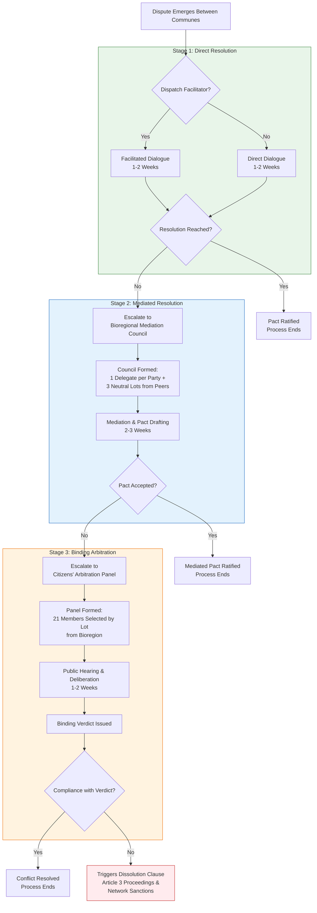

# The Transition Security Framework

## Volume I: The Safeguard Charter & Conflict Protocols

### Preamble: The Integrity Imperative
This Charter establishes the constitutional and operational safeguards for the Symbiotic Commonwealth, recognizing that the deepest threat to a liberated society is the recrystallization of power within its own institutions. Our security is defined not by walls, but by the resilience of our bonds and the clarity of our protocols against hierarchy, coercion, and the legacy logic of Game A.

---

### Part 1: The Commonwealth Safeguard Charter

#### Article 1: Foundational Principles
1.  **Subsidiarity:** Authority resides fundamentally in the base assembly (neighborhood, workplace, bioregional steward). Delegation upward is always specific, provisional, and for coordination only.
2.  **Opacity as Violence:** Secrecy in decision-making or resource allocation is a breach of trust and a threat to the commons, invalidating any decision made under its veil.
3.  **The Right to Dissolve:** The power to create institutions must be matched by the power to dissolve them, exercised by the federated network that brought them into being.

#### Article 2: The Rotating Mandate & Recall
*   **Section 2.1 – Non-Professionalization of Power:** All delegated roles in sectoral assemblies (Energy, Logistics, Care), federated councils, or any coordinating body are **service, not careers**. Terms are strictly limited to **one consecutive term** of no more than two years.
*   **Section 2.2 – Immediate Recall:** Any delegate is subject to immediate recall by a simple majority vote of their mandating base assembly. The recall process can be triggered by any five members of that assembly, with deliberation and vote to be completed within one week.
*   **Section 2.3 – Sortition for Adjudicatory Panels:** For conflict resolution bodies and audit committees, a minimum of one-third of members shall be selected by lottery (sortition) from a pool of willing volunteers from the relevant communes, ensuring broad citizen participation and breaking elite control.

#### Article 3: The Dissolution Clause
*   **Section 3.1 – Grounds for Dissolution:** Any collective body within the Commonwealth—be it a base assembly, a sectoral council, or a production cooperative—may be subject to dissolution if it is found, through due process, to have consistently and irremediably:
    *   Hoarded essential resources beyond its agreed-upon share.
    *   Created internal hierarchies that disenfranchise members.
    *   Repeatedly violated transparency protocols.
    *   Acted with sustained aggression or bad faith toward peer networks.
*   **Section 3.2 – Process of Dissolution:**
    1.  **Petition:** A petition signed by delegates from at least three peer networks within the same bioregional federation must be presented.
    2.  **Truth & Reconciliation Council:** A special council is formed with representatives from the petitioning networks, neutral communes from an adjacent bioregion, and the accused body.
    3.  **Finding & Redistribution:** If a supermajority (66%) of the council finds the grounds valid, the body is dissolved. Its functions are temporarily administered by the council, and its resources are redistributed according to a plan developed with input from the former body's members.

#### Article 4: Transparency as Public Infrastructure
*   **Section 4.1 – The Public Log:** All meetings, decisions, and resource allocations (down to a defined threshold of necessity) must be recorded in a publicly accessible, searchable digital log. This log is maintained on distributed, open-source infrastructure.
*   **Section 4.2 – The Open Audit:** Any Commonwealth member has the right to initiate an audit of any assembly's log or resource flows. Audits are conducted by a randomly selected panel from outside the assembly's immediate network.

---

### Part 2: The Bioregional Conflict Protocol

#### Principle: Conflict is Inevitable; Violence is a System Failure.
This protocol provides a pre-agreed pathway for resolving disputes between autonomous communes or federations, replacing courts and war with layered mediation and communal arbitration.

**Step 1: Direct Dialogue & Facilitated Negotiation (Weeks 1-2)**
*   The conflicting parties must first engage in structured dialogue, ideally with a mutually agreed-upon facilitator from a neighboring commune.
*   Goal: To draft a "Statement of Shared Needs & Grievances."

**Step 2: Bioregional Mediation Council (Weeks 3-5)**
*   If direct dialogue fails, the dispute escalates to a **Mediation Council**. This council comprises:
    *   One delegate from each conflicting party.
    *   Three delegates drawn by lot from a pre-vetted pool of facilitators from across the bioregion's other communes.
*   The Council's role is to mediate, not judge. It has two weeks to broker a pact.

**Step 3: Binding Decision by Sortition Assembly (Weeks 6-8)**
*   Should mediation fail, a **Citizens' Arbitration Panel** is convened.
    *   **Formation:** 21 individuals are selected by lottery from the entire adult population of the bioregion's communes (excluding the immediate parties in conflict).
    *   **Process:** This panel hears evidence and testimony from both sides over one week. They deliberate in public.
    *   **Verdict:** Their decision is final and binding. It may mandate specific actions, resource transfers, or changes in practice.
*   **Enforcement:** The moral and social weight of this communal verdict, backed by the network's commitment to the protocol, is its primary enforcement mechanism. Non-compliance triggers Article 3 (Dissolution Clause) proceedings against the recalcitrant body.

#### The Material Deterrent: Resource Symbiosis Networks
Conflict protocol is bolstered by material design. Communes are intentionally woven into **Resource Mutualization Pacts**:
*   **Shared Water Grids:** A commune's water supply is dependent on infrastructure and stewardship from upstream neighbors.
*   **Integrated Seed Banks & Food Reserves:** Genetic diversity and food security are held in distributed, shared repositories.
*   **Interdependent Energy Microgrids:** Power flows across communal boundaries, making energy independence in conflict impossible.
*   **Result:** An attack on a neighbor is an immediate act of self-sabotage, severing the attacker from the life-support systems of the network. This creates a powerful structural incentive for peace.

---

*A flowchart titled "Bioregional Conflict Protocol." It begins with a diamond labeled "Dispute Emerges." The first box is "Step 1: Direct Dialogue (2 Weeks)" which can lead to "Resolution." If "Fails," it proceeds to "Step 2: Mediation Council (3 Weeks)" with representatives from parties and neutral lots. This can lead to "Mediated Pact." If "Fails," it proceeds to "Step 3: Sortition Assembly (3 Weeks)" showing a lottery from the bioregion population leading to a "Binding Verdict." From the verdict, an arrow leads to "Compliance" and another arrow labeled "Non-Compliance" leads to a final box: "Triggers Dissolution Clause (Art. 3) & Network Sanctions."*

---

## Volume II: Scenario Playbooks & Defense White Paper

### Playbook 1: The "Die-Hard" Scenario – The Corporate Enclave

**Scenario:** "NeoGensys Corp," a former biotech and utility conglomerate, controls a fortified enclave (a former corporate campus with its own power, water, and drone perimeter) within a Commonwealth bioregion. It refuses to integrate, hoards critical medical data and patents, and uses its remaining capital to hire mercenaries to raid nearby communes for supplies.

**Strategy: Integrated Non-Cooperation & Strategic Bypass**
The Commonwealth response is multi-layered, aiming to isolate and render the enclave irrelevant without a costly frontal assault.

| Tactic | Application | Goal |
| :--- | :--- | :--- |
| **Material Blockade & Sanctuary** | Communes publicly declare the enclave under a **"Non-Cooperation Pact."** No trade, no communication, no passage through Commonwealth territory for its agents. Simultaneously, offer sanctuary and full rights to any defector from the enclave, especially technical workers. | To strangle the enclave's external supply lines and incentivize internal defection, eroding its human capital. |
| **Cyber/Knowledge Bypass** | Open-source research collectives work to **"re-invent around"** NeoGensys's patented technology. Publish all findings in the Commonwealth Knowledge Commons. Use mesh networks to broadcast this information into the enclave, demonstrating their proprietary hold is broken. | To undermine the enclave's economic and ideological power base, showing its "assets" are now common knowledge. |
| **Targeted Resource Denial** | If the enclave is dependent on a Commonwealth-managed aquifer or wind corridor, the Bioregional Council can **"dial down"** its share to a basic human needs allowance, as per the Resource Pact, in response to its aggressive acts. | To apply calibrated, defensible pressure that is a direct consequence of the enclave's own hostile actions. |
| **Final Offer of Integration** | Present a clear, public treaty: Surrender the enclave's sovereign authority, open its archives to the Truth & Reconciliation process, and integrate as a self-managing commune under the Safeguard Charter. In return, its members receive full amnesty (except for individual, adjudicated acts of violence) and a stake in the commons. | To provide a dignified off-ramp, splitting the enclave's leadership from its population and presenting a peaceful path to the wider public. |

### The Commonwealth Defense Federation (CDF) White Paper

**Core Doctrine: Defense, Not Projection; Federation, Not Army.**

*   **Philosophical Basis:** Drawing from the **Makhnovist** principle that a revolutionary defense must be inseparable from the liberated community, and the **Rojava** model of locally rooted self-defense units (YPG/YPJ), the CDF rejects the concept of a standing, professional army. Military force is a temporary, regrettable necessity, strictly subordinated to social and ecological imperatives.

*   **Structure:**
    *   **Local Self-Defense Units (SDU):** Every commune maintains a trained, voluntary SDU. Its primary role is **territorial defense** and protection of common infrastructure. Training emphasizes de-escalation, first aid, and ethical combat. All SDU members rotate with civilian duties; there are no professional soldiers.
    *   **Bioregional Defense Council:** Composed of rotating, recallable delegates from each commune's SDU and the broader assembly. Its role is **coordination, not command.** It manages shared early-warning systems, coordinates drills, and facilitates resource sharing for defense.
    *   **Federated Mobilization:** In the face of an existential external threat (e.g., a remnant Game A military invasion), the Bioregional Council can propose a **"Defense Mandate"** to federate SDUs under a single, temporary operational command. This mandate must be ratified by a supermajority of base assemblies, is strictly time-limited (e.g., 6 months, renewable only by re-ratification), and the operational commander is selected by lot from a pool of nominated SDU coordinators and is subject to immediate recall.

*   **Rules of Engagement (The Four Pillars):**
    1.  **Strictly Defensive:** No offensive operations outside of Commonwealth-recognized territory.
    2.  **Proportionality & Minimum Force:** Any use of force must be proportional to the threat and cease the moment the threat is neutralized.
    3.  **Civilian Primacy:** All SDUs are logistically and politically dependent on their commune's assembly. They draw supplies from the communal storehouse and are accountable to the civilian population.
    4.  **Transparency in Arms:** All weaponry and its location is logged in the public registry. The development or stockpiling of weapons of mass destruction, indiscriminate area-effect weapons, or autonomous killing machines is constitutionally prohibited.

**Conclusion: Vigilance as a Daily Practice**
The security of the Commonwealth does not ultimately lie in its clauses or its defense units, but in the daily practice of its principles: the rotation of power, the sharing of bread, and the courageous exercise of the right to dissolve that which begins to oppress. This framework is not a cage of law, but the grammar of a living, arguing, and ultimately resilient body politic.

---
**References & Conceptual Heritage**

1.  Arato, A. (2016). *Post-Sovereign Constitution Making: Learning and Legitimacy*. Oxford University Press. (On constituent power and limits).
2.  Bookchin, M. (2015). *The Next Revolution: Popular Assemblies and the Promise of Direct Democracy*. Verso. (On libertarian municipalism and confederation).
3.  International Center on Nonviolent Conflict. (2023). *Civil Resistance & the Ecology of Movement Survival*. (On strategic non-cooperation).
4.  Le Guin, U.K. (1974). *The Dispossessed: An Ambiguous Utopia*. Harper & Row. (Fictional exploration of Odonian social safeguards).
5.  Makhno, N., et al. (1920s). *The Organizational Platform of the Libertarian Communists*. (Historical document on revolutionary army-community relations).
6.  Öcalan, A. (2017). *The Political Thought of Abdullah Öcalan: Kurdistan, Woman's Revolution and Democratic Confederalism*. Pluto Press. (On democratic confederalism and self-defense).
7.  Rojava Information Center. (2023). *The Social Contract of the Autonomous Administration of North and East Syria*. (Primary source on contemporary stateless governance).
8.  van Reybrouck, D. (2016). *Against Elections: The Case for Democracy*. Bodley Head. (On sortition and citizen assemblies).
9.  Zibechi, R. (2012). *Territories in Resistance: A Cartography of Latin American Social Movements*. AK Press. (On autonomy and decentralized power).
