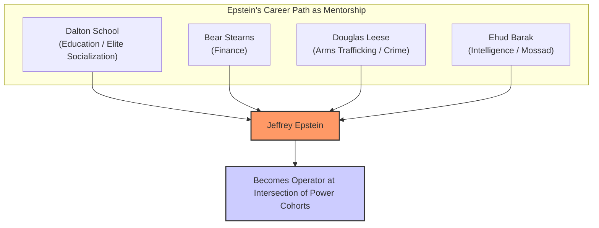
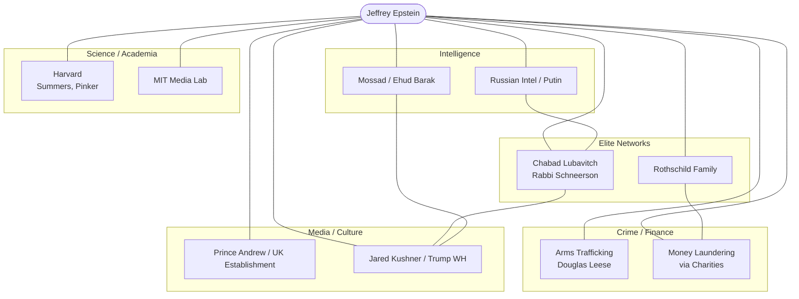
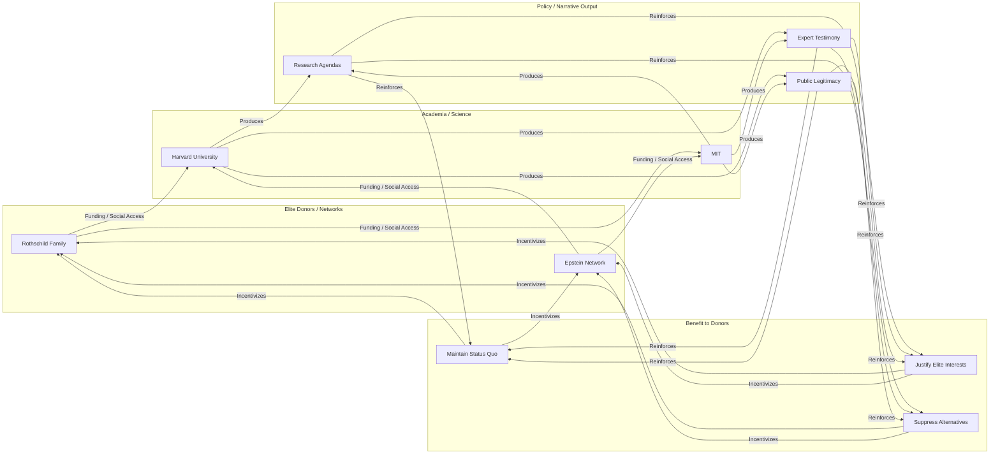
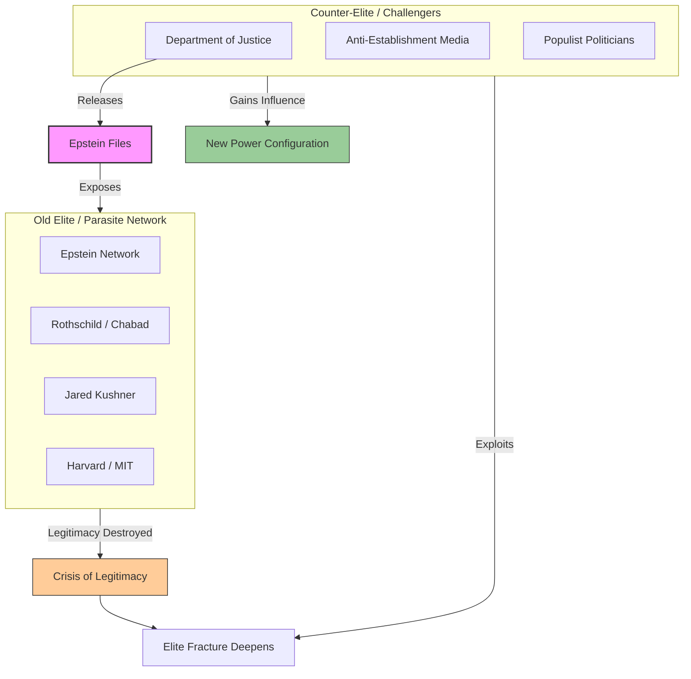

# Case Study 19: The Epstein Network – A Transnational Elite Node

## 1. Research Objective
Following the methodology outlined in the **Game A Hierarchy** (Section 3), this case study uses the recently released Epstein Files to trace the flows of capital, influence, and personnel through the network surrounding Jeffrey Epstein. The objective is to validate the "Arena Rhizome" model by demonstrating how a single operator connected the core cohorts of the global power structure, revealing the operational mechanics of the transnational "parasite" elite.

## 2. Methodology
- **Personnel Network Analysis (The "Revolving Door")**  
  Mapping Epstein’s career trajectory (Dalton School → Bear Stearns → Douglas Leese → Ehud Barak) as a mentorship program across key cohorts: Education/Elite Socialization, Finance, Crime (Arms Trafficking), and Intelligence.
- **Funding Source & Capital Flow Analysis**  
  Examining Epstein’s relationships with figures like the Rothschilds, Bill Gates, Elon Musk, and Peter Thiel to analyze his role as a capital conduit between "new money" (tech/stock market wealth) and "old money" (family/occult wealth).
- **Network Linkage Mapping**  
  Connecting Epstein to other key nodes: Jared Kushner (linking to the Trump White House and Chabad), Prince Andrew (linking to the UK monarchy and crime), and Masha Drokova (linking to Russian intelligence and Putin).
- **Narrative/Ideological Analysis**  
  Examining the role of Chabad Lubavitch and Rabbi Schneerson as the "Occult" binding agent (Game A Hierarchy §2.6), providing a shared eschatological framework (messianic accelerationism) for the network.

## 3. Key Findings

### 3.1 Validation of the "Parasite" Model
Epstein functioned as a perfect parasite. He did not create primary wealth but positioned himself at the intersection of **Intelligence, Crime, and Science** (the transnational systems) to extract value from the **host** (nation-states, corporations, individuals). His career path demonstrates deliberate training across these sectors.

### 3.2 Mapping the Rhizomatic Connections
The case confirms the flows outlined in the Arena Rhizome diagram (Game A Hierarchy §2):
- **Elite Networks (Chabad) ↔ Intelligence (Mossad/Barak):** Epstein’s training under Barak and his deep ties to Chabad (visiting Schneerson's grave with Kushner) show the fusion of secret society/occult networks with state intelligence.
- **Crime (Arms/Douglas Leese) ↔ Offshore Finance (Rothschilds):** His early work in arms trafficking provided the capital and mindset for later financial manipulation and money laundering for global elites.
- **Science/Academia ↔ Media/Culture:** His funding and socializing at Harvard (with Larry Summers, Steven Pinker) and MIT demonstrates the **"Cognitive Capture"** mechanism. His role was to bind academia to the interests of the parasitic network, ensuring the "hallucination" (the justification for the status quo) was maintained by respected institutions.
- **Transnational Capital ↔ Elite Families:** The emails showing Musk, Thiel, and Gates *seeking out* Epstein confirm that he represented a deeper layer of power—the **old family wealth (Rothschild, Epstein, Guttman)** that stands *above* the transient wealth of the stock market.

### 3.3 The Mechanism of Control: The Occult as Operating System
The lecture’s claim that the elite are bound by **"the Occult"** (Kabbalah, Hermeticism) finds its structural evidence here. Chabad Lubavitch functions as a **transnational secret society** that:
1.  Provides ideological cohesion (the messianic accelerationist script).
2.  Offers a network of trust spanning Russia (Putin's use of it to track oligarchs), the US (Kushner/Trump), and Israel (Netanyahu).
3.  Manages capital flow (Kushner’s charities as money laundering vehicles, as per the FBI source).

### 3.4 The Civil War Among Elites (The "Counter-Elite")
The release of the Epstein Files by the DOJ is not an act of transparency. It is a strategic weapon in a **civil war between elite factions** (Game A Hierarchy §4). A "counter-elite" is using this data to:
- **Target Cognitive Infrastructure:** Destroy the legitimacy of the "Epstein network" and its affiliated institutions (Harvard, MIT, mainstream media).
- **Exploit Cohort Fractures:** Amplify the tension between the **old, occult-bound elite** (Rothschild/Epstein) and the **new, nationalist/populist elite** (represented by elements of the Trump movement that now disavow him).
- **Disrupt Rhizomatic Connections:** By exposing the Kushner-Chabad-Russia connection, they sever a critical link in the network.

## 4. Strategic Implications for Game B
This case study provides crucial intelligence for building a Symbiotic Commonwealth:

1.  **Target the Occult Core:** Expose not just the financial or political corruption, but the **shared worldview** that binds this elite. Their actions are not random; they follow a script. Understanding that script (messianic accelerationism) allows for prediction and counter-narrative.
2.  **Exploit the Civil War:** The conflict between the "Epstein elite" and the "counter-elite" is a fracture to be widened. Game B strategies can remain neutral but benefit from the chaos, building dual power while the old order tears itself apart.
3.  **Build Transparent, Resilient Alternatives:** The network's power came from **secrecy** (offshore accounts, private islands, secret societies). Game B must be built on radical **transparency**, **distributed trust** (blockchain, mutual aid), and **open-source institutions** that cannot be co-opted by a hidden, occult-bound cabal.
4.  **Reclaim Science and Academia:** The Epstein case shows how easily "science" is captured. Game B must foster truly independent research institutions, funded by the commons, that serve the public good, not the interests of a parasitic elite.

---

*This case study is part of the Solarpunk Mandala Arena library. For methodology and related cases, see [Case Studies Index](/knowledge_base/case-studies/case-studies.md).*
