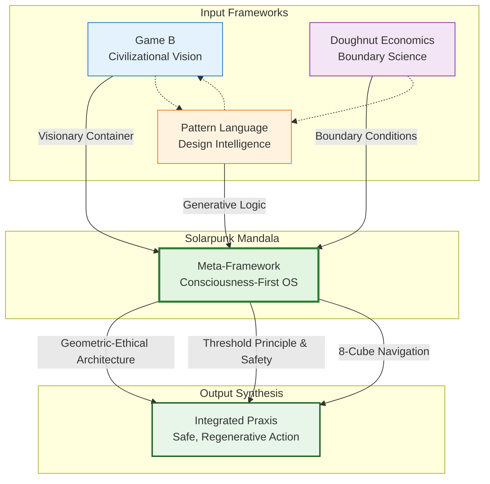
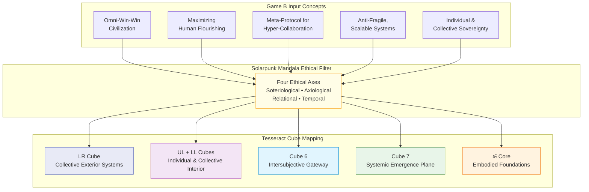
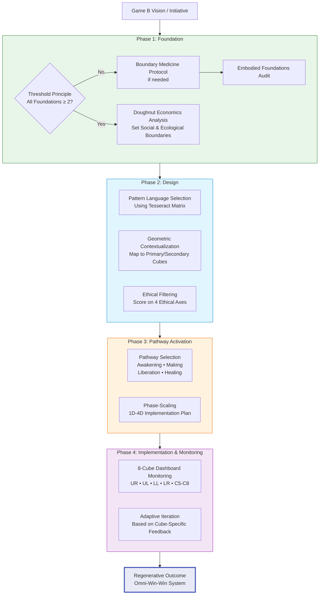

# Rhizome: Game B, Doughnut Economics & Pattern Language - A Synthesis through the Solarpunk Mandala

**Synopsis:** This rhizome maps Game B's civilizational vision through the Solarpunk Mandala's geometric-ethical architecture, demonstrating its role as a synthesizing meta-framework. It provides specific integration with Doughnut Economics (boundary conditions) and Pattern Language (generative design logic), including a complete Pattern Language ↔ Tesseract Mapping Matrix for practical application.

## Executive Summary

The convergence of Game B's vision for post-rivalrous civilization, Doughnut Economics' boundary science, and Pattern Language's design intelligence creates a powerful triad for regenerative transformation. The Solarpunk Mandala serves as the essential "operating system" that integrates these frameworks into a coherent, actionable whole. This document provides both the theoretical synthesis and practical tools (including a complete mapping matrix) for implementing this integrated approach.

## 1. Introduction: The Need for a Synthesizing Lens

Game B represents a vital, sprawling exploration of post-rivalrous civilizational forms. However, by its own definition, it resists prescriptive reductionism, describing itself as a "modus operandi" and a "meta-protocol for hyper-collaboration" where players "feel their way up the hill." This emergent, exploratory strength can benefit from a coordinating meta-framework that provides:

1. **A consistent ontological ground** for concepts like flourishing and sovereignty
2. **A structural geometry** to map multiple, irreducible perspectives
3. **Explicit ethical and safety protocols** to navigate complexity without harm
4. **Translation layers** to integrate complementary, well-developed frameworks

The Solarpunk Mandala is explicitly designed as this kind of "operating system for understanding how other frameworks connect." This analysis uses the Mandala's architecture to formally link Game B with two critical frameworks: **Doughnut Economics** (defining the *boundaries* of a thriving system) and **Pattern Language** (providing the *generative design logic* for its structures).

## 2. Game B Through the Mandala Lens: Foundational Mapping

The Mandala's matrix provides a detailed mapping of Game B concepts, forming the basis for further integration:

| Game B Concept | Mandala Mapping | Rationale |
| :--- | :--- | :--- |
| **"Omni-win-win civilization"** | **LR Cube** (Collective Exterior Systems) | The transformation of political, economic, and social structures is the exterior manifestation of this goal. |
| **"Maximizing human flourishing"** | **UL & LL Cubes** (Individual & Collective Interior) | Flourishing requires both subjective well-being (UL) and shared cultural meaning (LL). |
| **"Meta-protocol for hyper-collaboration"** | **Cube 6** (Intersubjective Gateway) | This is the cognitive/social space where "mine becomes ours," the core of collaborative protocol design. |
| **"Anti-fragile, scalable civilization"** | **Cube 7** (Systemic Emergence Plane) | Anti-fragility emerges at the transition point between individual and collective scales. |
| **"Individual/collective sovereignty"** | **ॐ Core** (Embodied Foundations) | Agency is impossible without secure Nourishment, Cleansing, Restoration, and Movement. |

**Ethical Navigation:** Game B's challenges are further guided by the Mandala's Four Ethical Axes. For example, transitioning from rivalrous dynamics aligns with the **Axiological Axis (Regeneration)**, cultivating sovereignty with the **Soteriological Axis (Integration)**, and enabling omni-consideration with the **Relational Depth Axis**.

This mapping provides the coordinate system for integrating other frameworks.

## 3. Integration 1: Doughnut Economics – Defining the Safe and Just Space

Doughnut Economics provides a brilliantly clear, visual boundary condition for Game B's "omni-win-win" vision: a social foundation for human well-being nested within an ecological ceiling.

**Mandala Synthesis:** The Doughnut is mapped to the Mandala's **Axiological Axis (Regeneration/Extraction)** and its **Tesseract as a model of nested systems**. The social foundation resonates with the **Embodied Foundations Core (ॐ)** and **LR Cube** (social systems), while the ecological ceiling connects to the **UR Cube** (biophysical systems) and the **Dissociation Boundary (Cube 5)** where consciousness meets its ecological embodiment.

**Contribution to Game B:** The Doughnut moves Game B from an abstract ideal to a **diagnostic and design constraint**. It answers: "What does 'winning' look like in biophysical and social terms?" A Game B community or economic prototype can use the Doughnut to assess its impacts, ensuring it operates in the "safe and just space" for humanity and the planet.

**Integrated Praxis:** The Mandala's **Pathways** provide the method to act on this diagnosis. *Awakening* to our ecological overshoot, *Making* regenerative economies, *Liberating* structures that cause shortfall, and *Healing* relationships with the living planet.

## 4. Integration 2: Pattern Language – The Generative Design Logic & Mapping Matrix

Christopher Alexander's Pattern Language offers a time-tested method for generating living, coherent structures—from rooms and buildings to towns and social processes. It is a "generative language" for design. This is precisely the tool needed to build the physical and social infrastructures of Game B.

**Mandala Synthesis:** Pattern Language is a manifestation of **geometric intelligence** applied to design. Each "pattern" can be mapped to specific Mandala cubes and the relationships between them, creating a structured approach to implementing Game B visions.

### **Pattern Language ↔ Tesseract Mapping Matrix**

**Purpose:** This matrix operationalizes Christopher Alexander's Pattern Language within the Solarpunk Mandala's Tesseract architecture, enabling Game B practitioners to design for coherent, living systems with geometric precision.

| Pattern (from A Pattern Language) | Primary Tesseract Cube(s) | Secondary Cube(s) | Ethical Axis Engagement | Mandala Pathway | Dimensional Scale |
| :--- | :--- | :--- | :--- | :--- | :--- |
| **INDEPENDENT REGIONS** | **LR** (Collective Systems) **Cube 7** (Emergence) | **UR** (Biophysical) **Cube 5** (Ecology+Spirit) | **Axiological**, **Temporal** | *Making* | 4D (Civilizational) |
| **COMMUNITY OF 7000** | **LL** (Culture) **Cube 6** (Intersubjective) | **ॐ Core** **LR** (Social) | **Relational**, **Soteriological** | *Liberation* | 3D (Community) |
| **PROMENADE** | **Cube 6** **LL** (Culture) | **UR** (Infrastructure) **LR** (Networks) | **Relational**, **Axiological** | *Making + Healing* | 2D (Social-Physical) |
| **ACTIVITY NODES** | **UR** (Infrastructure) **LR** (Economic) | **Cube 7** **Cube 8** (Meta) | **Axiological**, **Temporal** | *Making* | 2D (Systemic) |
| **HOUSEHOLD MIX** | **LL** (Culture) **Cube 6** | **ॐ Core** **UL** (Experience) | **Relational**, **Soteriological** | *Healing* | 1D-2D (Interpersonal) |
| **COMMON LAND** | **LR** (Politics/Economics) **Cube 5** | **UR** (Biological) **Cube 8** | **Axiological**, **Temporal** | *Liberation* | 3D (Structural) |
| **SELF-GOVERNING WORKSHOPS** | **LR** (Economic) **Cube 6** | **UL** (Agency) **LL** (Expression) | **Soteriological**, **Relational** | *Liberation + Making* | 2D (Socio-economic) |
| **NECKLACE OF PROJECTS** | **Cube 7** **Cube 8** | **LR** (Collective) **LL** (Identity) | **Temporal**, **Axiological** | *Making* | 3D (Emergent) |
| **SITE REPAIR** | **Cube 5** **UR** (Biological) | **Cube 8** **LR** (Economic) | **Axiological**, **Temporal** | *Healing* | 2D (Ecological-Social) |
| **COMMUNAL EATING** | **Cube 6** **ॐ Core** | **LL** (Ritual) **UL** (Joy) | **Relational**, **Soteriological** | *Healing* | 1D (Foundational) |

**How to Use This Matrix:**
1. **Select patterns** relevant to your project phase (1D-4D scaling)
2. **Map primary & secondary cubes** to identify multidimensional impacts
3. **Align with ethical axes** to ensure regenerative navigation
4. **Activate corresponding pathways** for implementation

**Contribution to Game B:** Pattern Language provides the **missing "how-to" for embodied, anti-fragile design**. It allows Game B communities to "feel their way forward" not blindly, but with a curated library of generative design principles that promote life, connection, and adaptation. It operationalizes the goal of "navigating complexity without complicated systems" by using simple, recursive rules (patterns) to generate complex, coherent wholes.

```mermaid
graph TD
    subgraph "Tesseract Geometric Structure"
        UR["UR Cube<br/>Biological & Physical"]
        UL["UL Cube<br/>Subjective Experience"]
        LL["LL Cube<br/>Shared Culture"]
        LR["LR Cube<br/>Collective Systems"]
        C5["Cube 5<br/>Ecology+Spirituality"]
        C6["Cube 6<br/>Intersubjective"]
        C7["Cube 7<br/>Systemic Emergence"]
        C8["Cube 8<br/>Meta-Perspective"]
        OM["ॐ Core<br/>Embodied Foundations"]
    end
    
    %% Pattern Nodes with connections
    P1["INDEPENDENT REGIONS"] --> UR & LR & C7
    P2["COMMUNITY OF 7000"] --> LL & C6 & OM
    P3["PROMENADE"] --> C6 & LL & UR
    P4["ACTIVITY NODES"] --> UR & LR & C7 & C8
    P5["HOUSEHOLD MIX"] --> LL & C6 & OM & UL
    P6["COMMON LAND"] --> LR & C5 & UR & C8
    P7["SELF-GOVERNING WORKSHOPS"] --> LR & C6 & UL & LL
    P8["NECKLACE OF PROJECTS"] --> C7 & C8 & LR & LL
    P9["SITE REPAIR"] --> C5 & UR & C8 & LR
    P10["COMMUNAL EATING"] --> C6 & OM & LL & UL
    
    %% Styling
    style UR fill:#e8eaf6,stroke:#3f51b5
    style UL fill:#f3e5f5,stroke:#9c27b0
    style LL fill:#fff3e0,stroke:#ef6c00
    style LR fill:#e1f5fe,stroke:#0288d1
    style C5 fill:#e8f5e9,stroke:#2e7d32
    style C6 fill:#fffde7,stroke:#f9a825
    style C7 fill:#f1f8e9,stroke:#689f38
    style C8 fill:#fce4ec,stroke:#d81b60
    style OM fill:#fff3e0,stroke:#ff9800
    
    style P1 fill:#bbdefb
    style P2 fill:#c8e6c9
    style P3 fill:#fff9c4
    style P4 fill:#f0f4c3
    style P5 fill:#ffecb3
    style P6 fill:#d1c4e9
    style P7 fill:#b2ebf2
    style P8 fill:#ffccbc
    style P9 fill:#d7ccc8
    style P10 fill:#f8bbd0
```

### **Pattern Implementation Protocol**

**Four-Phase Application Method:**

1. **GEOMETRIC CONTEXTUALIZATION** (Mapping Phase)
   - Identify which primary and secondary cubes your project activates
   - Ensure balanced activation across Tesseract (avoiding overemphasis on UR/LR "exterior" cubes)

2. **ETHICAL FILTERING** (Evaluation Phase)
   - For each pattern, ask the axis-specific questions
   - Score each pattern 1-5 on relevant axes

3. **PATHWAY SELECTION** (Action Phase)
   - Choose primary pathway(s) for implementation
   - Apply the **Threshold Principle**: Ensure all 4 Embodied Foundations ≥2

4. **PHASE-SCALING** (Adaptive Phase)
   - **1D Patterns:** Implement immediately if Foundations secure
   - **2D Patterns:** Require 2+ ethical axes alignment
   - **3D Patterns:** Require 3+ axes and community dialogue
   - **4D Patterns:** Require all axes + Cube 8 consideration

## 5. Synthesis: The Mandala as a Coherent Action System

The power of this integration is that it moves from abstract concepts to coherent, safe action. Consider a Game B community prototyping a local economy:

1.  **Foundation & Goal:** They first audit their **Embodied Foundations** (Threshold Principle) to ensure safety. Their goal is an "omni-win-win" local system.
2.  **Boundary Condition:** They use the **Doughnut** to define non-negotiable boundaries: meeting social needs without exceeding ecological limits.
3.  **Design Process:** They use **Pattern Language** to generate the physical marketplace (*Market of Many Shops*), governance process (*Self-Governing Workshops*), and social rituals (*Celebration*).
4.  **Navigation & Execution:** The entire process is navigated via the **Tesseract** (holding all perspectives), evaluated by the **Four Ethical Axes**, and executed through the appropriate **Pathways** (e.g., *Making* the market, *Liberating* from extractive supply chains).

In this flow, the Solarpunk Mandala acts as the synthesizing engine, ensuring that the visionary container of Game B is filled with ethically grounded, structurally sound, and practically actionable content from other best-in-class frameworks.

## 6. Conclusion: A Contribution to the Game B Ecosystem

This formal analysis demonstrates that the Solarpunk Mandala does not seek to replace Game B but to **equip it**. By providing:
- A **consciousness-first ontological foundation** for values like flourishing
- A **geometric architecture** for complexity navigation
- **Explicit safety protocols** via the Threshold Principle
- A **proven protocol** for integrating tools like Doughnut Economics and Pattern Language

the Mandala offers the Game B community a way to enhance the coherence, rigor, and practical effectiveness of its vital experimentation. The included **Pattern Language ↔ Tesseract Mapping Matrix** provides an immediately usable tool for translating Game B visions into living, breathing communities.

This rhizome entry serves as an invitation for Game B players to explore the Mandala as a meta-protocol for their meta-protocol, turning the multitudes of hills toward the flag into a more intelligible and navigable landscape.
